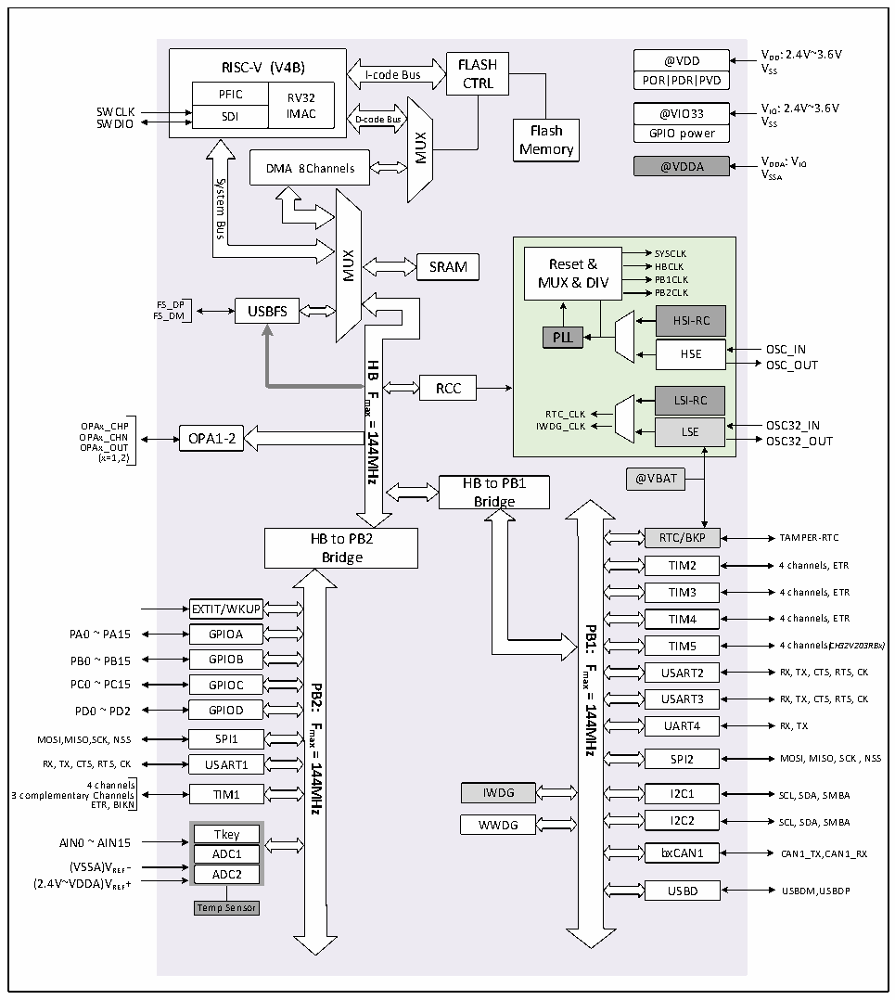

<!-- source-page: 9 -->

[← p.8](0008.md) · [index](../README.md) · [PDF p.9](https://ch32-riscv-ug.github.io/CH32V20x/datasheet_en/CH32FV2x_V3xRM.PDF#page=9) · [p.10 →](0010.md)

<!-- header: CH32F/V20x_V30x_V31x Series Reference Manual https://wch-ic.com -->

Figure 1-4 CH32V203 (Small-and-medium capacity general-purpose) system architecture  
 <!-- rendered from the PDF; verify at https://ch32-riscv-ug.github.io/CH32V20x/datasheet_en/CH32FV2x_V3xRM.PDF#page=9 -->

🖼 Text parsed from the figure above

VDD: 2.4V~3.6V  
@VDD  
<!-- image: p9-draw-image-00002 inside the figure -->
RISC-V (V4B) FLASH  
RISC-V (V4B)  PFICSDI  RV32IMAC  
VSS  
I-code Bus  
POR PDR PVD  
CTRL  
SWCLK VIO: 2.4V~3.6V SWDIO VSS  
SDI IMAC D-code Bus Flash  
@VIO33 GPIO power  
MUX  
Memory  
@VDDA VDDA: VIO VSSA  
DMA 8Channels  
System  
Bus  
SYSCLK Reset &amp; HBCLK MUX &amp; DIV PB1CLKPB2CLKHSI-RCPLLHSELSI-RCRTC_CLK IWDG_CLK LSE  LSI-RC  LSE  
MUX  
SRAM  
FS_DP USBFS  
FS_DM  
OSC_OUT  
<strong>HB</strong>  
RCC  
<strong>Fmax</strong>  
<strong>=144MHz</strong>  
O O P P A A x x _ _ C C H H N P OPA1-2 IWDG_CLK LSE O O S S C C 3 3 2 2 _ _ I O N UT  
OPAx_OUT  
(x=1,2)  
HB to PB1 @VBAT  
Bridge  
HB to PB2  
RTC/BKP TAMPER-RTC  
Bridge  
TIM2 4 channels, ETR  
TIM3 4 channels, ETR  
EXTIT/WKUP  
TIM4 4 channels, ETR  
<strong>PB1:</strong>  
PA0 ~ PA15 GPIOA  
<em>TIM5 4 channels(CH32V203RBx)</em>  
PB0 ~ PB15 GPIOB  
<strong>Fmax</strong>  
USART2 RX, TX, CTS, RTS, CK  
PC0 ~ PC15 GPIOC  
<strong>PB2:</strong>  
<strong>=</strong>  
USART3 RX, TX, CTS, RTS, CK  
<strong>144MHz</strong>  
PD0 ~ PD2 GPIOD  
UART4 RX, TX  
<strong>Fmax</strong>  
MOSI,MISO,SCK, NSS SPI1  
<strong>=144MHz</strong>  
RX, TX, CTS, RTS, CK USART1 SPI2 MOSI, MISO, SCK , NSS  
4 channels  
3 complementary Channels TIM1 IWDG I2C1 SCL, SDA, SMBA  
ETR, BIKN  
WWDG I2C2 SCL, SDA, SMBA  
Tkey ADC1ADC2  
AIN0 ~ AIN15  
ADC1 bxCAN1 CAN1_TX,CAN1_RX  
(VSSA)VREF -  
(2.4V~VDDA)VREF+  
USBD USBDM,USBDP  
Temp Sensor  

<!-- image: p9-draw-image-00001 bbox=[508.2, 795.0, 527.28, 805.2] -->
<!-- footer: V2.5 4 -->
