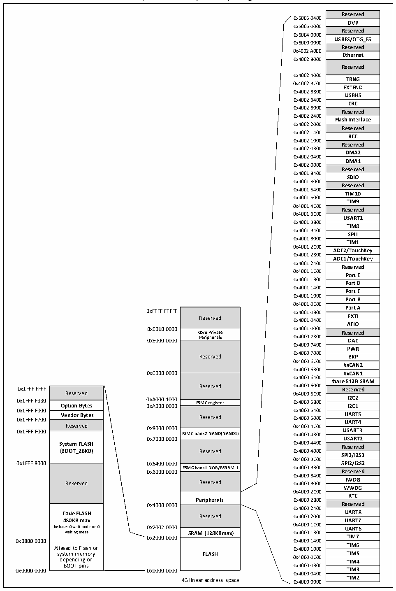

<!-- source-page: 19 -->

[← p.18](0018.md) · [index](../README.md) · [PDF p.19](https://ch32-riscv-ug.github.io/CH32V20x/datasheet_en/CH32FV2x_V3xRM.PDF#page=19) · [p.20 →](0020.md)

<!-- header: CH32F/V20x_V30x_V31x Series Reference Manual https://wch-ic.com -->

Figure 1-13 CH32V3x (Connected/interconnected/high-capacity general-purpose) and CH32V31x  
 <!-- rendered from the PDF; verify at https://ch32-riscv-ug.github.io/CH32V20x/datasheet_en/CH32FV2x_V3xRM.PDF#page=19 -->

# (Interconnected) memory image

🖼 Text parsed from the figure above

Reserved  DVP  Reserved  USBFS/OTG_FS  Reserved  Ethernet  Reserved  TRNG  EXTEND  USBHS  CRC  Reserved  Flash Interface  Reserved  RCC  Reserved  DMA2  DMA1  Reserved  SDIO  Reserved  TIM10  TIM9  Reserved  USART1  TIM8  SPI1  TIM1  ADC2/TouchKey  ADC1/TouchKey  Reserved  Port E  Port D  Port C  Port B  Port A  EXTI  AFIO  Reserved  DAC  PWR  BKP  bxCAN2  bxCAN1  share 512B SRAM  Reserved  I2C2  I2C2I2C1  UART5  UART4  USART3  USART2  Reserved  SPI3/I2S3  SPI2/I2S2  Reserved  IWDG  WWDG  RTC  Reserved  UART8  UART7  UART6  TIM7  TIM6  TIM5  TIM4  TIM3  TIM2  
0x5005 0400  
0x5005 0000  
0x5004 0000  
0x5000 0000  
0x4002 A000  
0x4002 8000  
0x4002 4000  
0x4002 3C00  
0x4002 3800  
0x4002 3400  
0x4002 3000  
0x4002 2400  
0x4002 2000  
0x4002 1400  
0x4002 1000  
0x4002 0800  
0x4002 0400  
0x4002 0000  
0x4001 8400  
0x4001 8000  
0x4001 5400  
0x4001 5000  
0x4001 4C00  
0x4001 3C00  
0x4001 3800  
0x4001 3400  
0x4001 3000  
0x4001 2C00  
0x4001 2800  
0x4001 2400  
0x4001 1C00  
0x4001 1800  
0x4001 1400  
0x4001 1000  
0x4001 0C00  
Reserved  Core Private Peripherals  Reserved  Reserved  FSMC register  Reserved  FSMC bank2 NAND(NAND1)  Reserved  FSMC bank1 NOR/PSRAM 1  Reserved  Peripherals  Reserved  SRAM (128KBmax)  FLASH  
Reserved 0x4001 0400 EXTI  
<strong>Core Private Reserved</strong>  
<strong>Peripherals 0x4000 7800</strong>  
0xE000 0000 DAC  
0x4000 7400  
0x4000 7000  
Reserved BKP  
0x4000 6C00  
0x4000 6800  
0xC000 0000 bxCAN1  
0x4000 6400  
Reserved  Option Bytes  Vendor Bytes  Reserved  System FLASH (BOOT_28KB)  Reserved  Code FLASH 480KB max Includes 0 wait and non-0 waiting areas  Aliased to Flash or system memory depending on BOOT pins  
0x1FFF F800 0x4000 5400  
0x7000 0000 USART2  
0x4000 3C00  
<strong>FSMC bank1 NOR/PSRAM 1 0x4000 3800</strong>  
0x6000 0000 Reserved  
0x4000 3400  
0x4000 2C00  
<strong>Peripherals 0x4000 2800</strong>  
0x4000 0000 Reserved  
0x4000 2400  
Reserved 0x4000 2000  
0x4000 1C00  
0x2000 0000 TIM7  
0x0800 0000 0x4000 1400  
0x4000 0400  
4G linear address space 0x4000 0000 TIM2  

<!-- image: p19-draw-image-00001 bbox=[508.2, 795.0, 527.28, 805.2] -->
<!-- footer: V2.5 14 -->
