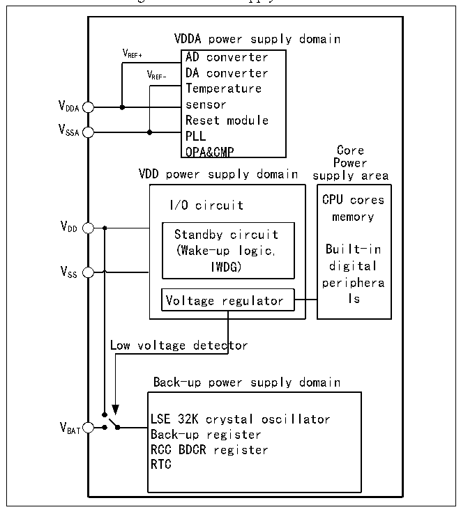

<!-- source-page: 22 -->

[← p.21](0021.md) · [index](../README.md) · [PDF p.22](https://ch32-riscv-ug.github.io/CH32V20x/datasheet_en/CH32FV2x_V3xRM.PDF#page=22) · [p.23 →](0023.md)

<!-- header: CH32F/V20x_V30x_V31x Series Reference Manual https://wch-ic.com -->

# Chapter 2 Power Control (PWR)

<strong><em>This chapter applies to the whole family of CH32F20x, CH32V20x, CH32V30x and CH32V31x.</em></strong>  

## 2.1 Overview

The CH32F20x, CH32V20x, and CH32V30x products have a system operating voltage VDD range of 2.4(1) to  
3.6V, and the CH32V31x products have a system operating voltage VDD range of 2.4(1) to 3.6V, with a  
built-in voltage regulator to provide the operating power supply required by the core. When the main power  
(VDD) is off, backup power supply such as battery can supply power to the real-time clock (RTC) and backup  
registers through the VBAT pin. If the backup power supply is not required, it is recommended to connect VDD  
directly to the VBAT pin.  
<em>Note: (1) For chips with FEATURE_SIGN register VLEVEL bit 1, the system operating voltage VDD supports</em>  
<em>a minimum supply voltage of 2.4V; For chips with VLEVEL bit 0, the system operating voltage VDD supports</em>  
<em>a minimum supply voltage of 1.8V.</em>  
<em>For CH32V31x products the following parameters are also included (refer to the CH32V307DS0 manual for</em>  
<em>specific data):</em>  
- <em>(1) VDD_ETH: Power supply for the built-in Ethernet 10/100M PHY.</em>
- <em>(2) VDDK: Internal power LDO decoupling terminal, external decoupling capacitor is required.</em>
The VDDA and VSSA pins are dedicated to supply power to the analog related circuits in the system, including  
ADC, DAC, temperature sensors, etc. As reference points of some analog circuits, VREF+ and VREF- are equal  
to VDDA and VSSA inside the chip.  

Figure 2-1 Power supply overview  
 <!-- rendered from the PDF; verify at https://ch32-riscv-ug.github.io/CH32V20x/datasheet_en/CH32FV2x_V3xRM.PDF#page=22 -->

🖼 Text parsed from the figure above

VDDA power supply domain  
V REF+ AD converter  
VREF-  
VREF- DA converter  
Temperature  
Reset module  
V  
SSA PLL  
OPA&amp;CMP Core  
Power  
VDD power supply domain supply area  
CPU cores  
I/O circuit  
memory  
V  
DD Standby circuit  
(Wake-up logic, Built-in  
V IWDG) digital  
SS  
periphera  
Voltage regulator ls  
Low voltage detector  
Back-up power supply domain  
LSE 32K crystal oscillator  
V  
BAT Back-up register  
RCC BDCR register  
RTC  

After the main power (VDD) is off, the analog switch will be turned to VBAT, and the backup area will be  
<!-- image: p22-draw-image-00001 bbox=[508.2, 795.0, 527.28, 805.2] -->
<!-- footer: V2.5 17 -->
