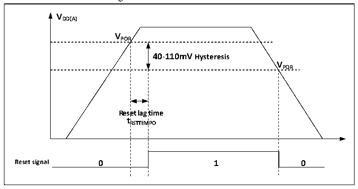

<!-- source-page: 23 -->

[← p.22](0022.md) · [index](../README.md) · [PDF p.23](https://ch32-riscv-ug.github.io/CH32V20x/datasheet_en/CH32FV2x_V3xRM.PDF#page=23) · [p.24 →](0024.md)

<!-- header: CH32F/V20x_V30x_V31x Series Reference Manual https://wch-ic.com -->
powered by the VBAT pin. At this time, the PC13 to PC15 IOs cannot be used as GPIOs, and only the  
following functions are available:  
● PC13 can be used as TAMPER pin, RTC alarm or second output.  
● PC14 and PC15 can be only used as LSE pins.  
When the main power (VDD) is stable, the system will automatically switch the backup area powered by VDD,  
and the PC13 to PC15 IOs can be used as GPIOs.  
When the PC13 to PC15 pins are used as GPIO output, the speed must be limited below 2MHz, the  
maximum load capacitance is 30pF, and it is forbidden to use it in the occasions of continuous output and  
draw current, such as LED drive.  
<em>Note: During the restoration of the main power supply (VDD), the internal VBAT power supply is still</em>  
<em>connected to the external backup power supply through the corresponding VBAT pin. If VDD is less than the</em>  
<em>reset delay time tRSTTEMPO, it will be stabilized and be higher than the value of VBAT by more than 0.6V, and</em>  
<em>the current may be injected into VBAT through the diode between VDD and VBAT in a very short moment. Then,</em>  
<em>the backup power supply such as the battery will be injected through the VBAT pin. If the backup power</em>  
<em>supply cannot withstand such instantaneously injected current, it is then recommended to add a positive on</em>  
<em>low-dropout diode between the backup power supply and VBAT pin.</em>  

## 2.2 Power Supply Management

### 2.2.1 Power-on Reset and Power-down Reset

The power-on reset (POR) and power-down reset (PDR) circuits are integrated inside the system. When  
VDD/VDDA is below the corresponding threshold, the system will be reset by the relevant circuits, without the  
need for an external reset circuit. Please refer to the corresponding data sheet for more details concerning the  
power-on threshold (VPOR) and the power-down threshold (VPDR).  

Figure 2-2 POR/PDR waveform  
 <!-- rendered from the PDF; verify at https://ch32-riscv-ug.github.io/CH32V20x/datasheet_en/CH32FV2x_V3xRM.PDF#page=23 -->

🖼 Text parsed from the figure above

<strong>VDD(A)</strong>  
<strong>VPOR</strong>  
40-110mV Hysteresis  Rese t R  et lag RSTTEM  time MPO  V  
<strong>VPDR</strong>  

### 2.2.2 Programmable Voltage Detector

The programmable voltage detector (PVD) is mainly used to monitor the main power of the system and  
compares it to the threshold selected by the PLS [2:0] bits in the power control register (PWR_CTLR).  
Coordinated with the external interrupt register (EXTI) setting, it can generate related interrupt to notify the  
system in time to perform operations before power failure such as data storage.  
Configuration procedure:  
1) Set the PLS [2:0] bits in the PWR_CTLR register and select the voltage threshold to be detected.  
2) Optional interrupt processing. The PVD function is internally connected to the line16 of the EXTI module  
<!-- image: p23-draw-image-00001 bbox=[508.2, 795.0, 527.28, 805.2] -->
<!-- footer: V2.5 18 -->
