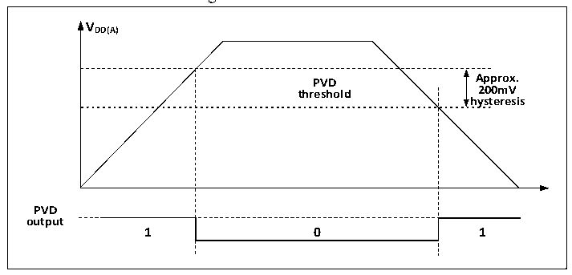

<!-- source-page: 24 -->

[← p.23](0023.md) · [index](../README.md) · [PDF p.24](https://ch32-riscv-ug.github.io/CH32V20x/datasheet_en/CH32FV2x_V3xRM.PDF#page=24) · [p.25 →](0025.md)

<!-- header: CH32F/V20x_V30x_V31x Series Reference Manual https://wch-ic.com -->
to trigger the setting of rising/falling edges. Enable this interrupt (with EXTI configured). When VDD  
drops below the PVD threshold or rises above the PVD threshold, a PVD interrupt can be generated.  
3) Set the PVDE bit in the PWR_CTLR register to enable PVD.  
4) Read the PVDO bit in the PWR_CSR register to obtain the relationship between the main power supply of  
the current system and the threshold set by PLS [2:0] bits, and perform the corresponding soft processing.  
When the VDD voltage is higher than the threshold set by PLS[2:0], PVDO position 0; when the VDD  
voltage is lower than the threshold set by PLS[2:0], PVDO position 1.  

Figure 2-3 PVD thresholds  
 <!-- rendered from the PDF; verify at https://ch32-riscv-ug.github.io/CH32V20x/datasheet_en/CH32FV2x_V3xRM.PDF#page=24 -->

🖼 Text parsed from the figure above

<strong>VDD(A)</strong>  
PVD threshold  0  
<strong>hysteresis</strong>  
<strong>PVD</strong>  
<strong>output</strong>  

## 2.3 Low-power Modes

After the system reset, the microcontroller is at a normal working status (Run mode). At this time, the system  
power can be saved by reducing the system clock frequency or disabling the peripheral clock or reducing the  
working peripheral clock. If the system does not need to work, the user can set the system to enter  
low-power mode, and let the system jump out of this status through specific events.  
The microcontroller currently features 3 low-power modes, which are divided into the following modes  
according to the working differences of processors, peripherals and voltage regulators, etc.:  
● Sleep mode: The core stops running, and all peripherals (Including the core private peripherals) are still  
running.  
● Stop mode: Stop all clocks, and the system will continue to run after awakening.  
● Standby mode: Stop all clocks, and reset the microcontroller after awakening (Power reset).  

<!-- p24-table-002 (table-2-1@1) -->
<table><caption>Table 2-1 List of low-power modes</caption><tr><th>Mode</th><th>Entry</th><th>Wake-up source</th><th>Effect on clock</th><th>Voltage regulator</th></tr><tr><td rowspan="2">Sleep</td><td>WFI</td><td>Any interrupt</td><td rowspan="2" style="text-align:left">Core clock OFF, no effect on other clocks</td><td rowspan="2">ON</td></tr><tr><td>WFE</td><td>Wake-up event</td></tr><tr><td>Stop</td><td style="text-align:left">Set SLEEPDEEP to 1 Clear PDDS to 0 WFI or WFE</td><td style="text-align:left">Any external interrupt/event (Set in the external interrupt register)</td><td style="text-align:left">HSE, HSI, PLL and peripheral clock OFF</td><td style="text-align:left">ON: LPDS=0 or Low-power: LPDS=1</td></tr><tr><td>Standby</td><td style="text-align:left">Set SLEEPDEEP to 1 Set PDDS to 1 WFI or WFE</td><td style="text-align:left"><em>WKUP pin rising edge, RTC alarm event, NRST pin reset, IWDG reset. Note: Any event can also wake up the system, but the system will not be reset after wake-up.</em></td><td style="text-align:left">HSE, HSI, PLL and peripheral clock OFF</td><td>OFF</td></tr></table>

<em>Note: The SLEEPDEEP bit is the core private peripheral control bit. For CH32F20x, refer to the Cortex-M3</em>  
<em>core manual. For CH32V20x, CH32V30x and CH32V31x, refer to the PFIC_SCTLR register.</em>  
<!-- image: p24-draw-image-00001 bbox=[508.2, 795.0, 527.28, 805.2] -->
<!-- footer: V2.5 19 -->
