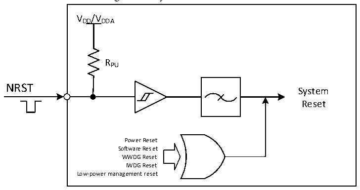

<!-- source-page: 31 -->

[← p.30](0030.md) · [index](../README.md) · [PDF p.31](https://ch32-riscv-ug.github.io/CH32V20x/datasheet_en/CH32FV2x_V3xRM.PDF#page=31) · [p.32 →](0032.md)

<!-- header: CH32F/V20x_V30x_V31x Series Reference Manual https://wch-ic.com -->
Low-power management reset: By resetting the nRST_STDBY bit in the user option bytes, the standby  
mode reset is enabled. After the process of entering the standby mode is executed at this time, a system reset  
will be performed instead of entering standby mode. By setting the nRST_STOP bit in User Option Bytes to  
0, the stop mode reset is enabled. After the process of entering the stop mode is executed, a system reset will  
be executed instead of entering stop mode.  

Figure 3-1 System reset structure  
 <!-- rendered from the PDF; verify at https://ch32-riscv-ug.github.io/CH32V20x/datasheet_en/CH32FV2x_V3xRM.PDF#page=31 -->

🖼 Text parsed from the figure above

VDD/VDDA  
RPU  
NRST  
System  
Reset  
Power Reset  
Software Reset  
WWDG Reset  
IWDG Reset  
Low-power management reset  

### 3.2.3 Backup Domain Reset

When the backup domain reset occurs, only the backup domain register will be reset, including the backup  
register, RCC_BDCTLR register (RTC enable and LSE oscillator). A backup domain reset is generated when  
one of the following events occurs:  
● On the premise that both VDD and VBAT are powered off, it is caused by power-on of VDD or VBAT  
● Set the BDRST bit in the RCC_BDCTLR register to 1  
<!-- image: p31-draw-image-00001 bbox=[508.2, 795.0, 527.28, 805.2] -->
<!-- footer: V2.5 26 -->
