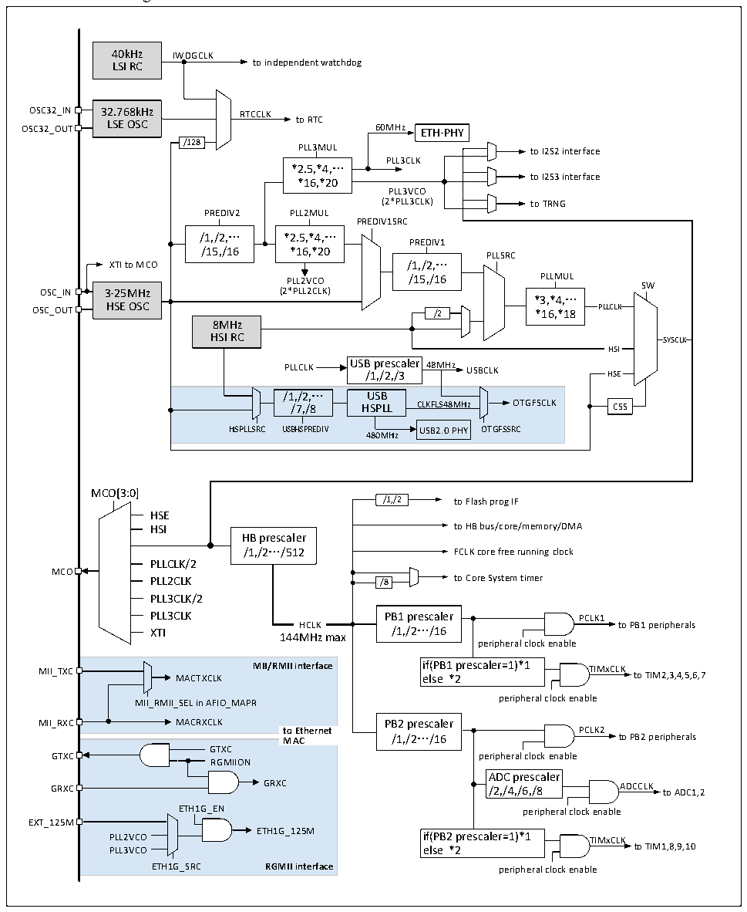

<!-- source-page: 32 -->

[← p.31](0031.md) · [index](../README.md) · [PDF p.32](https://ch32-riscv-ug.github.io/CH32V20x/datasheet_en/CH32FV2x_V3xRM.PDF#page=32) · [p.33 →](0033.md)

<!-- header: CH32F/V20x_V30x_V31x Series Reference Manual https://wch-ic.com -->

## 3.3 Clock

### 3.3.1 System Clock Structure

Figure 3-2 CH32V305/307/317 and CH32F205/207 clock tree structure  
 <!-- rendered from the PDF; verify at https://ch32-riscv-ug.github.io/CH32V20x/datasheet_en/CH32FV2x_V3xRM.PDF#page=32 -->

🖼 Text parsed from the figure above

40kHz IWDGCLK  
LSI RC to independent watchdog  
OSC32_IN 32.768kHz RTCCLK  
OSC32_OUT LSE OSC to RTC 60MHz ETH-PHY  
/128 PLL3MUL to I2S2 interface  
PLL3CLK  
*2.5,*4,…  
to I2S3 interface  
*16,*20  
PLL3VCO  
PREDIV2 PLL2MUL  
PREDIV1SRC  
/1,/2,… *2.5,*4,…  
PREDIV1  
/15,/16 *16,*20  
PLLSRC  
XTI to MCO /1,/2,…  
PLL2VCO /15,/16 PLLMUL SW  
OSC_IN 3-25MHz (2*PLL2CLK)  
*3,*4,…  
OSC_OUT HSE OSC /2 *16,*18 PLLCLK  
8MHz  
HSI RC SYSCLK  
HSI  
PLLCLK USB /1 p ,/ re 2 s ,/ c 3 aler 48MHz USBCLK HSE  
/1,/2,… USB /7,/8 HSPLL HSPLLSRC USBHSPREDIV480MHz  /1,/2,… /7,/8  USBHSPLL  CLKFLS48MHz OTGFSCLK USB2.0 PHY OTGFSSRC  
MCO[3:0]  
/1,/2 to Flash prog IF  
HSE  
HSI to HB bus/core/memory/DMA  
HB prescaler  
/1,/2…/512 FCLK core free running clock  
PLLCLK/2  
MCO  
PLL2CLK /8 to Core System timer  
PLL3CLK/2  
PLL3CLK PB1 prescaler PCLK1  
XTI HCLK /1,/2…/16 to PB1 peripherals  
144MHz max  
peripheral clock enable  
MII_TXC MACTXCLK MII/RMII interface i e f l ( s P e B 1 * 2 prescaler=1)*1 TIMxCLK to TIM2,3,4,5,6,7  
peripheral clock enable  
MII_RMII_SEL in AFIO_MAPR  
MII_RXC MACRXCLK PB2 prescaler  
to Ethernet PCLK2  
MAC /1,/2…/16 to PB2 peripherals  
GTXC  
GTXC peripheral clock enable  
RGMIION  
ADC prescaler  
GRXC GRXC /2,/4,/6,/8 ADCCLK to ADC1,2  
ETH1G_EN peripheral clock enable  
EXT_125M  
PLL2VCO ETH1G_125M if(PB2 prescaler=1)*1 TIMxCLK  
PLL3VCO else *2 to TIM1,8,9,10  
ETH1G_SRC RGMII interface peripheral clock enable  

Note: This clock tree structure is applied for CH32F20x_D8C, CH32V30x_D8C and CH32V31x_D8C.  
<!-- image: p32-draw-image-00001 bbox=[508.2, 795.0, 527.28, 805.2] -->
<!-- footer: V2.5 27 -->
