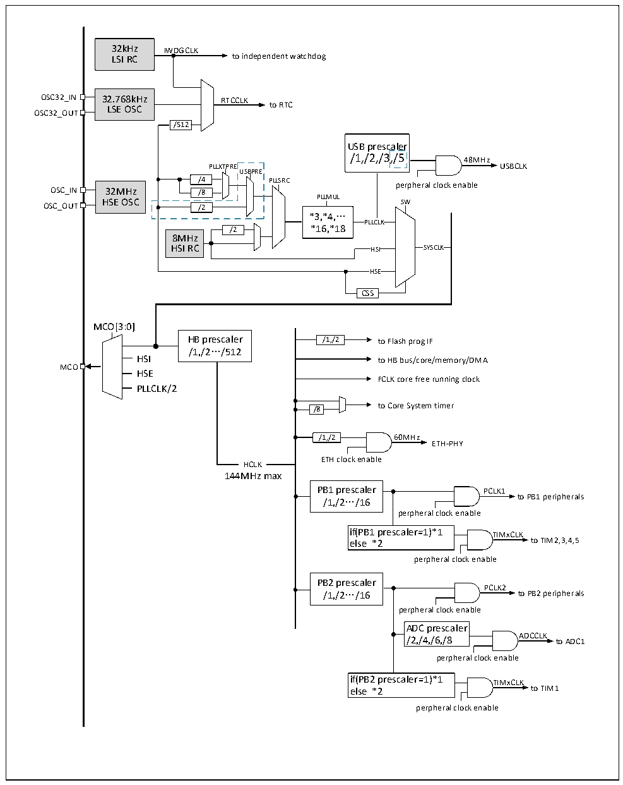

<!-- source-page: 34 -->

[← p.33](0033.md) · [index](../README.md) · [PDF p.34](https://ch32-riscv-ug.github.io/CH32V20x/datasheet_en/CH32FV2x_V3xRM.PDF#page=34) · [p.35 →](0035.md)

<!-- header: CH32F/V20x_V30x_V31x Series Reference Manual https://wch-ic.com -->

Figure 3-4 CH32V203RB clock tree structure  
 <!-- rendered from the PDF; verify at https://ch32-riscv-ug.github.io/CH32V20x/datasheet_en/CH32FV2x_V3xRM.PDF#page=34 -->

🖼 Text parsed from the figure above

32kHz IWDGCLK  
LSI RC to independent watchdog  
OSC32_IN 32.768kHz RTCCLK  
LSE OSC to RTC  
OSC32_OUT  
/512  
USB prescaler /1,/2,/3,/5  a,/l5er  
/1,/2,/3,/5 48MHz  
PLLXTPRE USBCLK  
USBPRE  
/4 PLLSRC perpheral clock enable  
OSC_IN 32MHz /8  
OSC_OUT HSE OSC /2 PLLMUL SW  
*3,*4,…  
PLLCLK  
/2 *16,*18  
8MHz  
HSI RC HSI SYSCLK  
HSE  HSE  
CSS  
MCO[3:0]  
HB prescaler /1,/2 to Flash prog IF  
/1,/2…/512  
HSI to HB bus/core/memory/DMA  
MCO  
HSE  
FCLK core free running clock  
PLLCLK/2  
to Core System timer  
/8  
/1,/2 60MHz  
ETH-PHY  
ETH clock enable  
HCLK  HCLK  
144MHz max  
PB1 prescaler PCLK1  
/1,/2…/16 to PB1 peripherals  
perpheral clock enable  
if(PB1 prescaler=1)*1 TIMxCLK  
else *2 to TIM2,3,4,5  
perpheral clock enable  
PB2 prescaler  
PCLK2  
/1,/2…/16 to PB2 peripherals  
perpheral clock enable  
ADC prescaler  
/2,/4,/6,/8 ADCCLK to ADC1  
perpheral clock enable  
if(PB2 prescaler=1)*1 TIMxCLK  
else *2 to TIM1  
perpheral clock enable  

Note: (1) CH32V203RB (CH32V20x_D8) products have an external crystal or clock (HSE) of 32M, and  
there is no need for a load capacitor to have been built in when using an external crystal.  
(2) The blue dotted line in Figure 3-4 above applies only to CH32V203RB chips with the penultimate  
digit of the lot number greater than zero.  
<!-- image: p34-draw-image-00001 bbox=[508.2, 795.0, 527.28, 805.2] -->
<!-- footer: V2.5 29 -->
