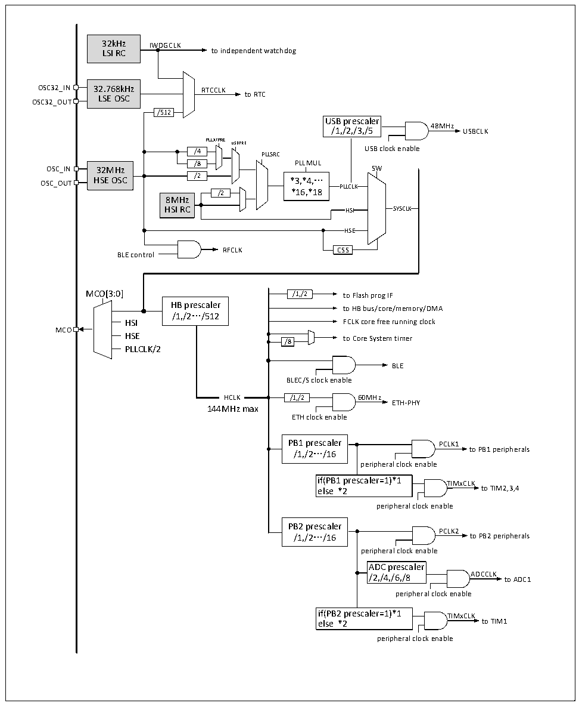

<!-- source-page: 35 -->

[← p.34](0034.md) · [index](../README.md) · [PDF p.35](https://ch32-riscv-ug.github.io/CH32V20x/datasheet_en/CH32FV2x_V3xRM.PDF#page=35) · [p.36 →](0036.md)

<!-- header: CH32F/V20x_V30x_V31x Series Reference Manual https://wch-ic.com -->

Figure 3-5 CH32FV208 clock tree structure  
 <!-- rendered from the PDF; verify at https://ch32-riscv-ug.github.io/CH32V20x/datasheet_en/CH32FV2x_V3xRM.PDF#page=35 -->

🖼 Text parsed from the figure above

32kHz IWDGCLK  
LSI RC to independent watchdog  
OSC32_IN 32.768kHz RTCCLK  
LSE OSC to RTC  
OSC32_OUT  
/512  
USB prescaler  
48MHz  
/1,/2,/3,/5 USBCLK  
PLLXTPRE  
USBPRE  
/4 PLLSRC USB clock enable  
/4 /8  
/8 PLLMUL  
32MHz HSE OSC  
HSE OSC /2 *3,*4,…  
OSC_OUT  
PLLCLK  
/2 *16,*18  
8MHz  
HSI RC HSI SYSCLK  
HSE  
RFCLK CSS  
BLE control  
MCO[3:0] /1,/2 to Flash prog IF  
HB prescaler  
to HB bus/core/memory/DMA  
/1,/2…/512  
HSI FCLK core free running clock  
MCO  
HSE /8 to Core System timer  
PLLCLK/2  
BLE  
BLEC/S clock enable  
HCLK  HCLK  
HCLK /1,/2 60MHz  
ETH-PHY  
144MHz max  
ETH clock enable  
PB1 prescaler PCLK1  
/1,/2…/16 to PB1 peripherals  
peripheral clock enable  
if(PB1 prescaler=1)*1 TIMxCLK  
else *2 to TIM2,3,4  
peripheral clock enable  
PB2 prescaler  
PCLK2  
/1,/2…/16 to PB2 peripherals  
peripheral clock enable  
ADC prescaler  
/2,/4,/6,/8 ADCCLK to ADC1  
peripheral clock enable  
if(PB2 prescaler=1)*1 TIMxCLK  
else *2 to TIM1  
peripheral clock enable  

Note: This clock tree structure is applied for CH32F20x_D8W and CH32V20x_D8W. When USB and ETH  
are used simultaneously, set the USBPRE[1:0] bits to 11b. The external crystal or clock (HSE) is 32M. When  
the external crystal is enabled, no load capacitor is required as it is built in.  

### 3.3.2 High-speed Clock (HSI/HSE)

HSI is a high-speed clock signal generated by an 8MHz RC oscillator in the system. The HSI RC oscillator  
can provide the system clock without depending on any external device. Its startup time is very short but the  
<!-- image: p35-draw-image-00001 bbox=[508.2, 795.0, 527.28, 805.2] -->
<!-- footer: V2.5 30 -->
