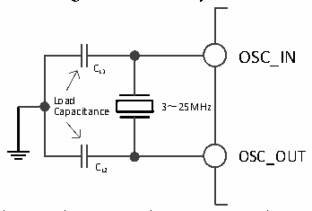
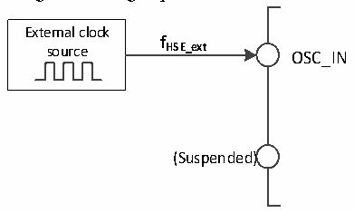

<!-- source-page: 36 -->

[← p.35](0035.md) · [index](../README.md) · [PDF p.36](https://ch32-riscv-ug.github.io/CH32V20x/datasheet_en/CH32FV2x_V3xRM.PDF#page=36) · [p.37 →](0037.md)

<!-- header: CH32F/V20x_V30x_V31x Series Reference Manual https://wch-ic.com -->
clock frequency accuracy is poor. HSI is enabled/disabled by setting the HSION bit in the RCC_CTLR  
register. The HSIRDY bit indicates whether the HSI RC oscillator is stable. By default, HSION and  
HSIRDY are set to 1 (Recommended not to disable). If the HSIRDYIE bit in the RCC_INTR register is set,  
a corresponding interrupt is generated.  
● Factory calibration: The difference in manufacturing process may cause the RC oscillation frequency of  
each chip to be different, so HSI calibration is performed for each chip before the chip is delivered out  
of the factory. After the system is reset, the factory calibration value is loaded into the HSICAL[7:0]  
bits in the RCC_CTLR register.  
● User adjustment: Based on different voltages or ambient temperatures, the application program can  
adjust the HSI frequency through the HSITRIM[4:0] bits in the RCC_CTLR register.  
<em>Note: If the HSE crystal oscillator fails, HSI clock is used as a backup clock source (clock security system).</em>  
HSE is a High-Speed External clock signal, including external crystal/ceramic resonator generation or  
external high-speed clock input.  
● External crystal/ceramic resonator (HSE crystal): An external 3 to 25MHz oscillator provides a more  
accurate clock source for the system. For details, please refer to the electrical characteristics of this  
manual. The HSE crystal can be enabled/disabled by setting the HSEON bit in the RCC_CTLR register.  
The HSERDY bit indicates whether the HSE crystal oscillation is stable. The clock is not released until  
the HSERDY bit is set to 1 by hardware. If the HSERDYIE bit in the RCC_INTR register is set, a  
corresponding interrupt can be generated.  

Figure 3-6 HSE crystal circuit  
 <!-- rendered from the PDF; verify at https://ch32-riscv-ug.github.io/CH32V20x/datasheet_en/CH32FV2x_V3xRM.PDF#page=36 -->

🖼 Text parsed from the figure above

OSC_IN  
CL1  
L C o a a p d a citance 3～25MHz  
OSC_OUT  
CL2  

<em>Note: The load capacitor should be placed as close as possible to the oscillator pins, and the loading</em>  
<em>capacitance values must be adjusted according to the selected oscillator.</em>  
● External high-speed clock source (HSE bypass): In this mode, an external clock source is directly  
provided to the OSC_IN pin, and the OSC_OUT pin is suspended. It can have a frequency of up to  
25MHz. The application program needs to set the HSEBYP bit when the HSEON bit is 0, to enable  
HSE bypass, and then set the HSEON bit.  

Figure 3-7 High-speed clock source circuit  
 <!-- rendered from the PDF; verify at https://ch32-riscv-ug.github.io/CH32V20x/datasheet_en/CH32FV2x_V3xRM.PDF#page=36 -->

🖼 Text parsed from the figure above

External clock  
<strong>f</strong>  
source HSE_ext OSC_IN  
(Suspended)  

<!-- image: p36-draw-image-00001 bbox=[508.2, 795.0, 527.28, 805.2] -->
<!-- footer: V2.5 31 -->
