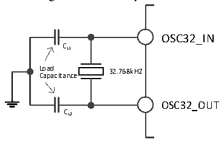
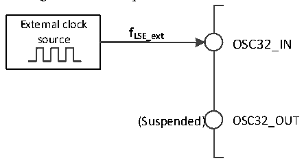

<!-- source-page: 37 -->

[← p.36](0036.md) · [index](../README.md) · [PDF p.37](https://ch32-riscv-ug.github.io/CH32V20x/datasheet_en/CH32FV2x_V3xRM.PDF#page=37) · [p.38 →](0038.md)

<!-- header: CH32F/V20x_V30x_V31x Series Reference Manual https://wch-ic.com -->

### 3.3.3 Low-speed Clock (LSI/LSE)

LSI is a low-speed clock signal generated by the system&#x27;s internal RC oscillator. It can keep running in stop  
and standby modes, and provide a clock reference for the RTC clock, independent watchdog, and wake-up  
unit. For further information, please refer to the electrical characteristics of this manual. LSI can be  
enabled/disabled by setting the LSION bit in the RCC_RSTSCKR register, and then it checks whether the  
LSI RC oscillation is stable by querying the LSIRDY bit. The clock is not released until the LSIRDY bit is  
set to 1 by hardware. If the LSIRDYIE bit in the RCC_INTR register is set, a corresponding interrupt can be  
generated.  
LSE is an external low-speed clock signal, including external crystal/ceramic resonator generation or  
external low-speed clock input. It provides a low-power but highly accurate clock source for RTC clock or  
other timing functions.  
● External crystal/ceramic resonator (LSE crystal): External 32.768kHz low-speed oscillator. LSE can be  
enabled/disabled by setting the LSEON bit in the RCC_BDCTLR register. The LSERDY bit indicates  
whether the LSE crystal oscillation is stable. The clock is not released until the LSERDY bit is set to 1  
by hardware. If the LSERDYIE bit in the RCC_INTR register is set, a corresponding interrupt can be  
generated.  

Figure 3-8 LSE crystal circuit  
 <!-- rendered from the PDF; verify at https://ch32-riscv-ug.github.io/CH32V20x/datasheet_en/CH32FV2x_V3xRM.PDF#page=37 -->

🖼 Text parsed from the figure above

OSC32_IN  
CL1  
L C o a a p d a citance 32.768kHZ  
OSC32_OUT  
CL2  

● External low-speed clock source (LSE bypass): In this mode, an external clock source is directly  
provided to the OSC32_IN pin, and the OSC32_OUT pin is suspended. The application program needs  
to set the LSEBYP bit when the LSEON bit is 0, to enable the LSE bypass, and then set the LSEON bit.  

Figure 3-9 Low-speed clock source circuit  
 <!-- rendered from the PDF; verify at https://ch32-riscv-ug.github.io/CH32V20x/datasheet_en/CH32FV2x_V3xRM.PDF#page=37 -->

🖼 Text parsed from the figure above

External clock  
<strong>f</strong>  
source LSE_ext OSC32_IN  
(Suspended) OSC32_OUT  

### 3.3.4 PLL Clock

By configuring the RCC_CFGR0 register and the EXTEND_CTR register, 3 clock sources and  
multiplication factors can be selected for the internal PLL clock. These settings must be completed before  
each PLL is enabled. Once the PLL is enabled, these parameters cannot be changed. PLL can be  
enabled/disabled by setting the PLLON bit in the RCC_CTLR register. The PLLRDY bit indicates whether  
the PLL clock is stable. The clock is not released until the PLLRDY bit is set to 1 by hardware. PLL2 can be  
enabled/disabled by setting the PLLON2 bit in the RCC_CTLR register. The PLLRDY2 bit indicates  
whether the PLL2 clock is stable. The clock is not released until the PLLRDY2 bit is set to 1 by hardware.  
<!-- image: p37-draw-image-00001 bbox=[508.2, 795.0, 527.28, 805.2] -->
<!-- footer: V2.5 32 -->
