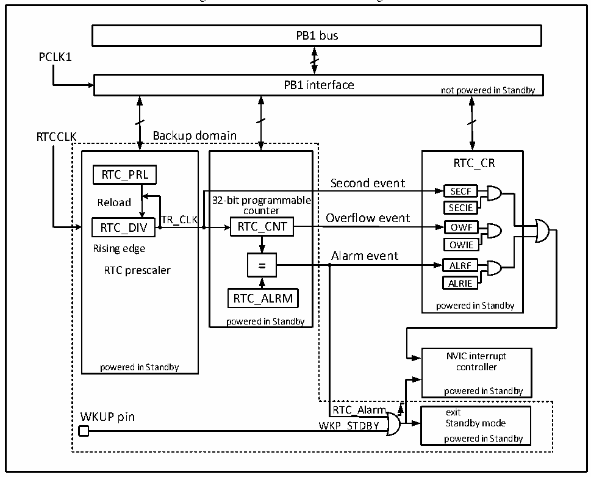

<!-- source-page: 71 -->

[← p.70](0070.md) · [index](../README.md) · [PDF p.71](https://ch32-riscv-ug.github.io/CH32V20x/datasheet_en/CH32FV2x_V3xRM.PDF#page=71) · [p.72 →](0072.md)

<!-- header: CH32F/V20x_V30x_V31x Series Reference Manual https://wch-ic.com -->

# Chapter 6 Real-Time Clock (RTC)

<strong><em>This chapter applies to the whole family of CH32F20x, CH32V20x, CH32V30x and CH32V31x.</em></strong>  
The real-time clock (RTC) is an independent timer module. It supports up to 32-bit programmable counter.  
With software, the real-time clock function can be implemented, and the counter value can be modified to  
re-configure the current time and date of the system. The RTC module is in the backup power supply area,  
and is not affected by the system reset and standby mode wake-up.  

## 6.1 Main Features

● Prescaler factor: up to 220  
● 32-bit programmable counter  
● Multiple types of clock sources, interrupt  
● Independent reset  

## 6.2 Functional Description

### 6.2.1 Overview

Figure 6-1 RTC structure block diagram  
 <!-- rendered from the PDF; verify at https://ch32-riscv-ug.github.io/CH32V20x/datasheet_en/CH32FV2x_V3xRM.PDF#page=71 -->

🖼 Text parsed from the figure above

PB1 bus  
PCLK1  
PB1 interface  
not powered in Standby  
RTCCLK Backup domain  
RTC_CR  
RTC_PRL  
Second event  
SECF  
Reload 32-bit programmable  
counter SECIE  
TR_CLK Overflow event  
RTC_DIV RTC_CNT OWF  
Rising edge OWIE  
Alarm event  
ALRF  
RTC prescaler  
ALRIE  
RTC_ALRM  
powered in Standby  
powered in Standby  
NVIC interrupt  
powered in Standby controller  
powered in Standby  
WKUP pin RTC_Alarm exit  
WKP_STDBY Standby mode  
powered in Standby  

As shown in Figure 6-1, the RTC module is mainly composed of 3 parts: PB1 bus interface, prescaler and  
<!-- image: p71-draw-image-00001 bbox=[508.2, 795.0, 527.28, 805.2] -->
<!-- footer: V2.5 66 -->
