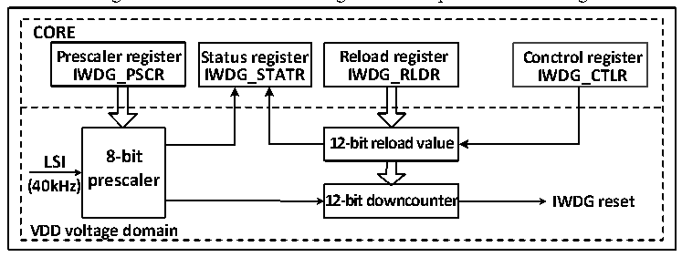

<!-- source-page: 77 -->

[← p.76](0076.md) · [index](../README.md) · [PDF p.77](https://ch32-riscv-ug.github.io/CH32V20x/datasheet_en/CH32FV2x_V3xRM.PDF#page=77) · [p.78 →](0078.md)

<!-- header: CH32F/V20x_V30x_V31x Series Reference Manual https://wch-ic.com -->

# Chapter 7 Independent Watchdog (IWDG)

<strong><em>This chapter applies to the whole family of CH32F20x, CH32V20x, CH32V30x and CH32V31x.</em></strong>  
The system is equipped with an Independent Watchdog (IWDG) to detect logic errors and software faults  
caused by external environmental interference. The IWDG clock source comes from LSI, can run  
independently of the main program, and is suited for applications with low precision requirements.  

## 7.1 Main Features

● 12-bit free-running downcounter  
● Clocked from LSI clock divided, can run in low-power mode  
● Reset condition: The downcounter value reaches 0  

## 7.2 Functional Description

### 7.2.1 Principle and Application

The clock source of the independent watchdog is LSI clock, and its function can still work normally in stop  
and standby mode. When the watchdog downcounter value reaches 0, a system reset is generated, so the  
timeout period is (Reload value + 1) clocks.  

Figure 7-1 Structure block diagram of Independent Watchdog  
 <!-- rendered from the PDF; verify at https://ch32-riscv-ug.github.io/CH32V20x/datasheet_en/CH32FV2x_V3xRM.PDF#page=77 -->

🖼 Text parsed from the figure above

<strong>CORE</strong>  
<strong>Prescaler register Status register Reload register Conctrol register</strong>  
<strong>IWDG_PSCR IWDG_STATR IWDG_RLDR IWDG_CTLR</strong>  
<strong>12-bit reload value</strong>  
<strong>8-bit</strong>  
<strong>LSI</strong>  
<strong>prescaler</strong>  
<strong>(40kHz)</strong>  
<strong>12-bit downcounter IWDG reset</strong>  
<strong>VDD voltage domain</strong>  

● Enable independent watchdog  
After the system reset, the watchdog is OFF. Write 0xCCCC to the IWDG_CR register to enable the  
watchdog, and then it can no longer be disabled unless a reset occurs.  
If the hardware independent watchdog enable bit (IWDG_SW) is enabled in User Option Bytes, the IWDG  
is permanently enabled after the microcontroller reset.  
● Watchdog configuration  
A 12-bit downcounter is in the watchdog. When the value of downcounter is reduced to 0, the system reset  
occurs. To enable IWDG, the following operations are needed:  
1) Counter time base: IWDG clock source is LSI. Set the LSI divider factor clock as IWDG counter time  
base through IWDG_PSCR register. Firstly write 0x5555 to the IWDG_CTLR register, and then modify  
the divider factor in the IWDG_PSCR register. The PVU bit in the IWDG_STATR register indicates the  
update status of the divider factor. The divider factor can only be modified and read after the update is  
finished.  
2) Reload value: It is used to update the current value of the counter in the independent watchdog, and the  
<!-- image: p77-draw-image-00001 bbox=[508.2, 795.0, 527.28, 805.2] -->
<!-- footer: V2.5 72 -->
