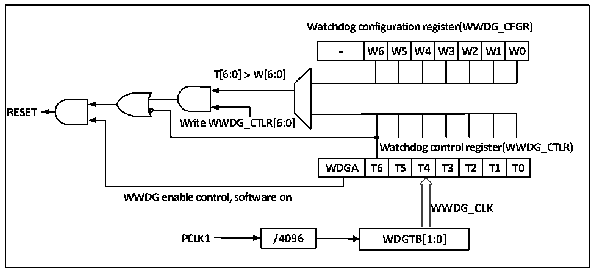

<!-- source-page: 81 -->

[← p.80](0080.md) · [index](../README.md) · [PDF p.81](https://ch32-riscv-ug.github.io/CH32V20x/datasheet_en/CH32FV2x_V3xRM.PDF#page=81) · [p.82 →](0082.md)

<!-- header: CH32F/V20x_V30x_V31x Series Reference Manual https://wch-ic.com -->

# Chapter 8 Window Watchdog (WWDG)

<strong><em>This chapter applies to the whole family of CH32F20x, CH32V20x, CH32V30x and CH32V31x.</em></strong>  
The Window Watchdog is generally used to monitor the software fault of the system operation, such as  
external interference and unforeseen logic errors. It needs to refresh the counter (Feed the dog) within a  
specific window time (With upper and lower limits). Otherwise, the watchdog circuit will generate a system  
reset before or after this window time.  

## 8.2 Function Description

### 8.2.1 Principle and Application

The window watchdog runs based on a 7-bit downcounter, which is mounted under the APB1 bus. The  
counter time base WWDG_CLK originates from the clock prescaler (PCLK1/4096). The clock prescaler  
factor is set by the WDGTB[1:0] bits in the WWDG_CFGR register. The downcounter is at a free running  
status. No matter whether the watchdog function is enabled or not, the counter keeps counting down in a  
cycle. The internal structure block diagram of window watchdog is as shown in Figure 8-1.  

Figure 8-1 Window Watchdog block diagram  
 <!-- rendered from the PDF; verify at https://ch32-riscv-ug.github.io/CH32V20x/datasheet_en/CH32FV2x_V3xRM.PDF#page=81 -->

🖼 Text parsed from the figure above

<strong>Watchdog configuration register(WWDG_CFGR)</strong>  
-  W6  W5  W4  W3  W2  W1  W0  
<strong>T[6:0] ＞ W[6:0]</strong>  
<strong>RESET</strong>  
<strong>Write WWDG_CTLR[6:0]</strong>  
<strong>Watchdog control register(WWDG_CTLR)</strong>  
WDGA  T6  T5  T4  T3  T2  T1  T0  
<strong>WWDG enable control, software on</strong>  
<strong>WWDG_CLK</strong>  
<strong>PCLK1 / 4 0 96 WDGTB[1:0]</strong>  

● Enable window watchdog  
After the system reset, the watchdog is disabled. Set the WDGA bit in the WWDG_CTLR register to switch  
on the watchdog, and then it can no longer be disabled unless a reset occurs.  
<em>Note: WWDG clock source can be disabled by setting the RCC_APB1PCENR register to suspend</em>  
<em>WWDG_CLK counting and indirectly stop the watchdog function. Or reset the WWDG module by setting the</em>  
<em>RCC_APB1PRSTR register, which is equivalent to the function of reset.</em>  
● Watchdog configuration  
A 7-bit counter which continues downcounting in a cycle is in the watchdog, and it supports read/write  
access. To enable watchdog reset function, the following operations are needed:  
1) Counter time base: The WDGTB[1:0] bits in the WWDG_CFGR register. Note to switch on the WWDG  
module clock of the RCC unit.  
<!-- image: p81-draw-image-00001 bbox=[508.2, 795.0, 527.28, 805.2] -->
<!-- footer: V2.5 76 -->
