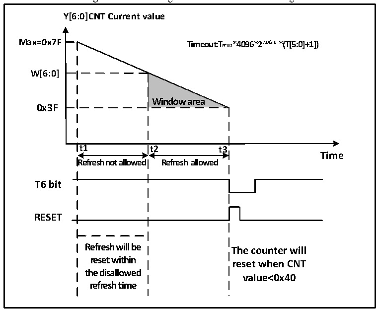

<!-- source-page: 82 -->

[← p.81](0081.md) · [index](../README.md) · [PDF p.82](https://ch32-riscv-ug.github.io/CH32V20x/datasheet_en/CH32FV2x_V3xRM.PDF#page=82) · [p.83 →](0083.md)

<!-- header: CH32F/V20x_V30x_V31x Series Reference Manual https://wch-ic.com -->
2) Window counter: Set the W[6:0] bits in the WWDG_CFGR register. This counter is used to be compared  
with the current counter by hardware, the value is configured by the user software and will not change. It  
serves as the maximum value of window time.  
3) Watchdog enable: The WDGA bit in the WWDG_CTLR register is set to 1 by software, and the watchdog  
function is enabled to reset the system.  
4) Feed dog: Refresh the current counter value and configure the T[6:0] bits in the WWDG_CTLR register.  
This action needs to be executed in the periodic window time after the watchdog function is enabled.  
Otherwise, the watchdog reset action occurs.  
● Feed dog window time  
As shown in Figure 8-2, the gray area is the detector window area of the window watchdog. Its maximum  
timeout (t2) corresponds to the time point when the current counter value reaches the window value W[6:0].  
Its minimum timeout (t3) corresponds to the time point when the current counter value reaches 0x3F. Within  
this area time (t2&lt;t&lt;t3), the feed dog operation can be performed (write T[6:0]) to refresh the current counter  
value.  

Figure 8-2 Counting mode of window watchdog  
 <!-- rendered from the PDF; verify at https://ch32-riscv-ug.github.io/CH32V20x/datasheet_en/CH32FV2x_V3xRM.PDF#page=82 -->

🖼 Text parsed from the figure above

<strong>Y[6:0]CNT Current value</strong>  
<strong>Max=0x7F Timeout:TPCLK1*4096*2W D G T B *(T[5:0]+1])</strong>  
<strong>W[6:0]</strong>  
<strong>Window area</strong>  
<strong>0x3F</strong>  
<strong>t1 t2 t3</strong>  
<strong>Time</strong>  
<strong>Refresh not allowed Refresh allowed</strong>  
<strong>T6 bit</strong>  
<strong>RESET</strong>  
<strong>Refresh will be</strong>  
<strong>The counter will</strong>  
<strong>reset within</strong>  
<strong>reset when CNT</strong>  
<strong>the disallowed</strong>  
<strong>value&lt;0x40</strong>  
<strong>refresh time</strong>  

● Watchdog reset:  
1) When the feed dog operation is not performed in time, the value of the T[6:0] counter changes from 0x40  
to 0x3F, a &quot;Window Watchdog Reset&quot; occurs, and a system reset occurs. I.e., when T6-bit is detected as 0  
by hardware, the system reset occurs.  
<em>Note: The application program can write 0 to the T6-bit by software to implement system reset, which is</em>  
<em>equivalent to software reset function.</em>  
2) When the counter refresh action is executed when the feed dog operation is disabled, i.e., when write  
operation is performed on the T[6:0] bits when t1≤t≤t2, a &quot;window watchdog reset&quot; occurs, and a system  
reset occurs.  
<!-- image: p82-draw-image-00001 bbox=[508.2, 795.0, 527.28, 805.2] -->
<!-- footer: V2.5 77 -->
