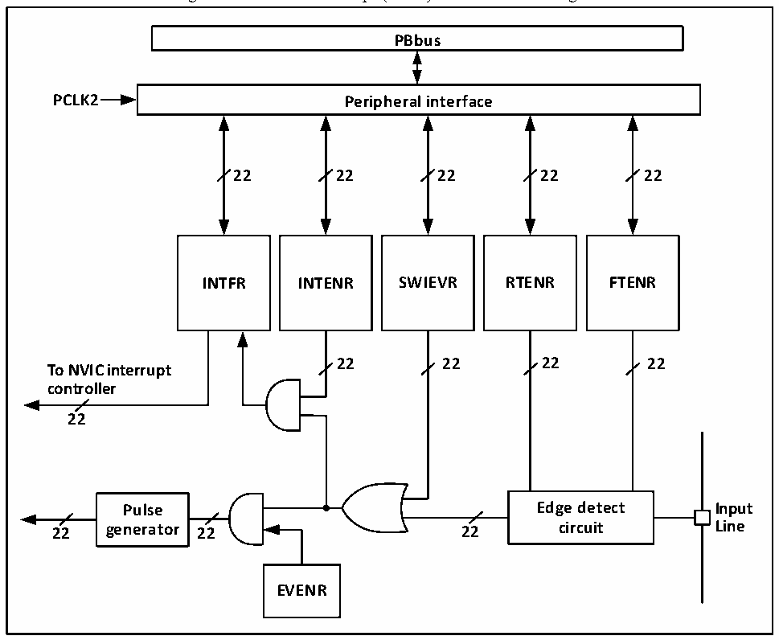

<!-- source-page: 99 -->

[← p.98](0098.md) · [index](../README.md) · [PDF p.99](https://ch32-riscv-ug.github.io/CH32V20x/datasheet_en/CH32FV2x_V3xRM.PDF#page=99) · [p.100 →](0100.md)

<!-- header: CH32F/V20x_V30x_V31x Series Reference Manual https://wch-ic.com -->

## 9.4 External Interrupt and Event Controller (EXTI)

### 9.4.1 Overview

Figure 9-1 External interrupt (EXTI) interface block diagram  
 <!-- rendered from the PDF; verify at https://ch32-riscv-ug.github.io/CH32V20x/datasheet_en/CH32FV2x_V3xRM.PDF#page=99 -->

🖼 Text parsed from the figure above

<strong>PBbus</strong>  
<strong>PCLK2 Peripheral interface</strong>  
<strong>22 22 22 22 22</strong>  
<strong>INTFR INTENR SWIEVR RTENR FTENR</strong>  
<strong>22 22 22 22</strong>  
<strong>To NVIC interrupt</strong>  
<strong>controller</strong>  
<strong>22</strong>  
<strong>Pulse Edge detect Input</strong>  
<strong>22 generator 22 22 circuit Line</strong>  
<strong>EVENR</strong>  

Figure shown in Figure 9-1, the trigger source of an external interrupt can be either a software interrupt  
(SWIEVR) or an actual external interrupt channel. The signal of the external interrupt channel is firstly  
filtered by the edge detect circuit. As long as either soft interrupt or external interrupt signal is generated, it  
is output to dual AND gate circuits of event enable and interrupt enable through the OR circuit in the figure.  
As long as the interrupt or the event is enabled, an interrupt or event is generated. 6 registers of EXTI are  
accessed by the processer through PB2 interface.  

### 9.4.2 Wakeup Event

The system can wake up from sleep mode caused by WFE command via wake-up event. The wake-up event  
is generated through the following 2 types of configuration:  
● Enable an interrupt in the peripheral register, but do not enable the interrupt in the NVIC or PEIC of the  
core, and enable the SEVONPEND bit in the core at the same time. Reflected in EXTI, EXTI interrupt  
is enabled, but EXTI interrupt in NVIC or PEIC is not enabled, at the same time, enable the  
SEVONPEND bit. When the CPU is woken up from WFE, the EXTI interrupt flag bit and NVIC/PEIC  
pending bit need to be cleared.  
● Enable an EXTI channel as an event channel. It is not necessary to clear the interrupt flag bit and  
<!-- image: p99-draw-image-00001 bbox=[508.2, 795.0, 527.28, 805.2] -->
<!-- footer: V2.5 94 -->
