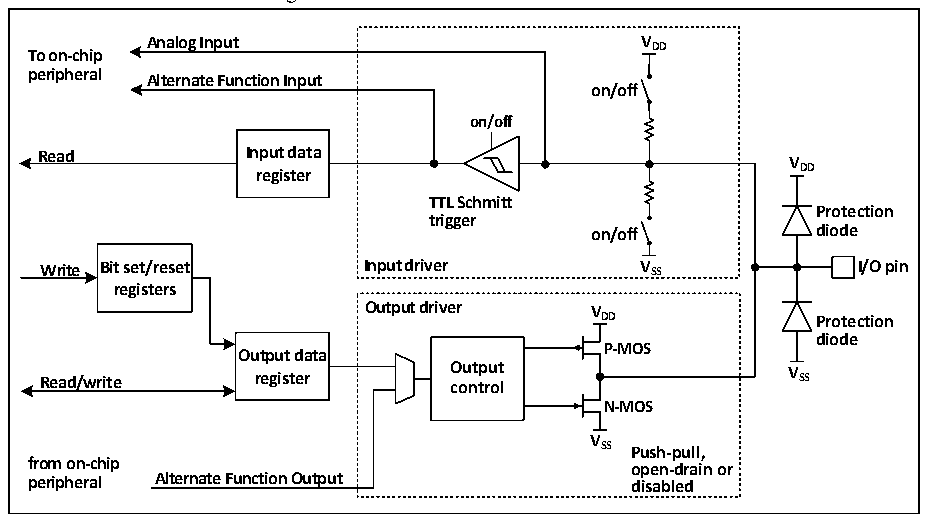

<!-- source-page: 129 -->

[← p.128](0128.md) · [index](../README.md) · [PDF p.129](https://ch32-riscv-ug.github.io/CH32V20x/datasheet_en/CH32FV2x_V3xRM.PDF#page=129) · [p.130 →](0130.md)

<!-- header: CH32F/V20x_V30x_V31x Series Reference Manual https://wch-ic.com -->

# Chapter 10 GPIO and Alternate Functions (GPIO/AFIO)

<strong><em>This chapter applies to the whole family of CH32F20x, CH32V20x, CH32V30x and CH32V31x.</em></strong>  
The GPIO ports can be configured as a variety of input or output modes, with built-in pull-up/pull-down  
resistors which can be switched off, and can be configured as push-pull or open-drain functions. GPIO ports  
also have some other alternate functions.  

## 10.1 Main Features

Each pin of the port can be configured into one of the following modes:  
● Floating input ● Open-drain output  
● Pull-up input ● Push-pull output  
● Pull-down input ● Input and output of alternate function  
● Analog input  
Many pins have alternate functions, and many other peripherals map their own output and input channels to  
these pins. The specific application of these alternate pins needs to be with reference to each peripheral, and  
this chapter shall specify whether these pins are alternate and remapped.  

## 10.2 Function Description

### 10.2.1 Overview

Figure 10-1 Basic structure of GPIO module  
 <!-- rendered from the PDF; verify at https://ch32-riscv-ug.github.io/CH32V20x/datasheet_en/CH32FV2x_V3xRM.PDF#page=129 -->

🖼 Text parsed from the figure above

<strong>Analog Input V DD</strong>  
<strong>To on-chip</strong>  
<strong>peripheral Alternate Function Input</strong>  
<strong>on/off</strong>  
<strong>on/off</strong>  
<strong>Read Input data</strong>  
<strong>V</strong>  
<strong>register DD</strong>  
<strong>TTL Schmitt</strong>  
<strong>Protection</strong>  
<strong>trigger</strong>  
<strong>on/off diode</strong>  
<strong>Write Bit set/reset Input driver V SS I/O pin</strong>  
<strong>registers</strong>  
<strong>Output driver V</strong>  
<strong>DD Protection</strong>  
<strong>diode</strong>  
<strong>P-MOS</strong>  
<strong>Output data</strong>  
<strong>Read/write register O co u n t t p r u o t l V SS</strong>  
<strong>N-MOS</strong>  
<strong>V</strong>  
<strong>SS Push-pull,</strong>  
<strong>from on-chip open-drain or</strong>  
<strong>peripheral Alternate Function Output disabled</strong>  

The IO port structure is as shown in Figure 10-1. Each pin has 2 protection diodes inside the chip, and the IO  
port can be divided into input and output drive modules internally. The weak pull-up and pull-down resistors  
are optional for input drive, and can be connected to analog input peripherals such as AD; if inputted to  
digital peripherals, they need to pass through a TTL Schmitt trigger, and then shall be connected to GPIO  
input register or other alternate peripherals. The output drive has a pair of MOS transistors. The IO port can  
be configured as open-drain or push-pull output by configuring whether the upper and lower MOS  
<!-- image: p129-draw-image-00001 bbox=[508.2, 795.0, 527.28, 805.2] -->
<!-- footer: V2.5 124 -->
