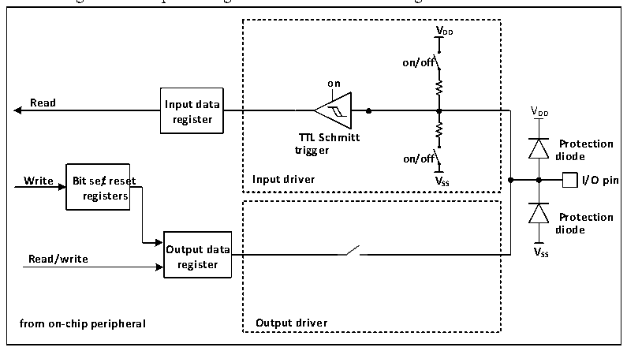
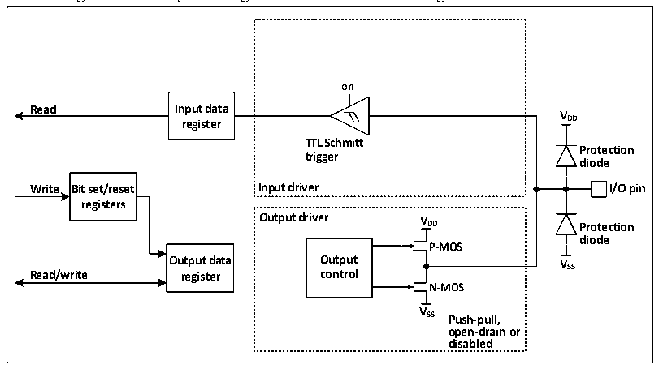

<!-- source-page: 131 -->

[← p.130](0130.md) · [index](../README.md) · [PDF p.131](https://ch32-riscv-ug.github.io/CH32V20x/datasheet_en/CH32FV2x_V3xRM.PDF#page=131) · [p.132 →](0132.md)

<!-- header: CH32F/V20x_V30x_V31x Series Reference Manual https://wch-ic.com -->

### 10.2.6 Input Configuration

Figure 10-2 Input configuration structure block diagram of GPIO module  
 <!-- rendered from the PDF; verify at https://ch32-riscv-ug.github.io/CH32V20x/datasheet_en/CH32FV2x_V3xRM.PDF#page=131 -->

🖼 Text parsed from the figure above

<strong>VDD</strong>  
<strong>on/off</strong>  
<strong>on</strong>  
<strong>Read Input data</strong>  
VDD  
<strong>register</strong>  
<strong>TTL Schmitt</strong>  
<strong>Protection</strong>  
<strong>trigger</strong>  
<strong>on/off diode</strong>  
<strong>Write Bit se/treset Input driver VSS I/O pin</strong>  
<strong>registers</strong>  
<strong>Protection</strong>  
<strong>diode</strong>  
<strong>Output data VSS</strong>  
<strong>Read/write</strong>  
<strong>register</strong>  
<strong>from on-chip peripheral Output driver</strong>  

When the IO port is configured as input mode, the output driver is disconnected, the input pull-up and  
pull-down are optional, and the alternate function and analog input are not connected. The data on each IO  
port is sampled to the input data register at each PB2 clock, and the corresponding bit of the input data  
register is read to obtain the level state of the corresponding pin.  

### 10.2.7 Output Configuration

Figure 10-3 Output configuration structure block diagram of GPIO module  
 <!-- rendered from the PDF; verify at https://ch32-riscv-ug.github.io/CH32V20x/datasheet_en/CH32FV2x_V3xRM.PDF#page=131 -->

🖼 Text parsed from the figure above

<strong>on</strong>  
<strong>Read Input data</strong>  
<strong>V</strong>  
<strong>register DD</strong>  
<strong>TTL Schmitt</strong>  
<strong>Protection</strong>  
<strong>trigger</strong>  
<strong>diode</strong>  
<strong>Write Bit set/reset Input driver I/O pin</strong>  
<strong>registers</strong>  
<strong>Output driver V</strong>  
<strong>DD Protection</strong>  
<strong>diode</strong>  
<strong>P-MOS</strong>  
<strong>Output data Output VSS</strong>  
<strong>Read/write register control</strong>  
<strong>N-MOS</strong>  
<strong>V</strong>  
<strong>SS Push-pull,</strong>  
<strong>open-drain or</strong>  
<strong>disabled</strong>  

When the IO port is configured as output mode, a pair of MOS in the output driver can be configured as  
push-pull or open-drain mode as required, without using alternate function. The pull-up and pull-down  
resistors of the input drive are disabled, the TTL Schmitt trigger is activated, and the level appearing on the  
IO pin will be sampled to the input data register every PB2 clock, so IO status will be obtained by reading  
the input data register. In the push-pull output mode, the value written last time will be obtained through the  
access to the output data register.  
<!-- image: p131-draw-image-00001 bbox=[508.2, 795.0, 527.28, 805.2] -->
<!-- footer: V2.5 126 -->
