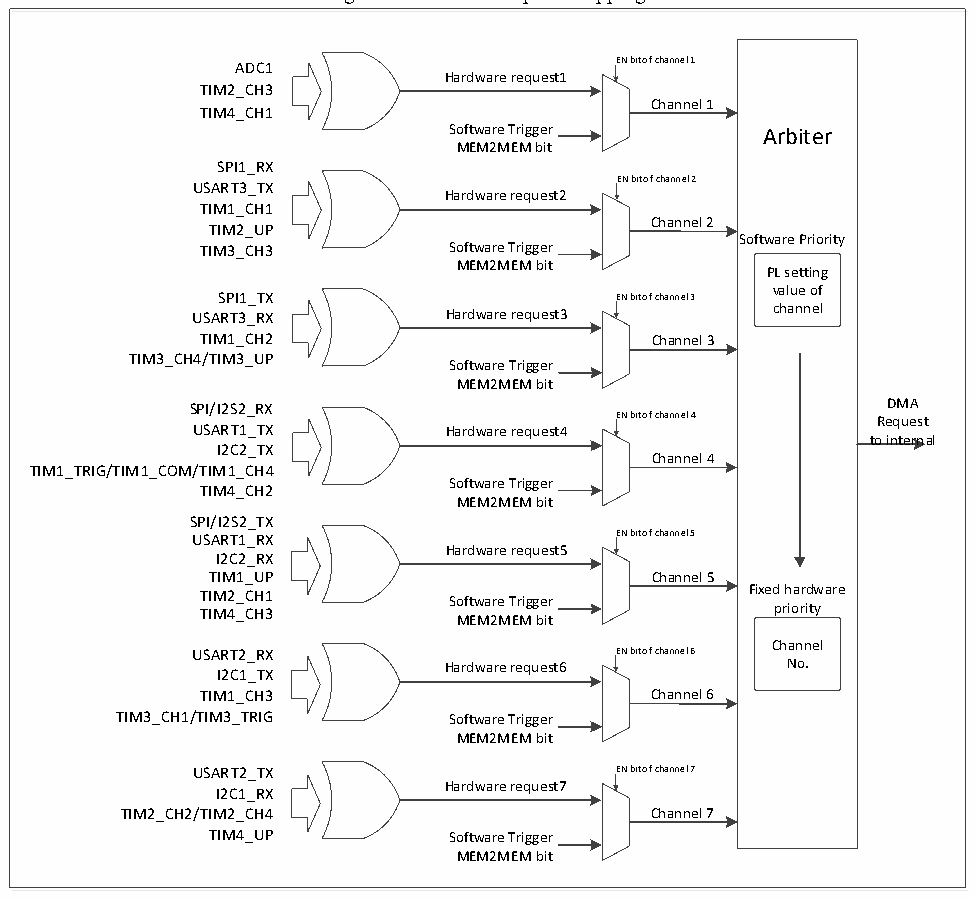

<!-- source-page: 165 -->

[← p.164](0164.md) · [index](../README.md) · [PDF p.165](https://ch32-riscv-ug.github.io/CH32V20x/datasheet_en/CH32FV2x_V3xRM.PDF#page=165) · [p.166 →](0166.md)

<!-- header: CH32F/V20x_V30x_V31x Series Reference Manual https://wch-ic.com -->

Figure 11-1 DMA1 request mapping  
 <!-- rendered from the PDF; verify at https://ch32-riscv-ug.github.io/CH32V20x/datasheet_en/CH32FV2x_V3xRM.PDF#page=165 -->

🖼 Text parsed from the figure above

<!-- image: p165-draw-image-00016 inside the figure -->
ADC1 EN bit of channel 1  
<!-- image: p165-draw-image-00002 inside the figure -->
Hardware request1  
<!-- image: p165-draw-image-00009 inside the figure -->
TIM2_CH3  
Channel 1  
TIM4_CH1  
Software Trigger Arbiter  
MEM2MEM bit  
SPI1_RX  
EN bit of channel 2  
USART3_TX  
<!-- image: p165-draw-image-00003 inside the figure -->
Hardware request2  
<!-- image: p165-draw-image-00010 inside the figure -->
TIM1_CH1  
Channel 2  
TIM2_UP  
Software Priority  
TIM3_CH3 Software Trigger  
MEM2MEM bit PL setting  
value of  
SPI1_TX EN bit of channel 3  
<!-- image: p165-draw-image-00004 inside the figure -->
USART3_RX Hardware request3 channel  
<!-- image: p165-draw-image-00011 inside the figure -->
TIM1_CH2 Channel 3  
TIM3_CH4/TIM3_UP  
Software Trigger  
MEM2MEM bit  
SPI/I2S2_RXENbitofchannel4Request DMA  
<!-- image: p165-draw-image-00005 inside the figure -->
USART1_TX Hardware request4  
<!-- image: p165-draw-image-00012 inside the figure -->
to internal  
I2C2_TX  
Channel 4  
TIM1_TRIG/TIM1_COM/TIM1_CH4  
Software Trigger  
TIM4_CH2  
MEM2MEM bit  
SPI/I2S2_TX  
USART1_RX EN bit of channel 5  
<!-- image: p165-draw-image-00006 inside the figure -->
Hardware request5  
<!-- image: p165-draw-image-00013 inside the figure -->
I2C2_RX  
TIM1_UP Channel 5  
TIM2_CH1 Fixed hardware  
Software Trigger  
TIM4_CH3 priority  
MEM2MEM bit  
Channel  
USART2_RX EN bit of channel 6  
<!-- image: p165-draw-image-00007 inside the figure -->
Hardware request6 No.  
<!-- image: p165-draw-image-00014 inside the figure -->
I2C1_TX  
TIM1_CH3 Channel 6  
TIM3_CH1/TIM3_TRIG Software Trigger  
MEM2MEM bit  
USART2_TX EN bit of channel 7  
<!-- image: p165-draw-image-00008 inside the figure -->
Hardware request7  
<!-- image: p165-draw-image-00015 inside the figure -->
I2C1_RX  
TIM2_CH2/TIM2_CH4 Channel 7  
TIM4_UP Software Trigger  
MEM2MEM bit  

<!-- image: p165-draw-image-00001 bbox=[508.2, 795.0, 527.28, 805.2] -->
<!-- footer: V2.5 160 -->
