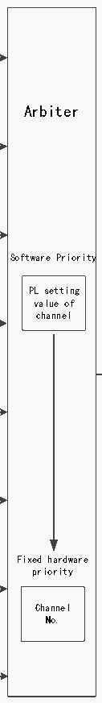

<!-- source-page: 169 -->

[← p.168](0168.md) · [index](../README.md) · [PDF p.169](https://ch32-riscv-ug.github.io/CH32V20x/datasheet_en/CH32FV2x_V3xRM.PDF#page=169) · [p.170 →](0170.md)

<!-- header: CH32F/V20x_V30x_V31x Series Reference Manual https://wch-ic.com -->

# Table 11-3 DMA request mapping

 <!-- p169-draw-image-00016 rendered from the PDF -->

ADC1 EN bit of channel 1  
<!-- image: p169-draw-image-00002 bbox=[193.68, 99.24, 206.76, 125.16] -->
USART4_TX Hardware request1  
<!-- image: p169-draw-image-00009 bbox=[330.72, 104.52, 342.96, 139.08] -->
TIM2_CH3  
Channel 1  
TIM4_CH1  
Software Trigger  
MEM2MEM bit  
SPI1_RX EN bit of channel 2 Arbiter  
<!-- image: p169-draw-image-00003 bbox=[193.68, 152.28, 206.76, 178.08] -->
USART3_TX Hardware request2  
<!-- image: p169-draw-image-00010 bbox=[330.72, 157.32, 342.96, 192.0] -->
TIM1_CH1 Channel 2  
TIM2_UP  
Software Trigger  
TIM3_CH3 MEM2MEM bit  
SPI1_TX EN bit of channel 3  
<!-- image: p169-draw-image-00004 bbox=[193.68, 205.32, 206.76, 231.12] -->
USART3_RX Hardware request3  
<!-- image: p169-draw-image-00011 bbox=[330.84, 210.24, 343.08, 244.8] -->
TIM1_CH2 Channel 3  
TIM3_CH4/TIM3_UP  
Software Trigger  
MEM2MEM bit Software Priority  
SPI2_RX  
EN bit of channel 4  
USART1_TX Hardware request4 PL setting  
<!-- image: p169-draw-image-00005 bbox=[193.68, 258.24, 206.76, 284.16] -->
<!-- image: p169-draw-image-00012 bbox=[330.96, 262.8, 343.08, 297.48] -->
I2C2_TX value of  

🖼 Text parsed from the figure above

Channel 4 channel  

TIM1_CH4/TIM1_TRIG/TIM1_COM  
TIM4_CH2 Software Trigger DMA  
MEM2MEM bit Request  
to  
SPI2_TX  
USART1_RX EN bit of channel 5 internal  
<!-- image: p169-draw-image-00006 bbox=[193.32, 311.28, 206.28, 337.08] -->
Hardware request5  
<!-- image: p169-draw-image-00013 bbox=[330.84, 315.72, 343.08, 350.28] -->
I2C2_RX  
TIM1_UP Channel 5  
TIM2_CH1  
Software Trigger  
TIM4_CH3 MEM2MEM bit  
EN bit of channel 6  
USART2_RX Hardware request6  
<!-- image: p169-draw-image-00007 bbox=[193.32, 364.32, 206.28, 390.12] -->
<!-- image: p169-draw-image-00014 bbox=[330.72, 368.28, 342.96, 402.96] -->
I2C1_TX  
Channel 6  
TIM1_CH3  
TIM3_CH1/TIM3_TRIG Software Trigger  
MEM2MEM bit  
EN bit of channel 7  
USART2_TX Hardware request7 Fixed hardware  
<!-- image: p169-draw-image-00008 bbox=[193.32, 417.24, 206.28, 443.16] -->
<!-- image: p169-draw-image-00015 bbox=[330.72, 421.2, 342.96, 455.76] -->
I2C1_RX priority  
Channel 7  
TIM2_CH2/TIM2_CH4  
TIM4_UP Software Trigger Channel  
MEM2MEM bit  

🖼 Text parsed from the figure above

No.  

EN bit of channel 8  
<!-- image: p169-draw-image-00017 bbox=[193.68, 469.32, 206.76, 495.12] -->
Hardware request8  
<!-- image: p169-draw-image-00018 bbox=[331.2, 473.16, 343.32, 507.84] -->
USART4_RX  
Channel 8  
Software Trigger  
MEM2MEM bit  
QingKe V4C MCUs (CH32V20x_D8W and CH32V20x_D8) and ARM ○R CortexTM-M3 MCUs  
(CH32F20x_D8W). The DMA controller provides 8 channels. Each channel corresponds to multiple  
peripheral requests. By setting the corresponding DMA control bit in the corresponding peripheral register,  
the DMA function of each peripheral can be switched on or off independently.  

<!-- p169-table-001 (table-11-6@1) pages 169-170 -->
<table><caption>Table 11-6 DMA peripheral mapping table by channel</caption><tr><th>Peripheral</th><th>Channel 1</th><th>Channel 2</th><th>Channel 3</th><th>Channel 4</th><th>Channel 5</th><th>Channel 6</th><th>Channel 7</th><th>Channel 8</th></tr><tr><td>ADC1</td><td>ADC1</td><td></td><td></td><td></td><td></td><td></td><td></td><td></td></tr><tr><td>SPI1</td><td></td><td>SPI1_RX</td><td>SPI1_TX</td><td></td><td></td><td></td><td></td><td></td></tr><tr><td>SPI2</td><td></td><td></td><td></td><td>SPI2_RX</td><td>SPI2_TX</td><td></td><td></td><td></td></tr><tr><td>USART1</td><td></td><td></td><td></td><td>USART1_TX</td><td>USART1_RX</td><td></td><td></td><td></td></tr><tr><td>USART2</td><td></td><td></td><td></td><td></td><td></td><td>USART2_RX</td><td>USART2_TX</td><td></td></tr><tr><td>USART3</td><td></td><td>USART3_TX</td><td>USART3_RX</td><td></td><td></td><td></td><td></td><td></td></tr><tr><td>USART4</td><td>USART4_TX</td><td></td><td></td><td></td><td></td><td></td><td></td><td>USART4_RX</td></tr><tr><td>I2C1</td><td></td><td></td><td></td><td></td><td></td><td>I2C1_TX</td><td>I2C1_RX</td><td></td></tr><tr><td>I2C2</td><td></td><td></td><td></td><td>I2C2_TX</td><td>I2C2_RX</td><td></td><td></td><td></td></tr><tr><td>TIM1</td><td></td><td>TIM1_CH1</td><td>TIM1_CH2</td><td style="text-align:left">TIM1_CH4TIM1_TRIGTIM1_COM</td><td>TIM1_UP</td><td>TIM1_CH3</td><td></td><td></td></tr><tr><td>TIM2</td><td>TIM2_CH3</td><td>TIM2_UP</td><td></td><td></td><td>TIM2_CH1</td><td></td><td style="text-align:left">TIM2_CH2TIM2_CH4</td><td></td></tr><tr><td>TIM3</td><td></td><td>TIM3_CH3</td><td style="text-align:left">TIM3_CH4TIM3_UP</td><td></td><td></td><td style="text-align:left">TIM3_CH1TIM3_TRIG</td><td></td><td></td></tr><tr><td>TIM4</td><td>TIM4_CH1</td><td></td><td></td><td>TIM4_CH2</td><td>TIM4_CH3</td><td></td><td>TIM4_UP</td><td></td></tr><tr><td>TIM5</td><td>TIM5_CH2</td><td></td><td>TIM5_CH3</td><td></td><td></td><td>TIM5_CH4</td><td style="text-align:left">TIM5_CH1TIM5_TRIG</td><td>TIM5_UP</td></tr></table>

<!-- image: p169-draw-image-00001 bbox=[508.2, 795.0, 527.28, 805.2] -->
<!-- footer: V2.5 164 -->
