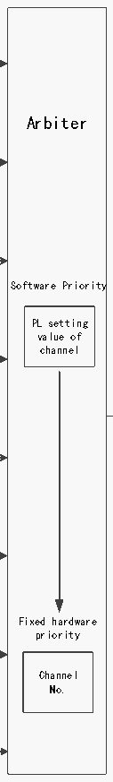

<!-- source-page: 170 -->

[← p.169](0169.md) · [index](../README.md) · [PDF p.170](https://ch32-riscv-ug.github.io/CH32V20x/datasheet_en/CH32FV2x_V3xRM.PDF#page=170) · [p.171 →](0171.md)

<!-- header: CH32F/V20x_V30x_V31x Series Reference Manual https://wch-ic.com -->

> ⬆ **Table continued** — rendered in full at [page 169](0169.md). <!-- p170-table-001 -->

# Table 11-4 DMA request mapping

ADC1  

 <!-- p170-draw-image-00016 rendered from the PDF -->

EN bit of channel 1  
<!-- image: p170-draw-image-00002 bbox=[193.56, 286.08, 206.64, 312.0] -->
USART4_TX  
Hardware request1  
<!-- image: p170-draw-image-00009 bbox=[330.6, 291.36, 342.84, 325.92] -->
TIM2_CH3  
TIM4_CH1 Channel 1  
TIM5_CH2 Software Trigger  
MEM2MEM bit  
SPI1_RX EN bit of channel 2 Arbiter  
<!-- image: p170-draw-image-00003 bbox=[193.56, 339.12, 206.64, 364.92] -->
USART3_TX Hardware request2  
<!-- image: p170-draw-image-00010 bbox=[330.6, 344.16, 342.84, 378.84] -->
TIM1_CH1 Channel 2  
TIM2_UP  
Software Trigger  
TIM3_CH3 MEM2MEM bit  
SPI1_TX EN bit of channel 3  
<!-- image: p170-draw-image-00004 bbox=[193.56, 392.16, 206.64, 417.96] -->
USART3_RX Hardware request3  
<!-- image: p170-draw-image-00011 bbox=[330.72, 397.08, 342.96, 431.64] -->
TIM1_CH2 Channel 3  
TIM3_CH4/TIM3_UP  
Software Trigger  
TIM5_CH3 MEM2MEM bit Software Priority  
SPI2_RX  
EN bit of channel 4  
USART1_TX Hardware request4 PL setting  
<!-- image: p170-draw-image-00005 bbox=[193.56, 445.08, 206.64, 471.0] -->
<!-- image: p170-draw-image-00012 bbox=[330.84, 449.64, 342.96, 484.32] -->
I2C2_TX value of  

🖼 Text parsed from the figure above

Channel 4 channel  

TIM1_CH4/TIM1_TRIG/TIM1_COM  
TIM4_CH2 Software Trigger DMA  
MEM2MEM bit Request  
to  
SPI2_TX  
USART1_RX EN bit of channel 5 internal  
<!-- image: p170-draw-image-00006 bbox=[193.2, 498.12, 206.16, 523.92] -->
Hardware request5  
<!-- image: p170-draw-image-00013 bbox=[330.72, 502.56, 342.96, 537.12] -->
I2C2_RX  
TIM1_UP Channel 5  
TIM2_CH1  
Software Trigger  
TIM4_CH3 MEM2MEM bit  
EN bit of channel 6  
USART2_RX Hardware request6  
<!-- image: p170-draw-image-00007 bbox=[193.2, 551.16, 206.16, 576.96] -->
<!-- image: p170-draw-image-00014 bbox=[330.6, 555.12, 342.84, 589.8] -->
I2C1_TX  
Channel 6  
TIM1_CH3  
TIM3_CH1/TIM3_TRIG Software Trigger  
TIM5_CH4 MEM2MEM bit  
EN bit of channel 7  
USART2_TX Hardware request7 Fixed hardware  
<!-- image: p170-draw-image-00008 bbox=[193.2, 604.08, 206.16, 630.0] -->
<!-- image: p170-draw-image-00015 bbox=[330.6, 608.04, 342.84, 642.6] -->
I2C1_RX priority  
Channel 7  
TIM2_CH2/TIM2_CH4  
TIM4_UP Software Trigger Channel  
TIM5_CH1/TIM5_TRIG MEM2MEM bit No.  
EN bit of channel 8  
<!-- image: p170-draw-image-00017 bbox=[193.56, 656.16, 206.64, 681.96] -->
USART4_RX Hardware request8  
<!-- image: p170-draw-image-00018 bbox=[331.08, 660.0, 343.2, 694.68] -->
TIM5_UP Channel 8  
Software Trigger  
MEM2MEM bit  

## 11.3 Register Description

<!-- image: p170-draw-image-00001 bbox=[508.2, 795.0, 527.28, 805.2] -->
<!-- footer: V2.5 165 -->
