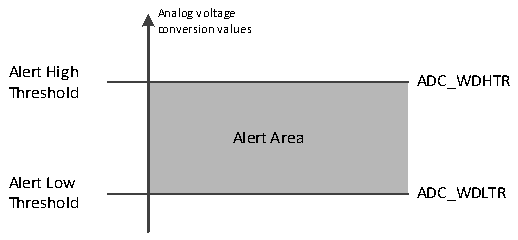

<!-- source-page: 188 -->

[← p.187](0187.md) · [index](../README.md) · [PDF p.188](https://ch32-riscv-ug.github.io/CH32V20x/datasheet_en/CH32FV2x_V3xRM.PDF#page=188) · [p.189 →](0189.md)

<!-- header: CH32F/V20x_V30x_V31x Series Reference Manual https://wch-ic.com -->
<em>3. The discontinuous mode cannot be set for the regular group and the injected group at the same time,</em>  
<em>and the discontinuous mode can only be used for single conversion.</em>  
<em>4. In the intermittent mode of the injection group, the number of injection channels to be converted</em>  
<em>after the external trigger is 1.</em>  
4) Continuous conversion  
In the continuous conversion mode, another conversion is started as soon as the previous ADC conversion is  
completed. The conversion will not stop on the last channel of the selection group, but will continue  
conversion from the first channel of the selection group again. The startup events in this mode include  
external trigger events and the ADON bit is set to 1. After setting the startup, the CONT bit needs to be set to  
1.  
If a regular channel is converted, the conversion data is stored in the ADC_RDATAR register, the conversion  
end flag EOC is set, and if EOCIE is set, an interrupt is generated.  
If an injection channel is converted, the conversion data is stored in the ADC_IDATARx register, the  
injection conversion end flag JEOC is set, and if JEOCIE is set, an interrupt is generated.  

### 12.2.5 Analog Watchdog

If the analog voltage converted by the ADC is lower than the low threshold or higher than the high threshold,  
the AWD analog watchdog status bit will be set. The threshold setting is located in the low 12 active bits in  
the ADC_WDHTR and ADC_WDLTR registers. By setting the AWDIE bit in the ADC_CTLR1 register, the  
corresponding interrupt is allowed to be generated.  

Figure 12-4 Analog watchdog threshold area  
 <!-- rendered from the PDF; verify at https://ch32-riscv-ug.github.io/CH32V20x/datasheet_en/CH32FV2x_V3xRM.PDF#page=188 -->

🖼 Text parsed from the figure above

Analog voltage  
conversion values  
Alert High  
ADC_WDHTR  
<!-- image: p188-draw-image-00002 inside the figure -->
Threshold  
Alert Area  
Alert Low  
ADC_WDLTR  
Threshold  

Configure the AWDSGL, AWDEN, JAWDEN and AWDCH[4:0] bits in the ADC_CTLR1 register to select  
the channel for analog watchdog vigilance. The specific relationship is shown in the following table:  

<!-- p188-table-001 (table-12-4@1) pages 188-189 -->
<table><caption>Table 12-4 Analog Watchdog Channel Selection</caption><tr><th rowspan="2" style="text-align:left">Analog watchdog vigilance channel</th><th colspan="4">ADC_CTLR1 register control bit</th></tr><tr><td>AWDSGL</td><td>AWDEN</td><td>JAWDEN</td><td>AWDCH[4:0]</td></tr><tr><td>Non-vigilance</td><td>Ignore</td><td>0</td><td>0</td><td>Ignore</td></tr><tr><td>All injected channels</td><td>0</td><td>0</td><td>1</td><td>Ignore</td></tr><tr><td>All regular channels</td><td>0</td><td>1</td><td>0</td><td>Ignore</td></tr><tr><td style="text-align:left">All injected and regular channels</td><td>0</td><td>1</td><td>1</td><td>Ignore</td></tr><tr><td>Single injected channel</td><td>1</td><td>0</td><td>1</td><td style="text-align:left">Determine channel No.</td></tr><tr><td>Single regular channel</td><td>1</td><td>1</td><td>0</td><td style="text-align:left">Determine channel No.</td></tr><tr><td>Single injected and regular</td><td>1</td><td>1</td><td>1</td><td>Determine</td></tr><tr><td>channel</td><td></td><td></td><td></td><td>channel No.</td></tr></table>

<!-- image: p188-draw-image-00001 bbox=[508.2, 795.0, 527.28, 805.2] -->
<!-- footer: V2.5 183 -->
