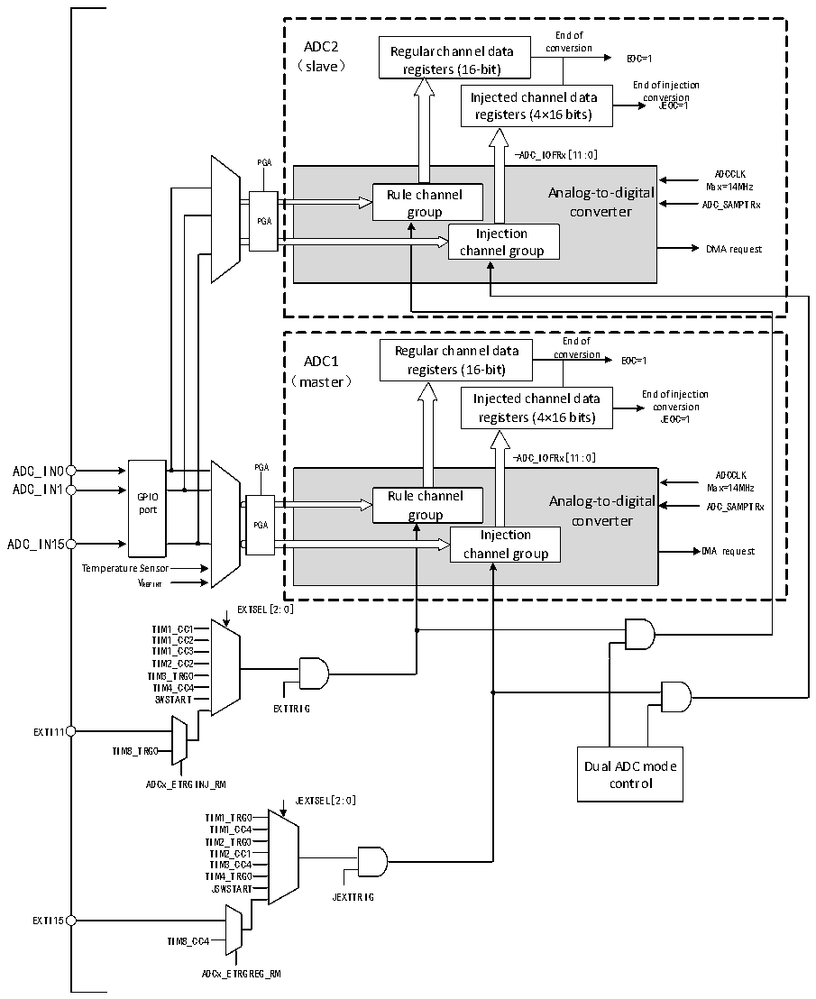

<!-- source-page: 190 -->

[← p.189](0189.md) · [index](../README.md) · [PDF p.190](https://ch32-riscv-ug.github.io/CH32V20x/datasheet_en/CH32FV2x_V3xRM.PDF#page=190) · [p.191 →](0191.md)

<!-- header: CH32F/V20x_V30x_V31x Series Reference Manual https://wch-ic.com -->

Figure 12-5 Dual ADC block diagram  
 <!-- rendered from the PDF; verify at https://ch32-riscv-ug.github.io/CH32V20x/datasheet_en/CH32FV2x_V3xRM.PDF#page=190 -->

🖼 Text parsed from the figure above

End of  
ADC2 Regular channel data conversion  
（slave） registers (16-bit) EOC=1  
End of injection  
Injected channel data conversion  
JEOC=1  
registers (4×16 bits)  
-ADC_IOFRx[11:0]  
PGA  
Rule channel Analog-to-digital group converter Injection channel group  PGA  
ADCCLK  
End of  
ADC1 Regular channel data conversion EOC=1  
registers (16-bit)  
（master）  
Injected channel data End of injection  
conversion  
registers (4×16 bits) JEOC=1  
-ADC_IOFRx[11:0]  
GPIO port  
Rule channel Analog-to-digital group converter Injection channel group  PGA  
ADCCLK  
ADC_IN15  
Temperature Sensor  
VREFINT  
TIM1_CC1  
TIM1_CC2  
TIM1_CC3  
TIM2_CC2  
TIM3_TRG0  
TIM4_CC4  
SWSTART  
EXTTRIG  
EXTI11  
TIM8_TRG0  
Dual ADC mode  
ADCx_ETRGINJ_RM control  
JEXTSEL[2:0]  
TIM1_TRG0  
TIM1_CC4  
TIM2_TRG0  
TIM2_CC1  
TIM3_CC4  
TIM4_TRG0  
JSWSTART  
JEXTTRIG  
EXTI15  
TIM8_CC4  
ADCx_ETRGREG_RM  

1) Independent mode  
In independent mode, the dual ADC modules do not work synchronously, and each ADC works  
independently.  
2) Injected simultaneous mode  
This mode converts an injected channel group. By setting the IEXTSEL[2:0] bits in the ADC1_CTLR1  
register, the trigger source can be selected. And a simultaneous trigger is provided to ADC2. After  
conversion, the converted data is stored in the ADC_IDATARx registers of each ADC. If an ADC interrupt is  
<!-- image: p190-draw-image-00001 bbox=[508.2, 795.0, 527.28, 805.2] -->
<!-- footer: V2.5 185 -->
