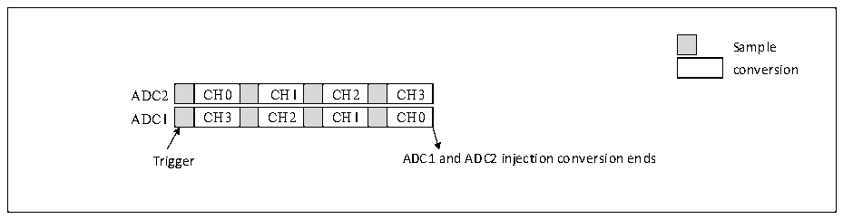
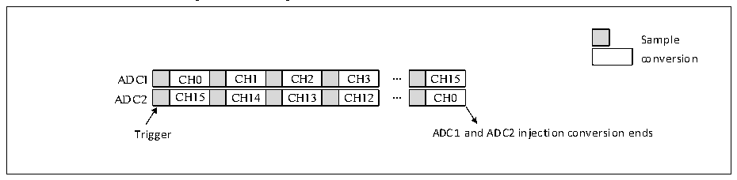

<!-- source-page: 191 -->

[← p.190](0190.md) · [index](../README.md) · [PDF p.191](https://ch32-riscv-ug.github.io/CH32V20x/datasheet_en/CH32FV2x_V3xRM.PDF#page=191) · [p.192 →](0192.md)

<!-- header: CH32F/V20x_V30x_V31x Series Reference Manual https://wch-ic.com -->
enabled, an IEOC interrupt is generated after conversion.  

Figure 12-6 Injected simultaneous mode on 4 channels  
 <!-- rendered from the PDF; verify at https://ch32-riscv-ug.github.io/CH32V20x/datasheet_en/CH32FV2x_V3xRM.PDF#page=191 -->

🖼 Text parsed from the figure above

Sample  
conversion  
CH0  CH1  CH2  CH3  CH3  CH2  CH1  CH0  
Trigger ADC1 and ADC2 injection conversion ends  

<em>Note: 1. Do not convert the same channel on the 2 ADCs.</em>  
<em>2. In simultaneous mode, to ensure that the conversion of the 2 groups can be completed each time, the</em>  
<em>conversion groups of ADC1 and ADC2 should have the same time, or the time of the longer conversion</em>  
<em>group is less than the trigger time interval.</em>  
3) Regular simultaneous mode  
This mode is performed on a regular channel group. By setting the REXTSEL[2:0] bits in the  
ADC1_CTLR1 register, the trigger source can be selected. And a simultaneous trigger is provided to ADC2.  
After conversion, a 32-bit DMA transfer request is generated, which transfers the data in the  
ADC1_RDATAR register to SRAM, and the high 16 bits contain the ADC2 converted data, the low 16 bits  
contain the ADC1 converted data. If an ADC interrupt is enabled, an EOC interrupt is generated.  

Figure 12-7 Regular simultaneous mode on 16 channels  
 <!-- rendered from the PDF; verify at https://ch32-riscv-ug.github.io/CH32V20x/datasheet_en/CH32FV2x_V3xRM.PDF#page=191 -->

🖼 Text parsed from the figure above

Sample  
conversion  
CH0  CH1  CH2  CH3  CH15  CH14  CH13  CH12  
CH15  CH0  
Trigger ADC1 and ADC2 injection conversion ends  

<em>Note: 1. Do not convert the same channel on ADC1 and ADC2;</em>  
<em>2. In simultaneous mode, to ensure that the conversion of the 2 groups can be completed each time, the</em>  
<em>conversion groups of ADC1 and ADC2 should have the same time, or the time of the longer conversion</em>  
<em>group is less than the trigger time interval.</em>  
4) Fast interleaved mode  
This mode only applies to a regular channel (Usually only one channel). By setting the REXTSEL[2:0] bits  
in the ADC1_CTLR1 register, the trigger source can be selected. After a trigger occurs, ADC2 starts  
conversion immediately, while ADC1 starts conversion after a delay of 7 ADC clock cycles. If both ADC1  
and ADC2 enable continuous mode (The CONT bit is set), continuous interleaved conversion is performed  
on regular channel. If an interrupt is enabled, ADC1 generates an EOC interrupt. If both ADC1 and ADC2  
enable DMA, a 32-bit DMA transfer request is generated, which transfers the data in the ADC1_RDATAR  
register to SRAM, and the high 16 bits contain the ADC2 converted data, the low 16 bits contain the ADC1  
converted data.  
<!-- image: p191-draw-image-00001 bbox=[508.2, 795.0, 527.28, 805.2] -->
<!-- footer: V2.5 186 -->
