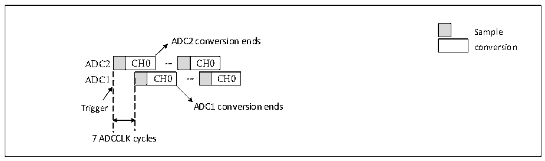
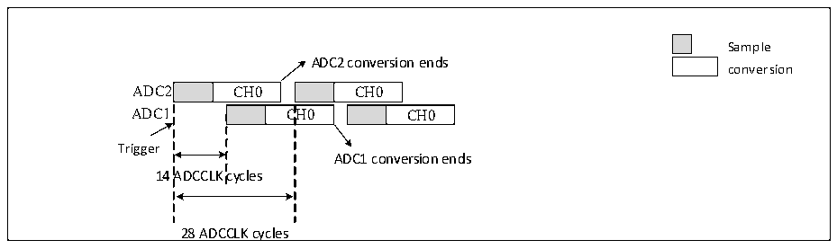

<!-- source-page: 192 -->

[← p.191](0191.md) · [index](../README.md) · [PDF p.192](https://ch32-riscv-ug.github.io/CH32V20x/datasheet_en/CH32FV2x_V3xRM.PDF#page=192) · [p.193 →](0193.md)

<!-- header: CH32F/V20x_V30x_V31x Series Reference Manual https://wch-ic.com -->

Figure 12-8 Fast interleaved mode on 1 channel in continuous conversion mode  
 <!-- rendered from the PDF; verify at https://ch32-riscv-ug.github.io/CH32V20x/datasheet_en/CH32FV2x_V3xRM.PDF#page=192 -->

🖼 Text parsed from the figure above

Sample  
ADC2 conversion ends  
conversion  
CH0  CH0  CH0  
CH0  
7 ADCCLK cycles  

<em>Note: The sampling time should be less than 7 ADC clock cycles, to avoid the overlap between ADC1 and</em>  
<em>ADC2 sampling phases in the event that they convert the same channel.</em>  
5) Slow interleaved mode  
This mode only applies to a regular channel (Only one channel). By setting the REXTSEL[2:0] bits in the  
ADC1_CTLR1 register, the trigger source can be selected. After a trigger occurs, ADC2 starts conversion  
immediately, while ADC1 starts conversion after a delay of 14 ADC clock cycles, and ADC2 starts again  
after a second delay of 14 ADC clock cycles, and so on. If an interrupt is enabled, ADC1 generates an EOC  
interrupt. If both ADC1 and ADC2 enable DMA, a 32-bit DMA transfer request is generated, which transfers  
the data in the ADC1_RDATAR register to SRAM, and the high 16 bits contain the ADC2 converted data,  
the low 16 bits contain the ADC1 converted data.  

Figure 12-9 Slow interleaved mode on 1 channel  
 <!-- rendered from the PDF; verify at https://ch32-riscv-ug.github.io/CH32V20x/datasheet_en/CH32FV2x_V3xRM.PDF#page=192 -->

🖼 Text parsed from the figure above

Sample  
ADC2 conversion ends  
conversion  
CH0  
CH0  C  CH0  
CH0  
Trigger  
ADC1 conversion ends  
14 ADCCLK cycles  
28 ADCCLK cycles  

<em>Note: 1. The sampling time should be less than 14 ADC clock cycles, to avoid an overlap with the next</em>  
<em>conversion;</em>  
<em>2. After 28 ADC clock cycles, a new ADC2 start is generated automatically;</em>  
<em>3.The CONT bit cannot be set.</em>  
6) Alternate trigger mode  
This mode only applies to an injected channel group. By setting the REXTSEL[2:0] bits in the  
ADC1_CTLR1 register, the trigger source can be selected. When the first trigger occurs, all injected group  
channels in ADC1 are converted. When the second trigger occurs, all injected group channels in ADC2 are  
converted. And so on. If an interrupt is enabled, an IEOC interrupt is generated after all injected group  
channels in ADC1 are converted. If an interrupt is enabled, an IEOC interrupt is generated after all injected  
group channels in ADC2 are converted.  
<!-- image: p192-draw-image-00001 bbox=[508.2, 795.0, 527.28, 805.2] -->
<!-- footer: V2.5 187 -->
