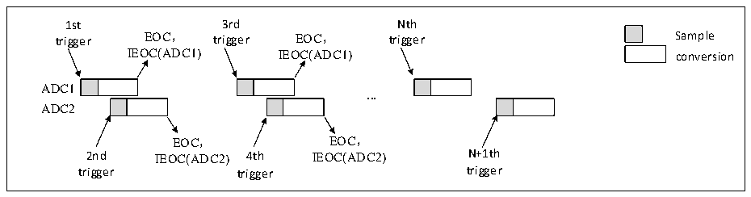
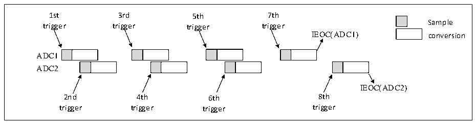
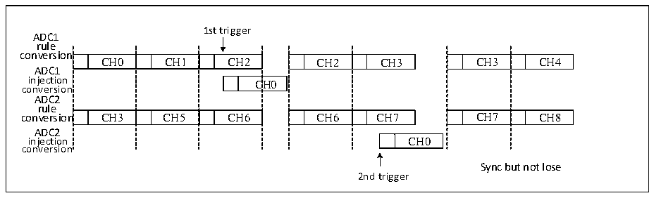

<!-- source-page: 193 -->

[← p.192](0192.md) · [index](../README.md) · [PDF p.193](https://ch32-riscv-ug.github.io/CH32V20x/datasheet_en/CH32FV2x_V3xRM.PDF#page=193) · [p.194 →](0194.md)

<!-- header: CH32F/V20x_V30x_V31x Series Reference Manual https://wch-ic.com -->

Figure 12-10 Alternate trigger: injected channel group of each ADC  
 <!-- rendered from the PDF; verify at https://ch32-riscv-ug.github.io/CH32V20x/datasheet_en/CH32FV2x_V3xRM.PDF#page=193 -->

🖼 Text parsed from the figure above

1st 3rd Nth  
trigger EOC， trigger EOC， trigger Sample  
IEOC(ADC1) IEOC(ADC1) conversion  
ADC1  
<strong>...</strong>  
ADC2  
EOC， EOC，  
2nd IEOC(ADC2) 4th IEOC(ADC2) N+1th  
trigger trigger trigger  

If the injected discontinuous mode is enabled, when the first trigger occurs, the first injected channel in  
ADC1 is converted. When the second trigger occurs, the first injected channel in ADC2 is converted. And so  
on. If an interrupt is enabled, an IEOC interrupt is generated after all injected group channels in ADC1 are  
converted. If an interrupt is enabled, an IEOC interrupt is generated after all injected group channels in  
ADC2 are converted.  

Figure 12-11 Alternate trigger: injected channel group of each ADC in discontinuous mode  
 <!-- rendered from the PDF; verify at https://ch32-riscv-ug.github.io/CH32V20x/datasheet_en/CH32FV2x_V3xRM.PDF#page=193 -->

🖼 Text parsed from the figure above

1st 3rd 5th 7th  
Sample  
trigger trigger trigger trigger  
IEOC(ADC1) conversion  
ADC1  
ADC2  
IEOC(ADC2)  
2nd 4th 6th 8th  
trigger trigger trigger trigger  

7) Regular simultaneous mode + Injected simultaneous mode  
This mode can interrupt simultaneous conversion of a regular group to start simultaneous conversion of an  
injected group. In this mode, the conversion groups of ADC1 and ADC2 should have the same time, or the  
time of the longer conversion group is less than the trigger time interval.  
8) Regular simultaneous mode + Alternate trigger mode  
This mode can interrupt simultaneous conversion of a regular group to start alternate trigger conversion of an  
injected group. When an injected event occurs, alternate trigger conversion starts immediately. If the regular  
conversion is already running, the regular conversion of both ADCs is stopped, and it is resumed  
synchronously at the end of the injected conversion.  

Figure 12-12 Alternate trigger conversion in regular simultaneous mode  
 <!-- rendered from the PDF; verify at https://ch32-riscv-ug.github.io/CH32V20x/datasheet_en/CH32FV2x_V3xRM.PDF#page=193 -->

🖼 Text parsed from the figure above

1st trigger  
ADC1  
rule  
conversion  
CH0  CH1  CH2  C  n  CH3  CH5  CH6  
CH2  CH3  CH6  CH7  
CH3  CH4  CH7  CH8  
ADC1  
C  CH0  
conversion  
ADC2  
rule  
ADC2  
CH0  
injection CH0  
conversion  
Sync but not lose  
2nd trigger  

<!-- image: p193-draw-image-00001 bbox=[508.2, 795.0, 527.28, 805.2] -->
<!-- footer: V2.5 188 -->
