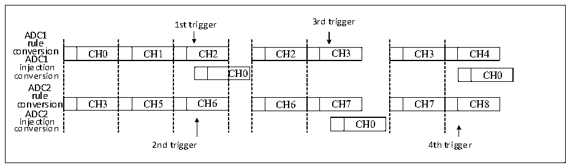
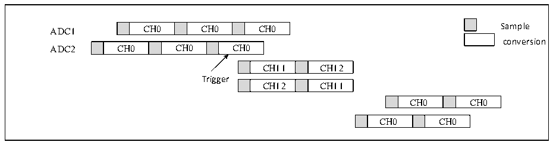

<!-- source-page: 194 -->

[← p.193](0193.md) · [index](../README.md) · [PDF p.194](https://ch32-riscv-ug.github.io/CH32V20x/datasheet_en/CH32FV2x_V3xRM.PDF#page=194) · [p.195 →](0195.md)

<!-- header: CH32F/V20x_V30x_V31x Series Reference Manual https://wch-ic.com -->
<em>Note: In this mode, the conversion groups of ADC1 and ADC2 should have the same time, or the time of the</em>  
<em>longer conversion group is less than the trigger time interval.</em>  
If a trigger occurs during an injected conversion that has interrupted a regular conversion, it will be ignored.  
The Figure 12-13 shows the behavior in this case (The second trigger is ignored).  

Figure 12-13 Trigger event occurring during injected conversion  
 <!-- rendered from the PDF; verify at https://ch32-riscv-ug.github.io/CH32V20x/datasheet_en/CH32FV2x_V3xRM.PDF#page=194 -->

🖼 Text parsed from the figure above

1st trigger 3rd trigger  
ADC1  
rule  
conversion CH0 CH1 CH2 CH2 CH3 CH3 CH4  
CH0  CH1  CH2  C  CH3  CH5  CH6  
CH2  CH3  CH6  CH7  
CH3  CH4  CH7  CH8  
ADC1  
injection  
C  CH0  
CH0  
ADC2  
rule  
ADC2  
CH0  
injection CH0  
conversion  
2nd trigger 4th trigger  

9) Injected simultaneous mode + Interleaved mode  
In this mode, an injected conversion can stop the interleaved conversion. When an injected event occurs, the  
interleaved conversion is interrupted, and the injected conversion starts. After injected conversion, the  
interleaved conversion is resumed.  

Figure 12-14 Injected group conversion during interleaved conversion  
 <!-- rendered from the PDF; verify at https://ch32-riscv-ug.github.io/CH32V20x/datasheet_en/CH32FV2x_V3xRM.PDF#page=194 -->

🖼 Text parsed from the figure above

CH0  CH0  CH0  
ADC1 CH0 CH0 CH0 Sample  
conversion  
CH0  CH0  CH0  
CH11  CH12  
Trigger  
CH12  CH11  
CH0  CH0  
CH0  CH0  

<em>Note: When the ADC clock prescaler is set to 4, the sampling interval is 8 ADC clock cycles followed by 6</em>  
<em>ADC clock cycles, instead of 7 ADC clock cycles followed by 7 ADC clock cycles.</em>  

## 12.3 Register Description

<!-- p194-table-014 (table-12-5@1) pages 194-195 -->
<table><caption>Table 12-5 ADC1 registers</caption><tr><th>Name</th><th>Access address</th><th>Description</th><th>Reset value</th></tr><tr><td>R32_ADC1_STATR</td><td>0x40012400</td><td>ADC1 status register</td><td>0x00000000</td></tr><tr><td>R32_ADC1_CTLR1</td><td>0x40012404</td><td>ADC1 control register1</td><td>0x00000000</td></tr><tr><td>R32_ADC1_CTLR2</td><td>0x40012408</td><td>ADC1 control register 2</td><td>0x00000000</td></tr><tr><td>R32_ADC1_SAMPTR1</td><td>0x4001240C</td><td>ADC1 sample time configuration register1</td><td>0x00000000</td></tr><tr><td>R32_ADC1_SAMPTR2</td><td>0x40012410</td><td>ADC1 sample time configuration register2</td><td>0x00000000</td></tr><tr><td>R32_ADC1_IOFR1</td><td>0x40012414</td><td style="text-align:left">ADC1 injected channel data offset register1</td><td>0x00000000</td></tr><tr><td>R32_ADC1_IOFR2</td><td>0x40012418</td><td style="text-align:left">ADC1 injected channel data offset register2</td><td>0x00000000</td></tr><tr><td>R32_ADC1_IOFR3</td><td>0x4001241C</td><td style="text-align:left">ADC1 injected channel data offset register3</td><td>0x00000000</td></tr><tr><td>R32_ADC1_IOFR4</td><td>0x40012420</td><td style="text-align:left">ADC1 injected channel data offset register4</td><td>0x00000000</td></tr><tr><td>R32_ADC1_WDHTR</td><td>0x40012424</td><td>ADC1 watchdog high threshold register</td><td>0x00000FFF</td></tr><tr><td>R32_ADC1_WDLTR</td><td>0x40012428</td><td>ADC1 watchdog low threshold register</td><td>0x00000000</td></tr><tr><td>R32_ADC1_RSQR1</td><td>0x4001242C</td><td>ADC1 regular channel sequence register1</td><td>0x00000000</td></tr><tr><td>R32_ADC1_RSQR2</td><td>0x40012430</td><td>ADC1 regular channel sequence register2</td><td>0x00000000</td></tr><tr><td>R32_ADC1_RSQR3</td><td>0x40012434</td><td>ADC1 regular channel sequence register3</td><td>0x00000000</td></tr><tr><td>R32_ADC1_ISQR</td><td>0x40012438</td><td>ADC1 injected channel sequence register</td><td>0x00000000</td></tr><tr><td>R32_ADC1_IDATAR1</td><td>0x4001243C</td><td>ADC1 injected data register1</td><td>0x00000000</td></tr><tr><td>R32_ADC1_IDATAR2</td><td>0x40012440</td><td>ADC1 injected data register2</td><td>0x00000000</td></tr><tr><td>R32_ADC1_IDATAR3</td><td>0x40012444</td><td>ADC1 injected data register3</td><td>0x00000000</td></tr><tr><td>R32_ADC1_IDATAR4</td><td>0x40012448</td><td>ADC1 injected data register4</td><td>0x00000000</td></tr><tr><td>R32_ADC1_RDATAR</td><td>0x4001244C</td><td>ADC1 regular data register</td><td>0x00000000</td></tr><tr><td>R32_ADC1_AUX</td><td>0x40012454</td><td>ADC1 sample time register</td><td>0x00000000</td></tr></table>

<!-- image: p194-draw-image-00001 bbox=[508.2, 795.0, 527.28, 805.2] -->
<!-- footer: V2.5 189 -->
