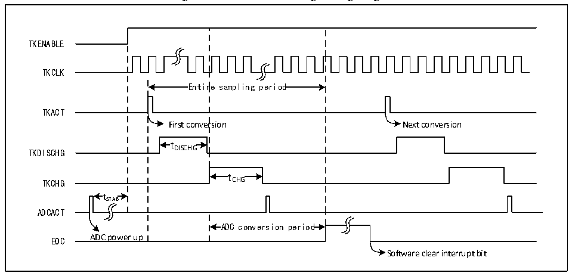

<!-- source-page: 207 -->

[← p.206](0206.md) · [index](../README.md) · [PDF p.207](https://ch32-riscv-ug.github.io/CH32V20x/datasheet_en/CH32FV2x_V3xRM.PDF#page=207) · [p.208 →](0208.md)

<!-- header: CH32F/V20x_V30x_V31x Series Reference Manual https://wch-ic.com -->

# Chapter 13 Touch Key Detection (TKEY)

<strong><em>This chapter applies to the whole family of CH32F20x, CH32V20x, CH32V30x and CH32V31x.</em></strong>  
The Touch Key Detection control (TKEY) unit implements the touch-key detection function by converting  
the capacitance to the voltage for sampling, with the help of the voltage conversion function of the ADC  
module. The detection channel multiplexes the 16 external channels of the ADC. It implements the  
touch-key detection through the single conversion mode of ADC.  

## 13.1 Functional Description

● Enable TKEY  
For TKEY detection, the ADC module is needed. To enable TKEY, ensure that ADC is powered on  
(ADON=1), then set the TKENABLE bit in the ADC_CTLR1 register to 1. The charge current of the TKEY  
module can be adjusted by the TKITUNE bit.  
TKEY only supports single 1-channel conversion mode, which configures the channel to be converted as the  
first channel in the regular sequence of ADC. And software starts conversion (Write to TKEY_ACT_DCG).  
<em>Note: When the TKEY conversion is disabled, ADC channel configuration function can still be retained.</em>  

Figure 13-1 TKEY working timing diagram  
 <!-- rendered from the PDF; verify at https://ch32-riscv-ug.github.io/CH32V20x/datasheet_en/CH32FV2x_V3xRM.PDF#page=207 -->

🖼 Text parsed from the figure above

TKENABLE  
TKCLK  
Entir  re sampling period  Entir  re sampling period  
TKACT  
First conversion Next conversion  
t DISCHG  tDISCHG  
TKDISCHG DISCHG  
t CHG  tCHG  
TKCHG CHG  
t  tSTAB  
ADCACT  
ADC conversion period  ADC conversion period  
EOC ADC power up  
Software clear interrupt bit  

● Programmable sampling time  
For TKEY unit conversion, multiple ADCCLK clock cycles (tDISCHG) need to be used for discharge, then  
charge and sample voltage on the channel through multiple ADCCLK cycles (tCHG). The charge cycle is  
the total of the configuration values of the TKCGx[2:0] bits in the TKEY_CHARGE1register and the  
TKEY_CHARGE2 register and the offset value of TKEY_CHGOFFSET. For each channel, different charge  
cycles can be used to adjust sampling voltage.  

## 13.2 TKEY Operations

TKEY detection is an extended function of ADC module. Its working principle is to change the capacitance  
sensed by the hardware channel through &quot;touch&quot; and &quot;non-touch&quot; methods, and then to convert the  
capacitance change into the voltage change and finally convert into a digital value by the ADC module.  
<!-- image: p207-draw-image-00001 bbox=[508.2, 795.0, 527.28, 805.2] -->
<!-- footer: V2.5 202 -->
