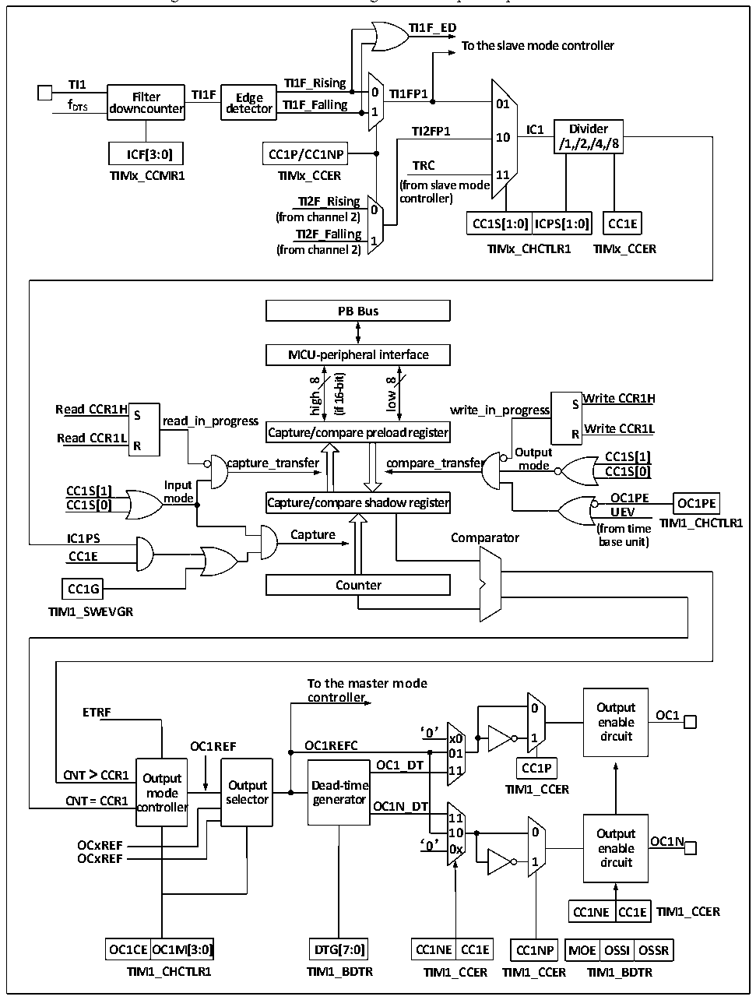

<!-- source-page: 215 -->

[← p.214](0214.md) · [index](../README.md) · [PDF p.215](https://ch32-riscv-ug.github.io/CH32V20x/datasheet_en/CH32FV2x_V3xRM.PDF#page=215) · [p.216 →](0216.md)

<!-- header: CH32F/V20x_V30x_V31x Series Reference Manual https://wch-ic.com -->

Figure 14-3 Structure block diagram of compare/capture channel  
 <!-- rendered from the PDF; verify at https://ch32-riscv-ug.github.io/CH32V20x/datasheet_en/CH32FV2x_V3xRM.PDF#page=215 -->

🖼 Text parsed from the figure above

<strong>TI1F_ED</strong>  
<strong>To the slave mode controller</strong>  
<strong>TI1 TI1F_Rising</strong>  
<strong>Filter TI1F Edge 0 TI1FP1</strong>  
<strong>f DTS downcounter detector TI1F_Falling 1 01</strong>  
<strong>TI2FP1 IC1 Divider</strong>  
<strong>10</strong>  
<strong>/1,/2,/4,/8</strong>  
<strong>ICF[3:0] CC1P/CC1NP</strong>  
<strong>TRC</strong>  
<strong>TIMx_CCMR1 TIMx_CCER 11</strong>  
<strong>(from slave mode</strong>  
<strong>TI2F_Rising controller)</strong>  
<strong>0</strong>  
<strong>(from channel 2)</strong>  
<strong>CC1S[1:0] ICPS[1:0] CC1E</strong>  
<strong>TI2F_Falling</strong>  
<strong>1</strong>  
<strong>(from channel 2) TIMx_CHCTLR1 TIMx_CCER</strong>  
<strong>PB Bus</strong>  
<strong>MCU-peripheral interface</strong>  
<strong>16-bit)</strong>  
<strong>8</strong>  
<strong>8</strong>  
<strong>wol Write CCR1H</strong>  
<strong>high</strong>  
<strong>Read CCR1H write_in_progress S S</strong>  
<strong>(if</strong>  
<strong>read_in_progress</strong>  
<strong>Write CCR1L Read CCR1L R</strong>  
<strong>Capture/compare preload register</strong>  
<strong>R</strong>  
<strong>Output CC1S[1]</strong>  
<strong>capture_transfer compare_transfer mode</strong>  
<strong>CC1S[0]</strong>  
<strong>Input</strong>  
<strong>CC1S[1]</strong>  
<strong>mode OC1PE CC1S[0] OC1PE</strong>  
<strong>Capture/compare shadow register</strong>  
<strong>UEV</strong>  
<strong>TIM1_CHCTLR1</strong>  
<strong>(from time</strong>  
<strong>IC1PS Capture Comparator base unit)</strong>  
<strong>CC1E</strong>  
<strong>CC1G Counter</strong>  
<strong>TIM1_SWEVGR</strong>  
<strong>To the master mode</strong>  
<strong>controller</strong>  
<strong>ETRF 0 Output OC1</strong>  
<strong>enable</strong>  
‘0’  
<strong>x0 1 circuit</strong>  
<strong>OC1REF OC1REFC</strong>  
<strong>01</strong>  
Output selector  
D  Dead-time generator  
<strong>controller OC1N_DT</strong>  
<strong>11</strong>  
<strong>10 0 Output</strong>  
<strong>OCxREF ‘0’ 0x enable OC1N</strong>  
<strong>OCxREF 1 circuit</strong>  
CC1NE  CC1E  
OC1CE  OC1M[3:0  
CC1NE  CC1E  
MOE  OSSI  OSSR  
<strong>OC1CEOC1M[3:0] DTG[7:0] CC1NE CC1E CC1NP MOE OSSI OSSR</strong>  
<strong>TIM1_CHCTLR1 TIM1_BDTR TIM1_CCER TIM1_CCER TIM1_BDTR</strong>  

The block diagram of the compare/capture channel is as shown in Figure 14-3. After the signal is inputted  
from the channel x pin, it can be selected as TIx (the source of TI1 may be more than CH1. See the timer  
structure block diagram 14-1). Take TI1 as an example: TI1 passes through the filter (ICF[3:0]) to generate  
TI1F, and then is divided into TI1F_Rising and TI1F_Falling after passing through the edge detector. These  
2 signals are selected (CC1P) to generate TI1FP1, TI1FP1 and TI2FP1 from channel 2 are sent to CC1S  
<!-- image: p215-draw-image-00001 bbox=[508.2, 795.0, 527.28, 805.2] -->
<!-- footer: V2.5 210 -->
