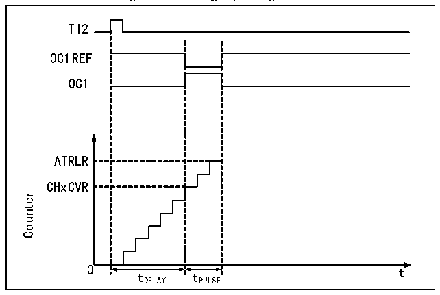

<!-- source-page: 219 -->

[← p.218](0218.md) · [index](../README.md) · [PDF p.219](https://ch32-riscv-ug.github.io/CH32V20x/datasheet_en/CH32FV2x_V3xRM.PDF#page=219) · [p.220 →](0220.md)

<!-- header: CH32F/V20x_V30x_V31x Series Reference Manual https://wch-ic.com -->
to the MOE, OIS, OISN, OSSI and OSSR bits. But OCx and OCxN will not be at the effective level at any  
time. The break event source can come from the break input pin, or it can be a clock failure event, and the  
clock failure event will be generated by CSS (Clock Security System).  
After the system reset, the break function will be disabled by default (MOE bit is low). Setting the BKE bit  
can enable the break function. The polarity of the input break signal can be set by setting BKP. The BKE and  
BKP signals can be written at the same time. There will be an PB clock delay before the actual write, so you  
need to wait for an PB cycle to read the written value correctly.  
When the selected level appears on the break pin, the system will generate the following actions:  
1) The MOE bit is asynchronously cleared, and the output is set to the invalid status, idle status or reset  
status according to the setting of the OSSI bit;  
2) After MOE is cleared, each output channel will output the level determined by OISx;  
3) During the supplementary output: the output will be in an invalid status, depending on the polarity;  
4) If BIE is set, an interrupt will be generated when BIF is set; if the BDE bit is set, a DMA request will be  
generated;  
5) If AOE is set, the MOE bit will be automatically set during the next update of event UEV.  

### 14.3.8 Single Pulse Mode

The single pulse mode can be used to allow the microcontroller to respond to a specific event to generate a  
pulse after a delay. The delay and pulse width are programmable. Setting the OPM bit can make the core  
counter stop when the next update event UEV is generated (the counter turns over to 0).  
As shown in Figure 14-5, it is necessary to detect the beginning of a rising edge on the TI2 input pin. After  
delaying Tdelay, a positive pulse of length Tpulse will be generated on OC1:  

Figure 14-5 Single pulse generation  
 <!-- rendered from the PDF; verify at https://ch32-riscv-ug.github.io/CH32V20x/datasheet_en/CH32FV2x_V3xRM.PDF#page=219 -->

🖼 Text parsed from the figure above

TI2  
OC1REF  
OC1  
ATRLR  
CHxCVR  
Counter  
0 t  
tDELAY tPULSE  

1) Set TI2 as trigger. Set CC2S to 01b and map TI2FP2 to TI2; set CC2P bit to 0b and set TI2FP2 to rising  
edge detection; set TS to 110b and set TI2FP2 as the trigger source; set SMS to 110b, and TI2FP2 is used  
to start the counter;  
2) Tdelay is determined by the value of the compare/capture register, and Tpulse is determined by the value  
of the auto-reload value register and the value of the compare/capture register.  

### 14.3.9 Encoder Mode

The encoder mode is a typical application of the timer. It can be used to access the dual-phase output of the  
encoder. The counting direction of the core counter is synchronized with the rotating shaft of the encoder.  
<!-- image: p219-draw-image-00001 bbox=[508.2, 795.0, 527.28, 805.2] -->
<!-- footer: V2.5 214 -->
