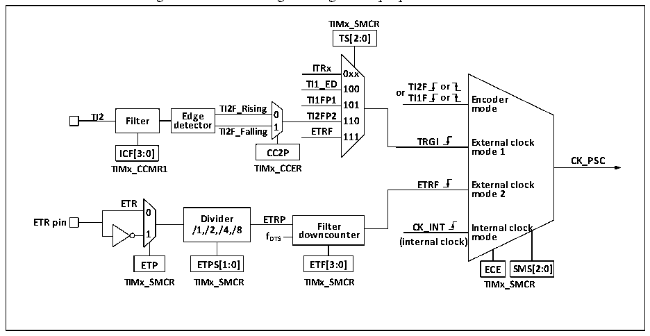

<!-- source-page: 246 -->

[← p.245](0245.md) · [index](../README.md) · [PDF p.246](https://ch32-riscv-ug.github.io/CH32V20x/datasheet_en/CH32FV2x_V3xRM.PDF#page=246) · [p.247 →](0247.md)

<!-- header: CH32F/V20x_V30x_V31x Series Reference Manual https://wch-ic.com -->
counting cycle is completed, CNT will be reloaded with the initial value.  
The general-purpose timer has 4 groups of compare/captures. On each group of compare/capture, pulses can  
be inputted from its dedicated pins or output waveforms to the pins, i.e., the compare/captures support input  
and output modes. The input of each channel of the compare/capture register supports operations such as  
filtering, frequency division and edge detection, and supports mutual triggering between channels, and can  
also provide a clock for the core counter CNT. Each compare/capture has a set of compare/capture register  
(CHxCVR), which supports comparison with the main counter (CNT) so as to output pulse.  

### 15.2.2 Difference between General-purpose Timer and Advanced-control Timer

Compared with the advanced-control timer, the general-purpose timer is lack of the following functions:  
1) The general-purpose timer lacks a repeated counting register that counts the count cycle of core counter.  
2) The compare/capture of general-purpose timer lacks deadband generation and has no complementary  
output.  
3) The general-purpose timer has no break signal mechanism.  
4) The default clock CK_INT of the general-purpose timer comes from PB1, while the CK_INT of the  
advanced-control timer comes from PB2.  

### 15.2.3 Clock Input

This section describes the source of CK_PSC. The clock source part of the general structure block diagram  
of the general-purpose timer is abstracted here.  

Figure 15-2 Block diagram of general-purpose timer source  
 <!-- rendered from the PDF; verify at https://ch32-riscv-ug.github.io/CH32V20x/datasheet_en/CH32FV2x_V3xRM.PDF#page=246 -->

🖼 Text parsed from the figure above

<strong>TIMx_SMCR</strong>  
<strong>TS[2:0]</strong>  
<strong>ITRx</strong>  
<strong>0xx</strong>  
<strong>TI1_ED 100 or TI2F or</strong>  
<strong>TI1FP1 TI1F or Encoder</strong>  
<strong>TI2F_Rising 101 mode</strong>  
<strong>TI2 Filter de E t d e g c e tor TI2F_Falling 0 1 T E I2 T F R P F 2 110</strong>  
<strong>111</strong>  
<strong>TRGI External clock</strong>  
<strong>ICF[3:0] CC2P mode 1</strong>  
<strong>CK_PSC</strong>  
<strong>TIMx_CCMR1 TIMx_CCER</strong>  
<strong>ETRF External clock</strong>  
<strong>mode 2</strong>  
<strong>ETR</strong>  
<strong>0</strong>  
<strong>ETR pin 1 /1 D ,/ i 2 vi , d /4 e , r /8 E f T D R TS P dow F n i c lt o e u r nter (int C e K r _ n I a N l T clock) I m nt o e d r e nal clock</strong>  
<strong>ETP ETPS[1:0] ETF[3:0] ECE SMS[2:0]</strong>  
<strong>TIMx_SMCR TIMx_SMCR TIMx_SMCR TIMx_SMCR</strong>  

The available input clocks can be divided into 4 categories:  
1) External clock pin (ETR) input: ETR→ETRP→ETRF;  
2) Internal PB clock input: CK_INT;  
3) From the compare/capture pin (TIMx_CHx): TIMx_CHx→TIx→TIxFPx; it is also used in encoder mode;  
4) Input from other internal timers: ITRx.  
The actual operation can be divided into 3 categories by determining the input pulse selection of the SMS  
from the CK_PSC source:  
1) Select the internal clock source (CK_INT);  
2) External clock source mode 1;  
<!-- image: p246-draw-image-00001 bbox=[508.2, 795.0, 527.28, 805.2] -->
<!-- footer: V2.5 241 -->
