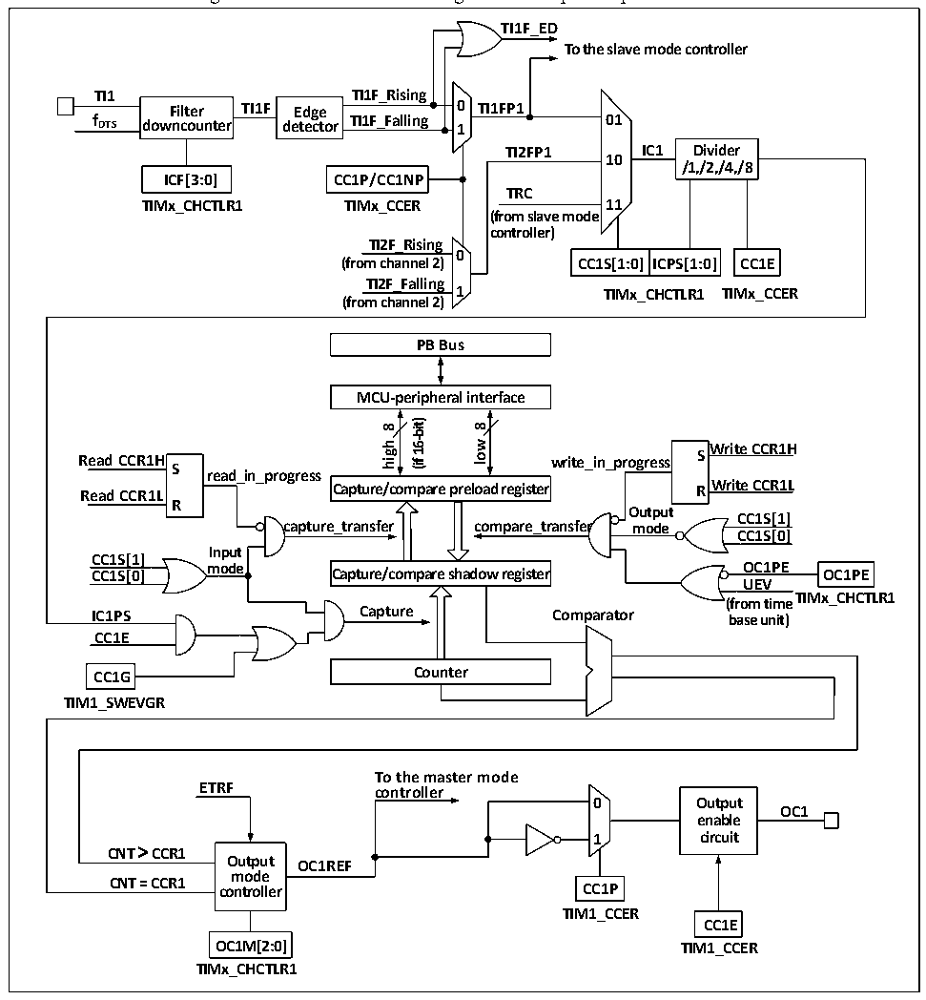

<!-- source-page: 248 -->

[← p.247](0247.md) · [index](../README.md) · [PDF p.248](https://ch32-riscv-ug.github.io/CH32V20x/datasheet_en/CH32FV2x_V3xRM.PDF#page=248) · [p.249 →](0249.md)

<!-- header: CH32F/V20x_V30x_V31x Series Reference Manual https://wch-ic.com -->

Figure 15-3 Structure block diagram of compare/capture channel  
 <!-- rendered from the PDF; verify at https://ch32-riscv-ug.github.io/CH32V20x/datasheet_en/CH32FV2x_V3xRM.PDF#page=248 -->

🖼 Text parsed from the figure above

<strong>TI1F_ED</strong>  
<strong>To the slave mode controller</strong>  
<strong>TI1 TI1F_Rising</strong>  
<strong>Filter TI1F Edge 0 TI1FP1</strong>  
<strong>f DTS downcounter detector TI1F_Falling 1 01</strong>  
<strong>TI2FP1 IC1 Divider</strong>  
<strong>10</strong>  
<strong>/1,/2,/4,/8</strong>  
<strong>ICF[3:0] CC1P/CC1NP</strong>  
<strong>TRC</strong>  
<strong>TIMx_CHCTLR1 TIMx_CCER 11</strong>  
<strong>(from slave mode</strong>  
<strong>controller)</strong>  
<strong>TI2F_Rising</strong>  
<strong>0</strong>  
CC1S[1:0]  ICPS[1:0]  
<strong>(from channel 2) CC1S[1:0] ICPS[1:0] CC1E</strong>  
<strong>TI2F_Falling</strong>  
<strong>1 TIMx_CCER</strong>  
<strong>TIMx_CHCTLR1</strong>  
<strong>(from channel 2)</strong>  
<strong>PB Bus</strong>  
<strong>MCU-peripheral interface</strong>  
<strong>16-bit)</strong>  
<strong>8</strong>  
<strong>8</strong>  
<strong>low</strong>  
<strong>high</strong>  
<strong>Write CCR1H</strong>  
<strong>Read CCR1H write_in_progress S S</strong>  
<strong>(if</strong>  
<strong>read_in_progress</strong>  
<strong>Write CCR1L Read CCR1L R</strong>  
<strong>Capture/compare preload register</strong>  
<strong>R</strong>  
<strong>Output</strong>  
<strong>CC1S[1]</strong>  
<strong>capture_transfer compare_transfer mode</strong>  
<strong>CC1S[0]</strong>  
<strong>Input</strong>  
<strong>CC1S[1]</strong>  
<strong>mode OC1PE CC1S[0] OC1PE</strong>  
<strong>Capture/compare shadow register</strong>  
<strong>UEV</strong>  
<strong>TIMx_CHCTLR1</strong>  
<strong>(from time</strong>  
<strong>IC1PS Capture Comparator base unit)</strong>  
<strong>CC1E</strong>  
<strong>CC1G Counter</strong>  
<strong>TIM1_SWEVGR</strong>  
<strong>To the master mode</strong>  
<strong>ETRF controller</strong>  
<strong>0 Output</strong>  
<strong>OC1</strong>  
<strong>enable</strong>  
<strong>1 circuit</strong>  
<strong>CNT &gt; CCR1</strong>  
<strong>Output OC1REF</strong>  
<strong>mode</strong>  
<strong>CNT = CCR1</strong>  
<strong>controller CC1P</strong>  
<strong>TIM1_CCER</strong>  
<strong>CC1E</strong>  
<strong>OC1M[2:0] TIM1_CCER</strong>  
<strong>TIMx_CHCTLR1</strong>  

After the signal is input from the channel x pin, it can be selected as TIx (the source of TI1 may be more than  
CH1. See Figure 14-1 timer block diagram). Take TI1 as an example: TI1 passes through the filter (ICF[3:0])  
to generate TI1F, and then is divided into TI1F_Rising and TI1F_Falling after passing through the edge  
detector. These 2 signals are selected (CC1P) to generate TI1FP1, and TI1FP1 and TI2FP1 from channel 2  
are sent to CC1S together to be selected as IC1, and then sent to the compare/capture register after going  
through the ICPS frequency division.  
The compare/capture register is composed of preload register and shadow register, and only the preload  
register is operated during reading and writing. In the capture mode, the capture occurs on the shadow  
register, and then copied to the preload register; in the comparison mode, the content of the preload register  
is copied to the shadow register, and then the content of the shadow register is compared with the core  
counter (CNT).  
<!-- image: p248-draw-image-00001 bbox=[508.2, 795.0, 527.28, 805.2] -->
<!-- footer: V2.5 243 -->
