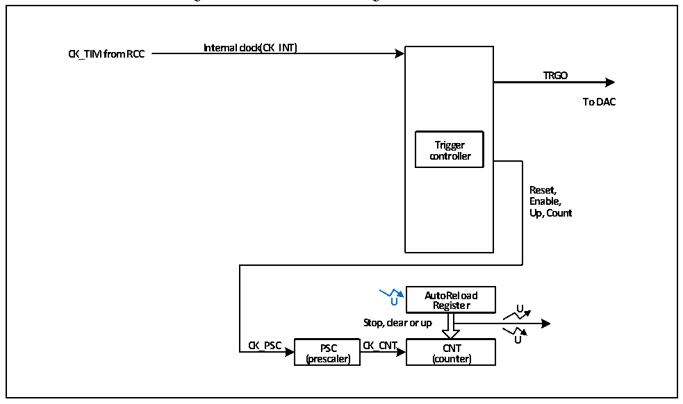

<!-- source-page: 273 -->

[← p.272](0272.md) · [index](../README.md) · [PDF p.273](https://ch32-riscv-ug.github.io/CH32V20x/datasheet_en/CH32FV2x_V3xRM.PDF#page=273) · [p.274 →](0274.md)

<!-- header: CH32F/V20x_V30x_V31x Series Reference Manual https://wch-ic.com -->

# Chapter 16 Basic Timer (BCTM)

<strong><em>This chapter applies to the whole family of CH32F20x, CH32V30x and CH32V31x.</em></strong>  
The basic timer module contains a 16-bit auto-reload timer (TIM6 and TIM7), that can be used to count and  
generate interrupt/DMA request on the update event.  

## 16.1 Main Features

Basic timer features include:  
● 16-bit auto-reload counter, supports upcount  
● 16-bit prescaler, the frequency division factor is dynamically adjustable from 1 to 65536  
● Synchronization circuit to trigger the DAC  
● Interrupt/DMA request generation on the update event  

## 16.2 Principle and Structure

Figure 16-1 Structure block diagram of basic timer  
 <!-- rendered from the PDF; verify at https://ch32-riscv-ug.github.io/CH32V20x/datasheet_en/CH32FV2x_V3xRM.PDF#page=273 -->

🖼 Text parsed from the figure above

<strong>Internal clock(CK_INT)</strong>  
<strong>CK_TIM from RCC</strong>  
<strong>TRGO</strong>  
<strong>To DAC</strong>  
<strong>Trigger</strong>  
<strong>controller</strong>  
<strong>Reset,</strong>  
<strong>Enable,</strong>  
<strong>Up, Count</strong>  
<strong>AutoReload</strong>  
<strong>U Register U</strong>  
<strong>Stop, clear or up</strong>  
<strong>U</strong>  
<strong>CK_PSC PSC CK_CNT CNT</strong>  
<strong>(prescaler) (counter)</strong>  

### 16.2.1 Overview

As shown in Figure 16-1, the structure of the basic timer can be divided into 2 parts: input clock and core  
counter.  
The clock source of basic timer is HB bus clock (CK_INT). These input clock signals become CK_PSC  
clock after various set filtering and frequency division operations, and then they are output to the core  
counter. In addition, these complex clock sources can also be output to DAC peripheral as TRGO.  
The core of the basic timer is a 16-bit counter (CNT). CK_PSC is divided by prescaler (PSC) and becomes  
CK_CNT, finally it is output to CNT. CNT supports upcount, and it has an auto-reload register (ATRLR),  
that reloads the initial value for the CNT every time a count cycle ends.  
<!-- image: p273-draw-image-00001 bbox=[508.2, 795.0, 527.28, 805.2] -->
<!-- footer: V2.5 268 -->
