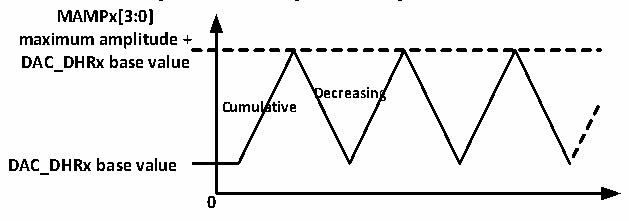
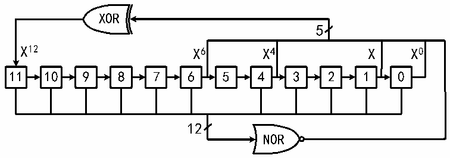

<!-- source-page: 283 -->

[← p.282](0282.md) · [index](../README.md) · [PDF p.283](https://ch32-riscv-ug.github.io/CH32V20x/datasheet_en/CH32FV2x_V3xRM.PDF#page=283) · [p.284 →](0284.md)

<!-- header: CH32F/V20x_V30x_V31x Series Reference Manual https://wch-ic.com -->

Figure 17-4 Triangular wave generation  
 <!-- rendered from the PDF; verify at https://ch32-riscv-ug.github.io/CH32V20x/datasheet_en/CH32FV2x_V3xRM.PDF#page=283 -->

🖼 Text parsed from the figure above

<strong>MAMPx[3:0]</strong>  
<strong>maximum amplitude +</strong>  
<strong>DAC_DHRx base value</strong>  
<strong>Decreasing</strong>  
<strong>Cumulative</strong>  
<strong>DAC_DHRx base value</strong>  
<strong>0</strong>  

### 17.2.5 DAC Noise-wave Generator

The module has a built-in noise-generator that uses the Linear Feedback Shift Register (LFSR) to generate  
pseudo noise with varying amplitude. Set WAVE[1:0] bits to ‘01’ to select the DAC noise generation  
function. Set the MAMPx[3:0] bits in the DAC_CTLR register to select the data of the masked part of the  
LFSR.  
The preload value of the register LFSR is 0xAAA. According to a specific algorithm, the value of this  
register is updated in 3 PB1 clock cycles after each trigger event. Setting the MAMPx[3:0] bits in the  
DAC_CR register can mask part or all of the LFSR data, so that the LSFR value obtained is added to the  
value of DAC_DHRx, and the overflow bit is removed and then written into the DAC_DORx register. If the  
register LFSR value is 0x000, it will inject ‘1’ (Anti-lock mechanism). Set WAVEx[1:0] bit to ‘00’ to reset  
the generation algorithm of LFSR waveform.  
<em>Note: To generate a noise-wave, DAC trigger must be enabled, i.e., setting the TENx bit in the DAC_CTLR</em>  
<em>register to 1.</em>  

Figure 17-5 LFSR register algorithm  
 <!-- rendered from the PDF; verify at https://ch32-riscv-ug.github.io/CH32V20x/datasheet_en/CH32FV2x_V3xRM.PDF#page=283 -->

🖼 Text parsed from the figure above

XOR  
5  
X12 X6 X4 X X0  
<!-- image: p283-draw-image-00010 inside the figure -->
<!-- image: p283-draw-image-00009 inside the figure -->
<!-- image: p283-draw-image-00002 inside the figure -->
<!-- image: p283-draw-image-00003 inside the figure -->
<!-- image: p283-draw-image-00004 inside the figure -->
<!-- image: p283-draw-image-00005 inside the figure -->
<!-- image: p283-draw-image-00006 inside the figure -->
<!-- image: p283-draw-image-00007 inside the figure -->
<!-- image: p283-draw-image-00008 inside the figure -->
<!-- image: p283-draw-image-00011 inside the figure -->
<!-- image: p283-draw-image-00012 inside the figure -->
<!-- image: p283-draw-image-00013 inside the figure -->
11 10 9 8 7 6 5 4 3 2 1 0  
12  
NOR  
<!-- image: p283-draw-image-00014 inside the figure -->

## 17.3 Dual DAC Conversion

When the 2 DAC channels are required at the same time, the module integrates 3 data registers in dual DAC  
mode (DAC_RD8BDHR, DAC_LD12BDHR, DAC_RD12BDHR), in order to efficiently operate the DAC  
module. The conversion value of the 2 DACs can be updated when only one of the 3 registers is operated.  
For dual DAC conversion, other registers of the module can be used to implement 11 types of conversion  
modes with different combinations. The value of data to be converted in the 2 channels needs to be written to  
one of the 3 data registers.  

### 17.3.1 Independent Trigger with the Same LFSR Generation

Set the TENx bits. TSELx can be set as different values. WAVEx is set to 0b01. MAMPx is set as the same  
LFSR mask value. When a channel1 trigger event occurs, add the counter (LFSR1) with the same mask  
value to the channel1 data register (DAC_DHR1), and the sum is transferred to DAC_DOR1 after delay of 3  
PB1 clocks, for conversion. Then the LFSR1 counter is updated. When a channel2 trigger event occurs, add  
<!-- image: p283-draw-image-00001 bbox=[508.2, 795.0, 527.28, 805.2] -->
<!-- footer: V2.5 278 -->
