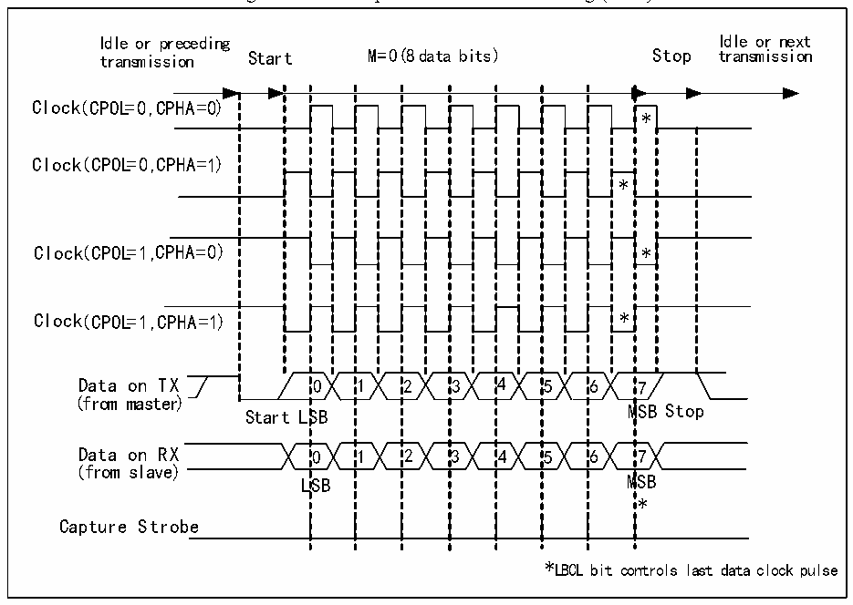
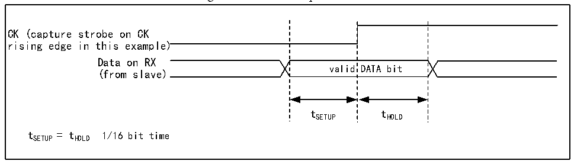

<!-- source-page: 296 -->

[← p.295](0295.md) · [index](../README.md) · [PDF p.296](https://ch32-riscv-ug.github.io/CH32V20x/datasheet_en/CH32FV2x_V3xRM.PDF#page=296) · [p.297 →](0297.md)

<!-- header: CH32F/V20x_V30x_V31x Series Reference Manual https://wch-ic.com -->

Figure 18-2 Example of USART clock timing (M=0)  
 <!-- rendered from the PDF; verify at https://ch32-riscv-ug.github.io/CH32V20x/datasheet_en/CH32FV2x_V3xRM.PDF#page=296 -->

🖼 Text parsed from the figure above

Idle or preceding Idle or next  
transmission Start M=0( 8 data bits) Stop transmission  
0SB0LSB  11  22  33  44  55  * * 6M6M  
Clock( CPOL=0 ,C PHA=0)  
*  *  7  
Clock(( CCPPOOLL==00 ,,C PHA=1))  
(from master)  
(from slave)  
*  
Capture Strobe  
*LBCL bit controls last data clock pulse  

Figure 18-3 Data sample hold time  
 <!-- rendered from the PDF; verify at https://ch32-riscv-ug.github.io/CH32V20x/datasheet_en/CH32FV2x_V3xRM.PDF#page=296 -->

🖼 Text parsed from the figure above

valid  DATA bit  
CK (capture strobe on CK  
rising edge in this example)  
Data on RX  
(from slave)  
tSETUP tHOLD  
t SETUP = t HOLD 1/16 bit time  

## 18.5 1-wire Half-duplex Mode

The half-duplex mode supports the use of a single pin (Only TX pin) to receive and transmit, and the TX pin  
and RX pin are connected inside the chip.  
To enable half-duplex mode, set HDSEL bit in the control register3 (R16_USARTx_CTLR3), but you need  
to disable LIN mode, smartcard mode, infrared mode and synchronous mode at the same time, i.e., to ensure  
that the SCEN, CLKEN and IREN bits are in the reset status. These 3 bits are in the control register2 and the  
control register3 (R16_USARTx_CTLR2 and R16_USARTx_CTLR3).  
After setting to half-duplex mode, it is needed to set the TX IO port to open-drain output high mode. When  
TE bit is set, the data will be sent out as long as the data is written to the data register. Special attention shall  
be paid to the fact that bus conflicts may occur when multiple devices use a single bus to transmit and  
receive in half-duplex mode. This requires users to avoid it by software.  
<!-- image: p296-draw-image-00001 bbox=[508.2, 795.0, 527.28, 805.2] -->
<!-- footer: V2.5 291 -->
