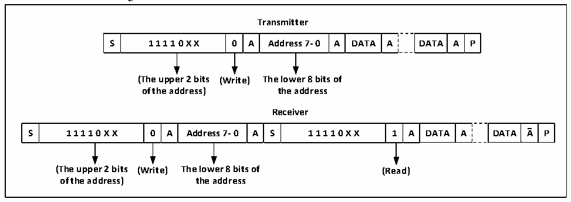

<!-- source-page: 312 -->

[← p.311](0311.md) · [index](../README.md) · [PDF p.312](https://ch32-riscv-ug.github.io/CH32V20x/datasheet_en/CH32FV2x_V3xRM.PDF#page=312) · [p.313 →](0313.md)

<!-- header: CH32F/V20x_V30x_V31x Series Reference Manual https://wch-ic.com -->

## 19.3 Master Mode

In master mode, the I2C module leads the data transmission and outputs the clock signal. The data transfer  
starts with a Start event and ends with a Stop event. The following is the required operations in master mode:  
Set the correct clock in the control register2 (R16_I2Cx_CTLR2) and the clock control register  
(R16_I2Cx_CKCFGR).  
Set a proper rising edge in the rising edge register (R16_I2Cx_RTR).  
Set the PE bit in R16_I2Cx_CTLR1 to start the peripheral.  
Set the START bit in the control register (R16_I2Cx_CTLR1) to generate a start event.  
After the START bit is set, the I2C module automatically switches to master mode, the MSL bit is set, and a  
Start event is generated. After the start event is generated, the SB bit is set. If the ITEVTEN bit (in  
R16_I2Cx_CTLR2) is set, an interrupt is generated. In this case, it is needed to read the R16_I2Cx_STAR1  
register. After the slave address is written to the data register, the SB bit is automatically cleared.  
If the 10-bit address mode is enabled, then write the data register to send the header sequence (the header  
sequence is 11110xx0b, of which the xx bits are the highest 2 bits of the 10-bit address).  
After the header sequence is transmitted, the ADD10 bit in the status register is set. If the ITEVTEN bit is  
already set, an interrupt will be generated. At this time, read the R16_I2Cx_STAR1 register and write the  
second address byte to the data register. Then, clear the ADD10 bit.  
Then, write the data register to send the second address byte. After sending the second address byte, the  
ADDR bit in the status register is set. If the ITEVTEN bit has been set, an interrupt will be generated. Read  
the R16_I2Cx_STAR2 register at this time and then read R16_I2Cx_STAR1 register again to clear the  
ADDR bit;  
If the 7-bit address mode is enabled, the write data register transmit the address byte. After the address byte  
is sent, the ADDR bit in the status register is set. If the ITEVTEN bit has been set, an interrupt will be  
generated. Read the R16_I2Cx_STAR1 register and then read the R16_I2Cx_STAR2 register again to clear  
the ADDR bit.  
In the 7-bit address mode, the first byte sent is the address byte, the first 7 bits represent the address of the  
target slave device, the 8th bit determines the direction of the subsequent message, and ‘0’ means the master  
device writes data to the slave device, ‘1’ means that the master device reads information from the slave  
device. In the 10-bit address mode, as shown in Figure 19-3, the first byte is 11110xx0, xx are the highest 2  
bits of the 10-bit address, and the second byte is the lower 8 bits of the 10-bit address in the address  
transmission phase. If you subsequently enter the master transmitter mode, send data continuously. If the  
device enters the master receiver mode subsequently, a start event needs to be re-sent, and a byte of  
11110xx1 will be sent together. Then, enter the master receiver mode.  

Figure 19-3 Master receive/transmits data in 10-bit address mode  
 <!-- rendered from the PDF; verify at https://ch32-riscv-ug.github.io/CH32V20x/datasheet_en/CH32FV2x_V3xRM.PDF#page=312 -->

🖼 Text parsed from the figure above

<strong>Transmitter</strong>  
S  1 1 1 1 0 X X  0  A  Address 7- 0  A  DATA  A  DATA  A  P  
<strong>(The upper 2 bits (Write) The lower 8 bits of</strong>  
<strong>of the address) the address</strong>  
<strong>Receiver</strong>  
S  1 1 1 1 0 X X  0  A  Address 7- 0  A  S  1 1 1 1 0 X X  1  A  DATA  A  DATA  A  P  
<strong>(The upper 2 bits (Write) The lower 8 bits of (Read)</strong>  
<strong>of the address) the address</strong>  

<!-- image: p312-draw-image-00001 bbox=[508.2, 795.0, 527.28, 805.2] -->
<!-- footer: V2.5 307 -->
