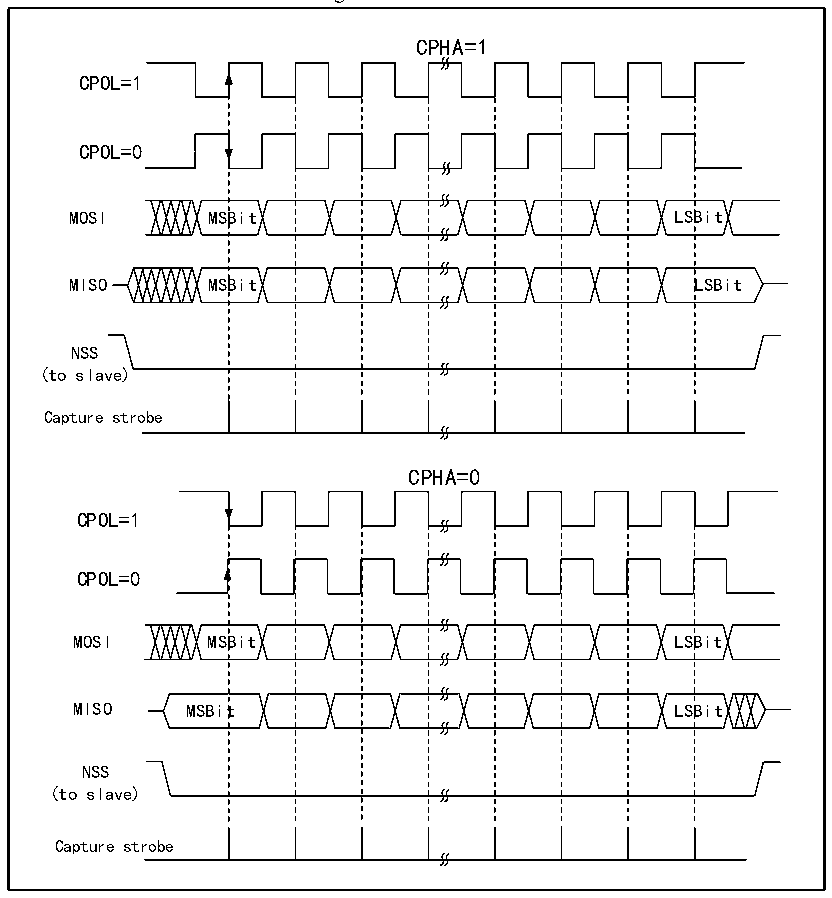

<!-- source-page: 332 -->

[← p.331](0331.md) · [index](../README.md) · [PDF p.332](https://ch32-riscv-ug.github.io/CH32V20x/datasheet_en/CH32FV2x_V3xRM.PDF#page=332) · [p.333 →](0333.md)

<!-- header: CH32F/V20x_V30x_V31x Series Reference Manual https://wch-ic.com -->
whether the clock remains high or low when there is no data. See Figure 20-2 below for details.  

Figure 20-2 SPI model  
 <!-- rendered from the PDF; verify at https://ch32-riscv-ug.github.io/CH32V20x/datasheet_en/CH32FV2x_V3xRM.PDF#page=332 -->

🖼 Text parsed from the figure above

CPHA=1  
CPOL=1  
CPOL=0  
MOSI MSBit LSBit  
MISO MSBit LSBit  
NSS  
(to slave)  
Capture strobe  
CPHA=0  
CPOL=1  
CPOL=0  
MOSI MSBit LSBit  
MISO MSBit LSBit  
NSS  
(to slave)  
Capture strobe  

The host and device need to be set to the same SPI mode, and the SPE bit needs to be cleared before  
configuring the SPI mode. The DEF bit can decide whether the single data length of SP is 8 bits or 16 bits.  
LSBFIRST can control whether a single data word is big-endian or little-endian.  

### 20.2.2 Master Mode

When the SPI module works in master mode, the serial clock is generated by SCK. To configure into master  
mode do the following steps:  
Configure the BR[2:0] bits in the control register to determine the clock;  
Configure the CPOL and CPHA bits to determine the SPI mode;  
Configure DEF to determine the data word length;  
Configure LSBFIRST to determine the frame format;  
Configure the NSS pin, such as setting the SSOE bit to let the hardware reset NSS. You can also set the SSM  
bit and set the SSI bit high;  
To set the MSTR bit and the SPE bit, it is necessary to ensure that NSS is already high at this time.  
<!-- image: p332-draw-image-00001 bbox=[508.2, 795.0, 527.28, 805.2] -->
<!-- footer: V2.5 327 -->
