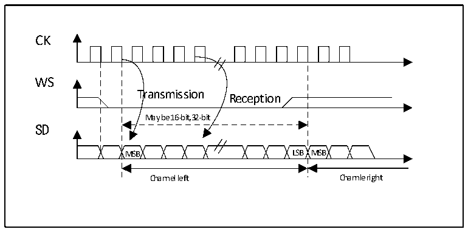
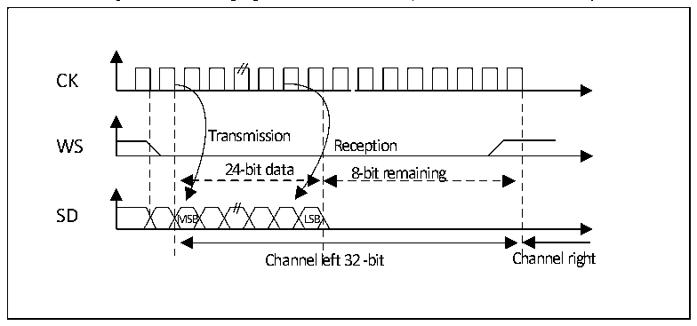

<!-- source-page: 337 -->

[← p.336](0336.md) · [index](../README.md) · [PDF p.337](https://ch32-riscv-ug.github.io/CH32V20x/datasheet_en/CH32FV2x_V3xRM.PDF#page=337) · [p.338 →](0338.md)

<!-- header: CH32F/V20x_V30x_V31x Series Reference Manual https://wch-ic.com -->

Figure 20-4 Philips protocol waveform (16/32 full precision, CPOL=0)  
 <!-- rendered from the PDF; verify at https://ch32-riscv-ug.github.io/CH32V20x/datasheet_en/CH32FV2x_V3xRM.PDF#page=337 -->

🖼 Text parsed from the figure above

CK  
WS  
Transmission  
Reception  
May be 16-bit,32-bit  
SD  
MSB LSB MSB  
Channel left Channle right  

Figure 20-5 Philips protocol waveform (24-bit frame, CPOL=0)  
 <!-- rendered from the PDF; verify at https://ch32-riscv-ug.github.io/CH32V20x/datasheet_en/CH32FV2x_V3xRM.PDF#page=337 -->

🖼 Text parsed from the figure above

Transmission  Reception  24-bit data MSB LSB  8-bit remaining  
CK  
SD  
Channel left 32 -bit Channel right  

This mode requires 2 read or write operations to the SPI_DATAR register. In transmit mode: if you need to  
send 0x8EAA33 (24 bits):  
First write to Data register Second write to Data register  
0x8EAA 0x33XX  
Only the 8 MSB are sent to complete the 24 bits  
8 LSB bit have no meaning and could be  
anything  
In receive mode: if 0x8EAA33 is received:  
First read from Data register Second read from Data register  
0x8EAA 0x3300  
Only the 8MSB are right  
The 8 LSB will always be 00  
<!-- image: p337-draw-image-00001 bbox=[508.2, 795.0, 527.28, 805.2] -->
<!-- footer: V2.5 332 -->
