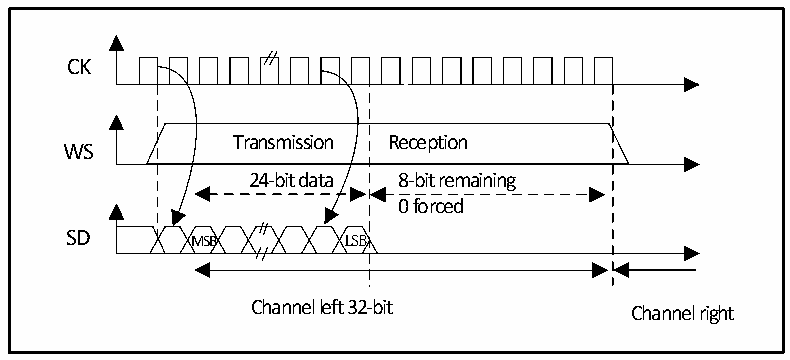
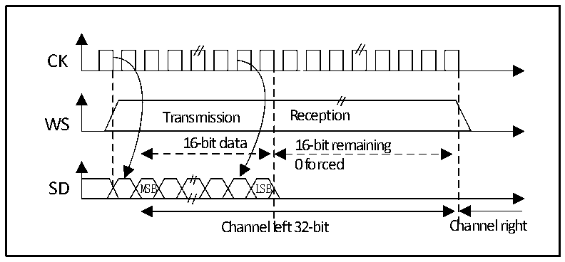
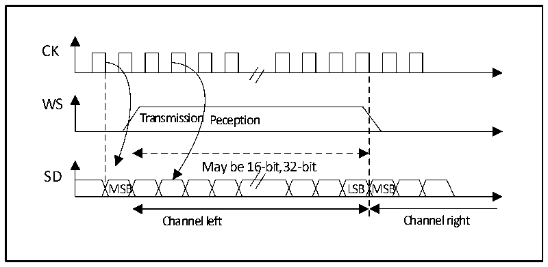

<!-- source-page: 339 -->

[← p.338](0338.md) · [index](../README.md) · [PDF p.339](https://ch32-riscv-ug.github.io/CH32V20x/datasheet_en/CH32FV2x_V3xRM.PDF#page=339) · [p.340 →](0340.md)

<!-- header: CH32F/V20x_V30x_V31x Series Reference Manual https://wch-ic.com -->

Figure 20-8 MSB aligned 24-bit data, CPOL = 0  
 <!-- rendered from the PDF; verify at https://ch32-riscv-ug.github.io/CH32V20x/datasheet_en/CH32FV2x_V3xRM.PDF#page=339 -->

🖼 Text parsed from the figure above

CK  
Transmission Reception  
WS  
24-bit data 8-bit remaining  
0 forced  
SD MSB LSB  
Channel left 32-bit Channel right  

Figure 20-9 MSB-aligned 16-bit data extended to 32-bit packet frame, CPOL = 0  
 <!-- rendered from the PDF; verify at https://ch32-riscv-ug.github.io/CH32V20x/datasheet_en/CH32FV2x_V3xRM.PDF#page=339 -->

🖼 Text parsed from the figure above

CK  
Transmission Reception  
WS  
16-bit data 16-bit remaining  
0 forced  
SD MSB LSB  
Channel left 32-bit Channel right  

#### 20.3.2.3 LSB alignment standard

This standard is similar to the MSB alignment standard (No difference in 16-bit or 32-bit full-precision  
frame format).  

Figure 20-10 LSB-aligned 16- or 32-bit full precision, CPOL = 0  
 <!-- rendered from the PDF; verify at https://ch32-riscv-ug.github.io/CH32V20x/datasheet_en/CH32FV2x_V3xRM.PDF#page=339 -->

🖼 Text parsed from the figure above

CK  
WS  
Transmission Peception  
May be 16-bit,32-bit  
SD  
MSB LSB MSB  
Channel left Channel right  

<!-- image: p339-draw-image-00001 bbox=[508.2, 795.0, 527.28, 805.2] -->
<!-- footer: V2.5 334 -->
