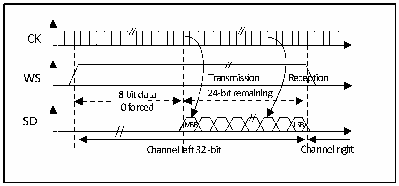
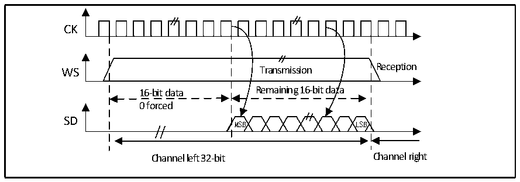

<!-- source-page: 340 -->

[← p.339](0339.md) · [index](../README.md) · [PDF p.340](https://ch32-riscv-ug.github.io/CH32V20x/datasheet_en/CH32FV2x_V3xRM.PDF#page=340) · [p.341 →](0341.md)

<!-- header: CH32F/V20x_V30x_V31x Series Reference Manual https://wch-ic.com -->

Figure 20-11 LSB-aligned 24-bit data, CPOL = 0  
 <!-- rendered from the PDF; verify at https://ch32-riscv-ug.github.io/CH32V20x/datasheet_en/CH32FV2x_V3xRM.PDF#page=340 -->

🖼 Text parsed from the figure above

CK  
WS Transmission Reception  
8-bit data 24-bit remaining  
0 forced  
SD  
MSB LSB  
Channel left 32 -bit Channel right  

In transmit mode, if you want to send data 0x3478AE, you need to write the register DATAR twice by  
software or DMA.  
TEX=&#x27;1 &#x27; when the data register is written TEX=&#x27;1 &#x27; when the data register is written  
for the first time for the second time  
0xXX34 0x78AE  
Only the lower 8 bits in the halfword have meaning, the higher 8 bits are forced to  
be set to 0x00  
In receive mode, if you want to receive data 0x3478AE, you need to read the register DATAR once when 2  
consecutive RXNE events occur.  
RXNE=&#x27;1&#x27; when the data register is read out RXNE=&#x27;1&#x27; when the data register is read out  
for the first time for the second time  
0xXX34 0x78E  
Only the lower 8 bits in the halfword have meaning, the higher 8 bits are forced to  
be set to 0x00  

Figure 20-12 LSB aligned 16-bit data extended to 32-bit packet frame, CPOL = 0  
 <!-- rendered from the PDF; verify at https://ch32-riscv-ug.github.io/CH32V20x/datasheet_en/CH32FV2x_V3xRM.PDF#page=340 -->

🖼 Text parsed from the figure above

CK  
WS Transmission Reception  
16-bit data Remaining 16-bit data  
0 forced  
SD  
MSB LSB  
Channel left 32-bit Channel right  

During the I2S configuration stage, if you choose to extend the 16-bit data to a 32-channel frame, you only  
need to access the DATAR register once. At this point, the high half word (16-bit MSB) after extending to 32  
bits is set to 0x0000 by hardware.  
<!-- image: p340-draw-image-00001 bbox=[508.2, 795.0, 527.28, 805.2] -->
<!-- footer: V2.5 335 -->
