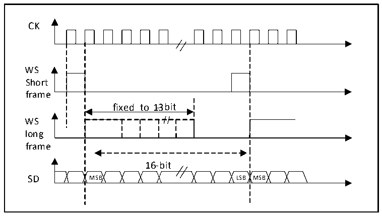
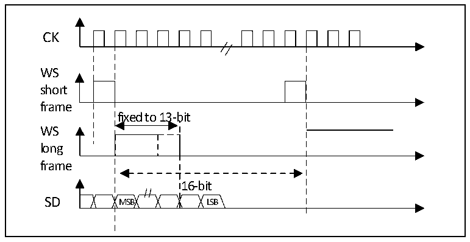

<!-- source-page: 341 -->

[← p.340](0340.md) · [index](../README.md) · [PDF p.341](https://ch32-riscv-ug.github.io/CH32V20x/datasheet_en/CH32FV2x_V3xRM.PDF#page=341) · [p.342 →](0342.md)

<!-- header: CH32F/V20x_V30x_V31x Series Reference Manual https://wch-ic.com -->
If the data to be transmitted or received is 0x76A3 (Extended to 32 bits is 0x000076A3), only one operation  
of DATAR is required. When sending, if TXE is 1, the user needs to write the data to be sent (i.e. 0x76A3).  
The 0x0000 part, which is used to extend to 32 bits, is first sent by the hardware, and once the valid data  
starts to be sent from the SD pin, the next TXE event occurs. On reception, the RXNE event occurs as soon  
as valid data is received (Instead of the 0x0000 part). This way, there is more time between the 2 reads and  
writes, preventing underflow or overflow conditions.  

#### 20.3.2.4 PCM standard

Under the PCM standard, there is no information for channel selection. The PCM standard has 2 available  
frame structures, short or long, which can be selected by setting the PCMSYNC bit in register I2SCFGR.  

Figure 20-13 PCM standard waveform (16-bit)  
 <!-- rendered from the PDF; verify at https://ch32-riscv-ug.github.io/CH32V20x/datasheet_en/CH32FV2x_V3xRM.PDF#page=341 -->

🖼 Text parsed from the figure above

CK  
fixed to 1-3bit  16-bit MSB LSB  
WS  
Short  
frame  
WS  
long  
frame  

For the long frame, in the main mode, the valid time of the WS signal used for synchronization is fixed to 13  
bits. For short frames, the length of the WS signal used for synchronization is only 1 bit.  

Figure 20-14 PCM standard waveform (16-bit)  
 <!-- rendered from the PDF; verify at https://ch32-riscv-ug.github.io/CH32V20x/datasheet_en/CH32FV2x_V3xRM.PDF#page=341 -->

🖼 Text parsed from the figure above

CK  
WS  
short  
frame  
fixed to 13-bit  
WS  
long  
frame  
16-bit  
SD MSB LSB  

No matter which mode (Master or slave), which synchronization method (Short frame or long frame), the  
time difference between 2 consecutive frames of data and between 2 synchronization signals, (Even in slave  
mode) needs to be set by setting the I2SCFGR register determined by the DATLEN bit and the CHLEN bit.  
<!-- image: p341-draw-image-00001 bbox=[508.2, 795.0, 527.28, 805.2] -->
<!-- footer: V2.5 336 -->
