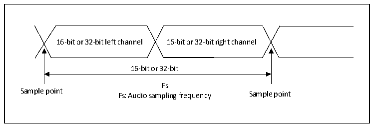
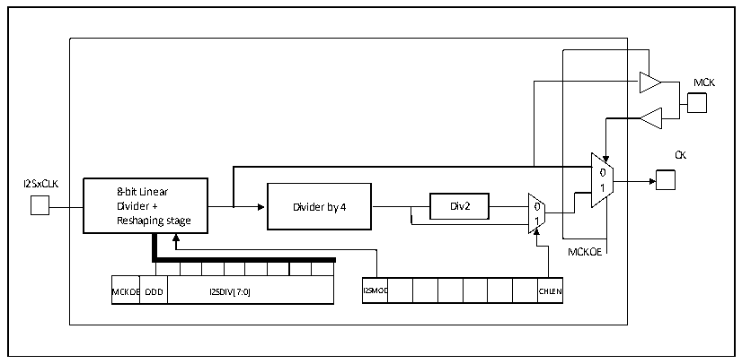

<!-- source-page: 342 -->

[← p.341](0341.md) · [index](../README.md) · [PDF p.342](https://ch32-riscv-ug.github.io/CH32V20x/datasheet_en/CH32FV2x_V3xRM.PDF#page=342) · [p.343 →](0343.md)

<!-- header: CH32F/V20x_V30x_V31x Series Reference Manual https://wch-ic.com -->

### 20.3.3 Clock Generator

The bit rate of I2S determines the data flow on the I2S data line and the frequency of the I2S clock signal.  
I2S bit rate = number of bits per channel × number of channels × audio sampling frequency.  
For a signal with left and right channels and 16-bit audio, the I2S bit rate is calculated as follows:  
I2S bit rate = 16 × 2 × Fs  
If the packet length is 32 bits, the I2S bit rate is calculated as follows:  
I2S bit rate = 32 × 2 × Fs  

Figure 20-15 Audio sampling frequency definition  
 <!-- rendered from the PDF; verify at https://ch32-riscv-ug.github.io/CH32V20x/datasheet_en/CH32FV2x_V3xRM.PDF#page=342 -->

🖼 Text parsed from the figure above

16-bit or 32-bit left channel 16-bit or 32-bit right channel  
16-bit or 32-bit  
Fs  
Sample point Fs: Audio sampling frequency Sample point  

In master mode, the linear divider needs to be set correctly in order to obtain the desired audio frequency.  

Figure 20-16 I2S clock generator structure  
 <!-- rendered from the PDF; verify at https://ch32-riscv-ug.github.io/CH32V20x/datasheet_en/CH32FV2x_V3xRM.PDF#page=342 -->

🖼 Text parsed from the figure above

MCK  
CK  
0  
I2SxCLK 8-bit Linear 1  
Divider + Dividecr by 4 Dicv2 0  
Reshaping stage 1  
MCKOE  
MCKOE  EODD  I2SDIV[7:0]  
I2SMOD  D  CHLEN  
MCKOEODD I2SDIV[7:0] I2SMOD CHLEN  

The clock source of I2SxCLK in the figure is the system clock (i.e., the HSI, HSE, or PLL that drives the HB  
clock). I2SxCLK can come from SYSCLK, or the PLL3 VCO (2xPLL3CLK) clock, which can be selected  
by the I2S2SRC and I2S3SRC bits in the RCC_CFGR2 register. Audio can be sampled at 96kHz, 48kHz,  
44.1kHz, 32kHz, 22.05kHz, 16kHz, 11.025kHz, or 8kHz (Or any value within this range). To obtain the  
desired frequency, set the linear divider according to the following formula:  
When the master clock needs to be generated (The MCKOE bit of the register SPI_I2SPR is 1):  
When the frame length of the channel is 16 bits, Fs = I2SxCLK / [(16*2) * ((2*I2SDIV) + ODD)*8]  
When the frame length of the channel is 32 bits, Fs = I2SxCLK / [(32*2) * ((2*I2SDIV) + ODD)*4]  
When the main clock is turned off (MCKOE bit is &#x27;0&#x27;):  
When the frame length of the channel is 16 bits, Fs = I2SxCLK / [(16*2) * ((2*I2SDIV) + ODD)]  
<!-- image: p342-draw-image-00001 bbox=[508.2, 795.0, 527.28, 805.2] -->
<!-- footer: V2.5 337 -->
