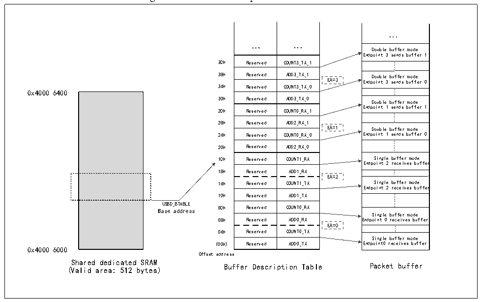

<!-- source-page: 359 -->

[← p.358](0358.md) · [index](../README.md) · [PDF p.359](https://ch32-riscv-ug.github.io/CH32V20x/datasheet_en/CH32FV2x_V3xRM.PDF#page=359) · [p.360 →](0360.md)

<!-- header: CH32F/V20x_V30x_V31x Series Reference Manual https://wch-ic.com -->
<em>both CAN1 &amp; CAN2 are used, the CAN filter table uses the high 256 bytes of the shared 512-byte dedicated</em>  
<em>SRAM area, and the USB uses the low 256 bytes.</em>  

Figure 21-1 Buffer description table structure  
 <!-- rendered from the PDF; verify at https://ch32-riscv-ug.github.io/CH32V20x/datasheet_en/CH32FV2x_V3xRM.PDF#page=359 -->

🖼 Text parsed from the figure above

...  
... ...  
Double buffer mode  
Endpoint 3 sends buffer 1  
Reserved  COUNT3_TX_1  Reserved Reserved  ADD3_TX_1COUNT3_TX_0  Reserved  ADD3_TX_0  Reserved  COUNT0_RX_1  Reserved Reserved  ADD2_RX_1COUNT0_RX_0  Reserved  ADD2_RX_0  Reserved  COUNT1_RX  Reserved  ADD1_RX  Reserved Reserved  COUNT1_TXADD1_TX  Reserved  COUNT0_RX  Reserved  ADD0_RX  Reserved Reserved  COUNT0_TXADD0_TX  
Double buffer mode Endpoint 3 sends buffer 0  Double buffer mode Endpoint 1 sends buffer 1  Double buffer mode Endpoint 1 sends buffer 0  Single buffer mode Endpoint 2 receives buffer  Single buffer mode Endpoint 2 receives buffer  Single buffer mode Endpoint 0 receives buffer  Single buffer mode Endpoint0 receives buffer  
0x4000 6400  
24H Reserved COUNT0_RX_0 Endpoint 1 sends buffer 0  
EA=2  
USBD_BTABLE  
Base address 0CH Reserved COUNT0_RX  
08H Reserved ADD0_RX Endpoint 0 receives buffer  
EA=0  
0x4000 6000  
Offset address  
Shared dedicated SRAM  
Buffer Description Table Packet buffer  
(Valid area: 512 bytes)  

Whether receiving or sending, the packet buffer is used from the bottom. The USBD module does not  
change the contents of other buffers beyond the currently allocated buffer area. If the buffer receives a data  
packet larger than itself, it will only receive data up to its own size, and the others will be discarded, that is, a  
so-called buffer overflow exception occurs.  
1）Endpoint initialization  
The first step in initializing an endpoint is to write the appropriate values to the USBD_ADDRx_TX or  
USBD_ADDRx_RX registers so that the USBD module can find the data to transmit or a buffer that is ready  
to receive data. The EPTYPE[1:0] bits in the USBD_EPRx register determine the basic type of the endpoint,  
and the EP_KIND bits determine the special characteristics of the endpoint. As a sender, you need to set the  
STAT_TX bit of the USBD_EPRx register to enable the endpoint, and configure the COUNTx_TX bit to  
determine the transmission length. As a receiver, you need to set the STAT_RX bit to enable the endpoint,  
and set the BL_SIZE and NUM_BLOCK bits to determine the size of the receive buffer to detect buffer  
overflow exceptions. For unidirectional endpoints with asynchronous non-double-buffered bulk transfers,  
only one register in the transfer direction needs to be set. Once the endpoint is enabled, the application can  
no longer modify the value of the USBD_EPRx register and the location of the  
USBD_ADDRx_TX/USBD_ADDRx_RX, USBD_COUNTx_TX/USBD_COUNTx_RX registers, because  
these values are modified in real time by the hardware. When the data transfer is completed, the CTR  
interrupt will be generated, at this time the above registers can be accessed and new transfers can be  
re-enabled.  
2）IN transaction (Transmit data)  
When receiving an IN-token packet, if the received address is consistent with a configured endpoint address,  
<!-- image: p359-draw-image-00001 bbox=[508.2, 795.0, 527.28, 805.2] -->
<!-- footer: V2.5 354 -->
