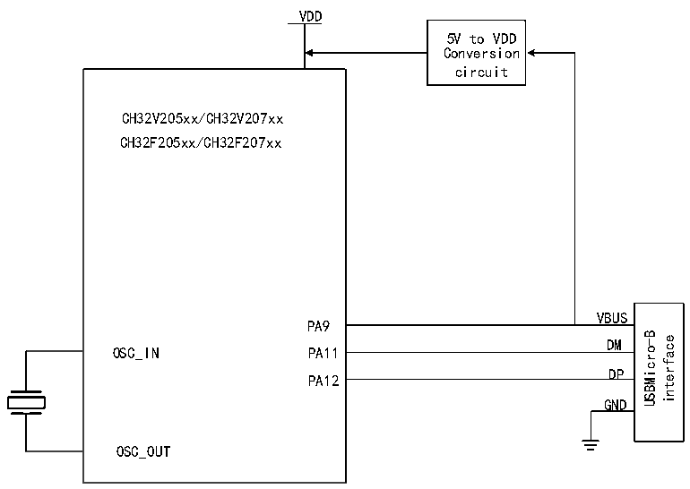

<!-- source-page: 405 -->

[← p.404](0404.md) · [index](../README.md) · [PDF p.405](https://ch32-riscv-ug.github.io/CH32V20x/datasheet_en/CH32FV2x_V3xRM.PDF#page=405) · [p.406 →](0406.md)

<!-- header: CH32F/V20x_V30x_V31x Series Reference Manual https://wch-ic.com -->

Figure 23-1 OTG Class B device connection  
 <!-- rendered from the PDF; verify at https://ch32-riscv-ug.github.io/CH32V20x/datasheet_en/CH32FV2x_V3xRM.PDF#page=405 -->

🖼 Text parsed from the figure above

VDD  
5V to VDD  
Conversion  
circuit  
CH32V205xx/CH32V207xx  
CH32F205xx/CH32F207xx  
VBUS  
PA9  
VBUSDM  DMDP  
USBMicro-B interface  
OSC_IN  
PA11  
PA12  
GND  
OSC_OUT  

The USB bus pull-up resistor necessary as a USB device can be set by software at any time to enable or not.  
When RB_UC_DEV_PU_EN in the USB control register R8_USB_CTRL is set to 1, the controller is set  
according to the speed of RB_UD_LOW_SPEED, which is the DP/DM pin of the USB bus internally.  
Connect a pull-up resistor and enable the USB device function.  
When a USB bus reset, USB bus suspend or wake-up event is detected, or when the USB successfully  
processes data transmission or data reception, the USB protocol processor will set the corresponding  
interrupt flag, and if the interrupt enable is turned on, it will also generate a corresponding interrupt request.  
The application can directly query or query and analyze the interrupt flag register R8_USB_INT_FG in the  
USB interrupt service routine, and perform corresponding processing according to RB_UIF_BUS_RST and  
RB_UIF_SUSPEND; and, if RB_UIF_TRANSFER is valid, then it is necessary to continue to analyze the  
USB interrupt status register R8_USB_INT_ST, according to the current endpoint number  
MASK_UIS_ENDP and the current transaction token PID identify MASK_UIS_TOKEN for corresponding  
processing. If the synchronization trigger bit RB_UEP_R_TOG of the OUT transaction of each endpoint is  
set in advance, then RB_U_TOG_OK or RB_UIS_TOG_OK can be used to judge whether the  
synchronization trigger bit of the currently received data packet matches the synchronization trigger bit of  
the endpoint. If the data is synchronized, the data valid; if the data is out of sync, the data should be  
discarded. After each USB send or receive interrupt is processed, the synchronization trigger bit of the  
corresponding endpoint should be modified correctly to detect whether the next data packet sent or received  
next time is synchronously detected; in addition, setting RB_UEP_T_AUTO_TOG or  
RB_UEP_R_AUTO_TOG enables to automatically flip the corresponding synchronization trigger bit after  
successful transmission or reception.  
The data to be sent by each endpoint is in its own buffer, and the length of the data to be sent is  
independently set in R8_UEPn_T_LEN; the data received by each endpoint is in its own buffer, but the  
length of the received data is in the USB receive length. In the register R8_USB_RX_LEN, it can be  
distinguished according to the current endpoint number when the USB receives an interrupt.  
<!-- image: p405-draw-image-00001 bbox=[508.2, 792.12, 527.28, 802.32] -->
<!-- footer: V2.5 400 -->
