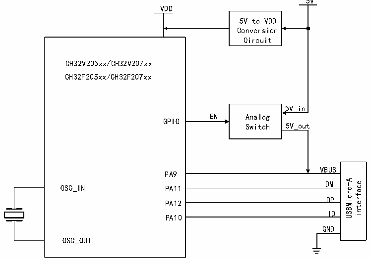

<!-- source-page: 412 -->

[← p.411](0411.md) · [index](../README.md) · [PDF p.412](https://ch32-riscv-ug.github.io/CH32V20x/datasheet_en/CH32FV2x_V3xRM.PDF#page=412) · [p.413 →](0413.md)

<!-- header: CH32F/V20x_V30x_V31x Series Reference Manual https://wch-ic.com -->

Figure 23-2 OTG Class A device connection  
 <!-- rendered from the PDF; verify at https://ch32-riscv-ug.github.io/CH32V20x/datasheet_en/CH32FV2x_V3xRM.PDF#page=412 -->

🖼 Text parsed from the figure above

5V  
VDD  
5V to VDD  
Conversion  
Circuit  
CH32V205xx/CH32V207xx  
CH32F205xx/CH32F207xx  
5V_in  
EN Analog  
GPIO  
Switch 5V_out  
VBUS  
PA9  
VBUSDM  DMDP  DPID  
USBMicro-A interface  
OSC_IN  
PA11  
PA12  
PA10  
GND  
OSC_OUT  

Each USB transaction initiated by the host endpoint always automatically sets the RB_UIF_TRANSFER  
interrupt flag after processing. The application can directly query or query and analyze the interrupt flag  
register R8_USB_INT_FG in the USB interrupt service routine, and perform corresponding processing  
according to each interrupt flag; and, if RB_UIF_TRANSFER is valid, then continue to analyze the USB  
interrupt status register R8_USB_INT_ST, process accordingly according to the response PID identification  
MASK_UIS_H_RES of the current USB transfer transaction.  
If the synchronization trigger bit (RB_UH_R_TOG) of the IN transaction of the host receiving endpoint is  
set in advance, then RB_U_TOG_OK or RB_UIS_TOG_OK can be used to judge whether the  
synchronization trigger bit of the currently received data packet matches the synchronization trigger bit of  
the host receiving endpoint. If synchronized, the data is valid; if the data is not synchronized, the data should  
be discarded. After each USB send or receive interrupt is processed, the synchronization trigger bit of the  
corresponding host endpoint should be modified correctly to synchronize the data packet sent next time and  
detect whether the data packet received next time is synchronized; in addition, setting  
RB_UEP_AUTO_TOG and RB_UH_R_AUTO_TOG enables to automatically flip the corresponding  
synchronization trigger bit after successful transmission or reception.  
The USB host token setting register R8_UH_EP_PID is used to set the endpoint number of the target device  
to be operated and the token PID packet identification of this USB transfer transaction. The data  
corresponding to the SETUP token and the OUT token is provided by the host sending endpoint, the data to  
be sent is in the R16_UH_TX_DMA buffer, and the length of the data to be sent is set in R16_UH_TX_LEN;  
the data corresponding to the IN token is returned by the target device to the host for reception Endpoint, the  
received data is stored in the R16_UH_RX_DMA buffer, the received data length is stored in  
R16_USB_RX_LEN, and the maximum packet length that the host endpoint can receive needs to be written  
to the R16_UH_RX_MAX_LEN register in advance.  

<!-- p412-table-002 (table-23-5@1) pages 412-413 -->
<table><caption>Table 23-5 Host registers</caption><tr><th>Name</th><th>Access address</th><th>Description</th><th>Reset value</th></tr><tr><td>R8_UHOST_CTRL</td><td>0x50000001</td><td>USB host physical port control register</td><td>0xX0</td></tr><tr><td>R32_UH_EP_MOD</td><td>0x5000000D</td><td>USB host endpoint mode control register</td><td>0x00</td></tr><tr><td>R16_UH_RX_DMA</td><td>0x50000018</td><td>USB host receive buffer start address</td><td>X</td></tr><tr><td>R16_UH_TX_DMA</td><td>0x5000001C</td><td>USB host transmit buffer start address</td><td>X</td></tr><tr><td>R16_UH_SETUP</td><td>0x50000036</td><td>USB host auxiliary setup register</td><td>0x00</td></tr><tr><td>R8_UH_EP_PID</td><td>0x50000038</td><td>USB host token setup register</td><td>0x00</td></tr><tr><td>R8_UH_RX_CTRL</td><td>0x5000003B</td><td style="text-align:left">USB host receive endpoint control register</td><td>0x00</td></tr><tr><td>R16_UH_TX_LEN</td><td>0x5000003C</td><td>USB host transmit length register</td><td>X</td></tr><tr><td>R8_UH_TX_CTRL</td><td>0x5000003E</td><td style="text-align:left">USB host transmit endpoint control register</td><td>0x00</td></tr></table>

<!-- image: p412-draw-image-00001 bbox=[508.2, 792.12, 527.28, 802.32] -->
<!-- footer: V2.5 407 -->
