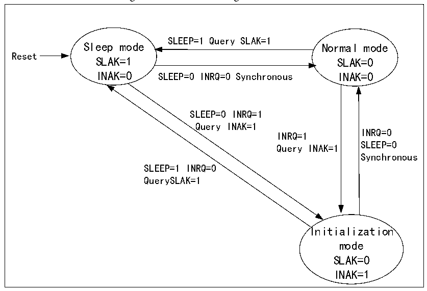

<!-- source-page: 419 -->

[← p.418](0418.md) · [index](../README.md) · [PDF p.419](https://ch32-riscv-ug.github.io/CH32V20x/datasheet_en/CH32FV2x_V3xRM.PDF#page=419) · [p.420 →](0420.md)

<!-- header: CH32F/V20x_V30x_V31x Series Reference Manual https://wch-ic.com -->
To enter the initialization mode from sleep mode, the SLEEP bit of CAN_CTLR must be cleared to 0 and the  
INRQ bit to 1. When the INAK bit of the register CAN_STATR is automatically set to 1, the switch to the  
initialization state is completed.  
To enter normal mode from sleep mode, the SLEEP bit of CAN_CTLR must be cleared to 0. When the  
SLAK bit of the register CAN_STATR is automatically cleared to 0, the normal mode is entered.  

Figure 24-1 CAN working mode switch  
 <!-- rendered from the PDF; verify at https://ch32-riscv-ug.github.io/CH32V20x/datasheet_en/CH32FV2x_V3xRM.PDF#page=419 -->

🖼 Text parsed from the figure above

SLEEP=1 Query SLAK=1  
Sleep mode Normal mode  
Reset  
SLAK=1 SLAK=0  
INAK=0 SLEEP=0 INRQ=0 Synchronous INAK=0  
SLEEP=0 INRQ=1  
Query INAK=1  
INRQ=0  
INRQ=1  
SLEEP=0  
Query INAK=1  
Synchronous  
SLEEP=1 INRQ=0  
QuerySLAK=1  
Initialization  
mode  
SLAK=0  
INAK=1  

## 24.3 CAN Controller Test Mode

In the initialization mode, operate the SILM and LBKM bits of the register CAN_BTIMR to select a test  
mode, and then exit the initialization mode and enter the test mode by clearing the INRQ bit of the register  
CAN_CTLR. There are 3 test modes: silent mode, loopback mode and silent loopback mode.  

### 24.3.1 Silent Mode

Setting the SILM bit in register CAN_BTIMR to 1 can optionally enter silent mode. In this mode, the CAN  
controller can receive, but cannot send messages to the outside world. It is always in a recessive bit to the  
outside world, which can avoid affecting the bus, but the message can be received by the controller of the  
node where it is located. Usually, silent mode is used for the status analysis of the CAN bus.  

### 24.3.2 Loopback Mode

By setting the LBKM bit of the register CAN_BTIMR to 1, the loopback mode can be selected. In this mode,  
the CAN controller can send external messages, but cannot receive external messages, but the sent messages  
can be received by the controller of the node where it is located, and the reception filtering mechanism is  
effective. Usually, loopback mode is used for transceiver testing of CAN controllers.  

### 24.3.3 Silent Loopback Mode

Setting the SILM and LBKM bits in register CAN_BTIMR to 1 can optionally enter silent loopback mode.  
<!-- image: p419-draw-image-00001 bbox=[508.2, 792.12, 527.28, 802.32] -->
<!-- footer: V2.5 414 -->
