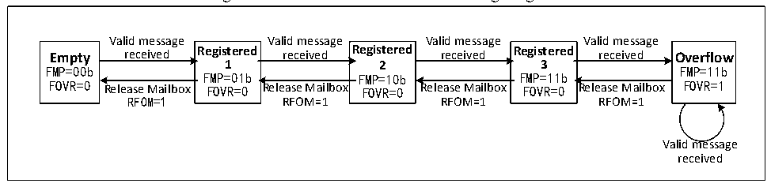

<!-- source-page: 422 -->

[← p.421](0421.md) · [index](../README.md) · [PDF p.422](https://ch32-riscv-ug.github.io/CH32V20x/datasheet_en/CH32FV2x_V3xRM.PDF#page=422) · [p.423 →](0423.md)

<!-- header: CH32F/V20x_V30x_V31x Series Reference Manual https://wch-ic.com -->
state is not If the mailbox is released, when the next valid packet is received, packet loss will inevitably  
occur.  

Figure 24-3 Receive FIFO state switching diagram  
 <!-- rendered from the PDF; verify at https://ch32-riscv-ug.github.io/CH32V20x/datasheet_en/CH32FV2x_V3xRM.PDF#page=422 -->

🖼 Text parsed from the figure above

Valid message Valid message Valid message Valid message  
Empty received Registered received Registered received Registered received Overflow  
1 2 3  
FMP=00b FMP=11b  
FMP=01b FMP=10b FMP=11b  
FOVR=0 Release Mailbox FOVR=0 Release Mailbox FOVR=0 Release Mailbox FOVR=0 Release Mailbox FOVR=1  
RFOM=1 RFOM=1 RFOM=1 RFOM=1  
Valid message  
received  

In the case of message loss above, that is, the receiving FIFO is full, and the message overflow causes the  
message to be lost. The FOVR bit of the receiving FIFO register CAN_RFIFOx will be automatically set to  
1 by hardware for overflow query. When the RFLM bit of the register CAN_CTLR is set to 1, the receiving  
FIFO locking function is enabled, and the discarded message is a new received message; when the RFLM bit  
of the register CAN_CTLR is cleared to 0, the receiving FIFO locking function is disabled. Among the 3  
original messages of the receiving FIFO, the last received message will be overwritten by the new message.  
When the relevant bit of the register CAN_INTENR is set, an interrupt can be generated when the state of  
the receiving FIFO is switched, so as to process the received message more efficiently, see section 24.6 CAN  
interrupt for details.  

### 24.5.6 Received Message Identifier Filtering

There are up to 28 filter groups in the module. By setting the filter group, each CAN node can receive the  
packets that meet the filtering rules, and the packets that do not meet the filtering rules are discarded by  
hardware without software intervention.  
Each filter bank consists of 2 32-bit registers CAN_FxR0 and CAN_FxR1. The bit width of the filter group  
can be independently configured as a 32-bit filter or 2 16-bit filters by setting each bit of the register  
CAN_FSCFGR. Each filter group can be configured as mask bit or identifier list mode by setting each bit of  
register CAN_FMCFGR, and each filter group can be enabled or disabled by setting each bit of register  
CAN_FWR. Setting each bit of the register CAN_FAFIFOR can select which receive FIFO the message that  
passes the filter is stored in.  
As shown in Table 24-1 below, in the mask bit mode, the 2 registers are the identifier register and the mask  
register, which need to be used together. Each bit of the identifier register indicates that the expected value of  
the corresponding bit is dominant or recessive. Each bit of the register indicates whether the corresponding  
bit needs to be consistent with the expected value of the corresponding identifier register bit.  

<!-- p422-table-001 (table-24-1@1) -->
<table><caption>Table 24-1 32-bit mask bit mode</caption><tr><th style="text-align:left">Identifier register</th><th>CAN_FxR1[31:24]</th><th colspan="2">CAN_FxR1[23:16]</th><th>CAN_FxR1[15:8]</th><th colspan="4">CAN_FxR1[7:0]</th></tr><tr><td style="text-align:left">Mask bit register</td><td>CAN_FxR2[31:24]</td><td colspan="2">CAN_FxR2[23:16]</td><td>CAN_FxR2[15:8]</td><td colspan="4">CAN_FxR2[7:0]</td></tr><tr><td>Map</td><td>STID[10:3]</td><td>STID[2:0]</td><td>EXID[17:13]</td><td>EXID[12:5]</td><td>EXID[4:0]</td><td>IDE</td><td>RTR</td><td>0</td></tr></table>

In the identifier list mode, both registers are used as identifier registers, and each bit of the received message  
identifier must be consistent with one of the registers to pass the filter.  
<!-- image: p422-draw-image-00001 bbox=[508.2, 792.12, 527.28, 802.32] -->
<!-- footer: V2.5 417 -->
