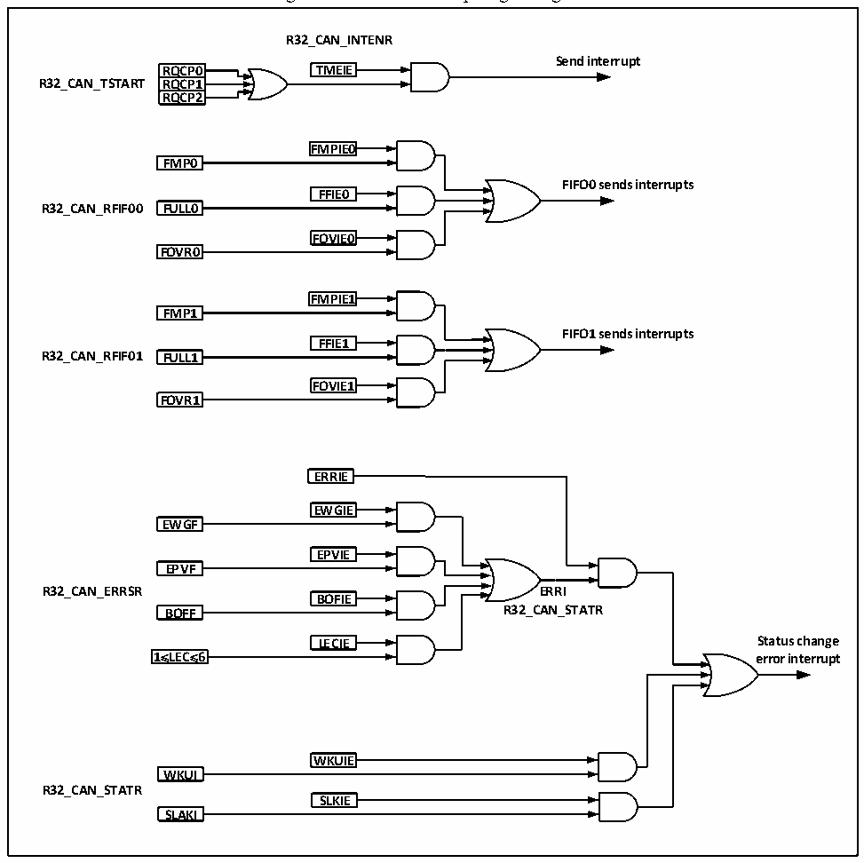

<!-- source-page: 428 -->

[← p.427](0427.md) · [index](../README.md) · [PDF p.428](https://ch32-riscv-ug.github.io/CH32V20x/datasheet_en/CH32FV2x_V3xRM.PDF#page=428) · [p.429 →](0429.md)

<!-- header: CH32F/V20x_V30x_V31x Series Reference Manual https://wch-ic.com -->

Figure 24-9 CAN interrupt logic diagram  
 <!-- rendered from the PDF; verify at https://ch32-riscv-ug.github.io/CH32V20x/datasheet_en/CH32FV2x_V3xRM.PDF#page=428 -->

🖼 Text parsed from the figure above

<strong>R32_CAN_INTENR</strong>  
<strong>Send interrupt</strong>  
RQCP0  RRQQCCPP01  RRQQCCPP12  
<strong>RQCP0 TMEIE</strong>  
<strong>R32_CAN_TSTART RQCP1</strong>  
<strong>RQCP2</strong>  
<strong>FMPIE0</strong>  
<strong>FMP0</strong>  
<strong>FIFO0 sends interrupts</strong>  
<strong>FFIE0</strong>  
<strong>R32_CAN_RFIF00 FULL0</strong>  
<strong>FOVIE0</strong>  
<strong>FOVR0</strong>  
<strong>FMPIE1</strong>  
<strong>FMP1</strong>  
<strong>FIFO1 sends interrupts</strong>  
<strong>FFIE1</strong>  
<strong>R32_CAN_RFIF01 FULL1</strong>  
<strong>FOVIE1</strong>  
<strong>FOVR1</strong>  
<strong>ERRIE</strong>  
<strong>EWGIE</strong>  
<strong>EWGF</strong>  
<!-- image: p428-draw-image-00003 inside the figure -->
<strong>EPVIE</strong>  
<strong>EPVF</strong>  
<!-- image: p428-draw-image-00002 inside the figure -->
<strong>R32_CAN_ERRSR ERRI</strong>  
<!-- image: p428-draw-image-00004 inside the figure -->
<strong>BOFIE</strong>  
<!-- image: p428-draw-image-00005 inside the figure -->
<strong>BOFF R32_CAN_STATR</strong>  
<strong>LECIE Status change</strong>  
LECIE  
<strong>1≤LEC≤6 error interrupt</strong>  
<strong>WKUIE</strong>  
<strong>WKUI</strong>  
<strong>R32_CAN_STATR</strong>  
<strong>SLKIE</strong>  
<strong>SLAKI</strong>  

## 24.7 Register Description

Registers related to CAN controller must be operated by 32-bit words, and the peripheral clock of CAN must  
be enabled. In order to avoid the influence of the current node on the entire CAN bus, the application  
software can only modify the bit timing register CAN_BTIMR in the initialization mode.  

<!-- p428-table-003 (table-24-5@1) pages 428-429 -->
<table><caption>Table 24-5 CAN1 registers</caption><tr><th>Name</th><th>Access address</th><th>Description</th><th>Reset value</th></tr><tr><td>R32_CAN1_CTLR</td><td>0x40006400</td><td>CAN1 master control register</td><td>0x00010002</td></tr><tr><td>R32_CAN1_STATR</td><td>0x40006404</td><td>CAN1 master status register</td><td>0x00000X02</td></tr><tr><td>R32_CAN1_TSTATR</td><td>0x40006408</td><td>CAN1 transmit status register</td><td>0x1C000000</td></tr><tr><td>R32_CAN1_RFIFO0</td><td>0x4000640C</td><td style="text-align:left">CAN1 receive FIFO0 control and status register</td><td>0x00000000</td></tr><tr><td>R32_CAN1_RFIFO1</td><td>0x40006410</td><td style="text-align:left">CAN1 receive FIFO1 control and status register</td><td>0x00000000</td></tr><tr><td>R32_CAN1_INTENR</td><td>0x40006414</td><td>CAN1 interrupt enable register</td><td>0x00000000</td></tr><tr><td>R32_CAN1_ERRSR</td><td>0x40006418</td><td>CAN1 error status register</td><td>0x00000000</td></tr><tr><td>R32_CAN1_BTIMR</td><td>0x4000641C</td><td>CAN1 bit timing register</td><td>0x01230000</td></tr><tr><td>R32_CAN1_TTCTLR</td><td>0x40006420</td><td>CAN1 time trigger control register</td><td>0x0000FFFF</td></tr><tr><td>R32_CAN1_TTCNT</td><td>0x40006424</td><td>CAN1 time trigger count value register</td><td>0x00000000</td></tr></table>

<!-- image: p428-draw-image-00001 bbox=[508.2, 792.12, 527.28, 802.32] -->
<!-- footer: V2.5 423 -->
