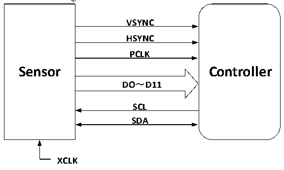

<!-- source-page: 450 -->

[← p.449](0449.md) · [index](../README.md) · [PDF p.450](https://ch32-riscv-ug.github.io/CH32V20x/datasheet_en/CH32FV2x_V3xRM.PDF#page=450) · [p.451 →](0451.md)

<!-- header: CH32F/V20x_V30x_V31x Series Reference Manual https://wch-ic.com -->

# Chapter 25 Digital Video Port (DVP)

<strong><em>This chapter applies to the whole family of CH32F20x, CH32V20x, CH32V30x and CH32V31x.</em></strong>  
Digital Video Port (DVP), which supports the use of DVP interface timing to obtain image data streams,  
supports image data organized in original line and frame formats, such as YUV, RGB, etc., and also supports  
compressed image data such as JPEG format, which can receive high-speed parallel data stream output by  
external 8-bit, 10-bit and 12-bit camera modules.  

## 25.1 Main Features

● Configurable 8/10/12-bit data width mode  
● Support YUV, RGB format data  
● Support JPEG compression format data  
● Built-in FIFO, support DMA transfer  
● Support dual-buffered reception  
● Support crop function  
● Support continuous mode and snapshot mode  

## 25.2 Functional Description

### 25.2.1 Connected to the Sensor

Figure 25-1 DVP interface connection  
 <!-- rendered from the PDF; verify at https://ch32-riscv-ug.github.io/CH32V20x/datasheet_en/CH32FV2x_V3xRM.PDF#page=450 -->

🖼 Text parsed from the figure above

<strong>VSYNC</strong>  
<strong>HSYNC</strong>  
<strong>PCLK</strong>  
Sensor Controller  
<strong>DO～D11</strong>  
<strong>SCL</strong>  
<strong>SDA</strong>  
<strong>XCLK</strong>  

● PLCK (Pixel clk): pixel clock, each clock corresponds to single pixel data (Uncompressed data). The  
PCLK clock output by the external DVP interface sensor supports a maximum of 96MHz.  
● HSYNC (Horizontal synchronization): horizontal synchronization signal.  
● VSYNC (Vertical synchronization): Frame synchronization signal.  
● DATA: pixel data or compressed data, the bit width supports 8/10/12 bits.  
● XCLK: The reference clock of the Sensor, which can be provided by the microcontroller or externally,  
generally using a crystal oscillator.  
● I2C interface: The register used to configure the sensor, which can simulate the I2C timing  
communication through the controlled common GPIO port, or use the hardware I2C interface to  
operate.  
<!-- image: p450-draw-image-00001 bbox=[508.2, 795.0, 527.28, 805.2] -->
<!-- footer: V2.5 445 -->
