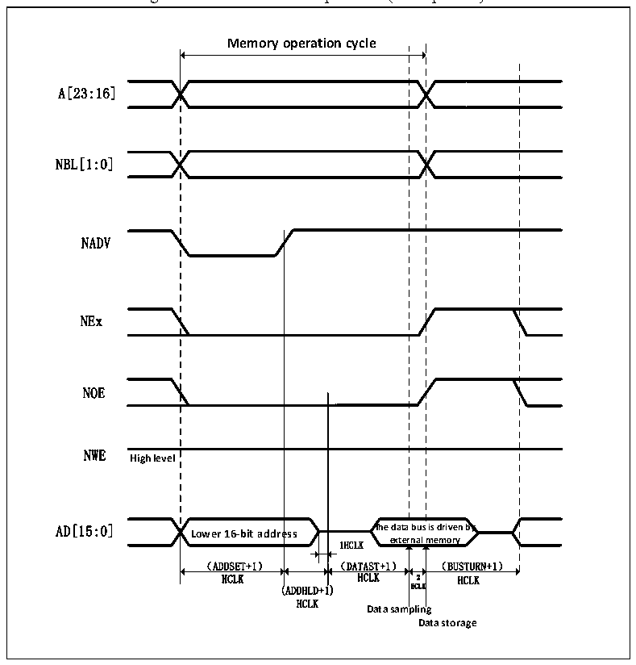

<!-- source-page: 464 -->

[← p.463](0463.md) · [index](../README.md) · [PDF p.464](https://ch32-riscv-ug.github.io/CH32V20x/datasheet_en/CH32FV2x_V3xRM.PDF#page=464) · [p.465 →](0465.md)

<!-- header: CH32F/V20x_V30x_V31x Series Reference Manual https://wch-ic.com -->

> ⬆ **Table continued** — rendered in full at [page 463](0463.md). <!-- p464-table-001 -->

#### 26.2.3.3 NOR/PSRAM Timing Diagram of Asynchronous Transfer Address/Data Multiplexing

Note the following for asynchronous static memory (NOR FLASH and PSRAM) operations:  
● When extended mode is enabled, read and write operations to memory using modes A, B, C, and D can  
be mixed.  

Figure 26-3 Mode 1 read operation (Multiplexed)  
 <!-- rendered from the PDF; verify at https://ch32-riscv-ug.github.io/CH32V20x/datasheet_en/CH32FV2x_V3xRM.PDF#page=464 -->

🖼 Text parsed from the figure above

<strong>Memory operation cycle</strong>  
Lower 16-bit addre （ADDSET+1）  ess  
A[23:16]  
NBL[1:0]  
NADV  
NEx  
NOE  
NWE  
<strong>High level</strong>  
HCLK HCLK 2 HCLK  
(ADDHLD+1) HCLK  
HCLK  
<strong>Data sampling</strong>  
<strong>Data storage</strong>  

<!-- image: p464-draw-image-00001 bbox=[508.2, 795.0, 527.28, 805.2] -->
<!-- footer: V2.5 459 -->
